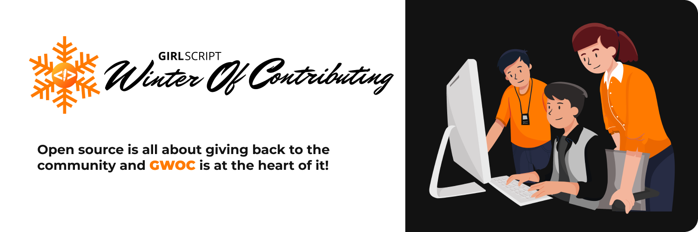

# GirlScript Winter of Contributing       

 
 

**GirlScript Winter of Contributing** is a three-month newly established initiative by **[GirlScript Foundation](https://www.girlscript.tech/home)** that will take place over the winter months. GWOC invites people to contribute their expertise and ideas in order to improve their technical abilities and obtain significant experience in the field of tech education.Throughout the program, the participants can contribute to a range of themes while being guided by an expert facilitator.The goal of GWOC is to develop the world's largest multilingual repository.🧡

<!-- ## Explore the topics
- [Frontend Web Development](./Frontend-Web-Development)
- [Backend Web Development](./Backend-Web-Development)
- [Android Development](./Android-development) -->

## Contributing Guidelines
Please follow the [contributing guidelines](./.github/CONTRIBUTING.md) to contribute to the project.

## Code of Conduct
This project and everyone participating in it is governed by the [GirlScript Code of Conduct](./.github/CODE_OF_CONDUCT.md). By participating, you are expected to uphold this code

