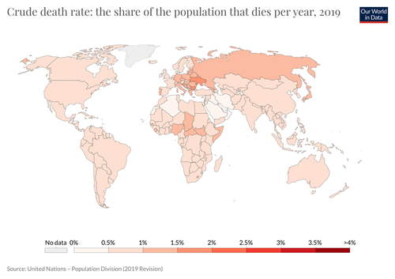

# Measurement of Mortality and Fertility

Mortality refers to the number of deaths in a population whereas Fertility refers to the ability to reproduce.

## Measurement of Mortality

Mortality can be measured by the following rates :

- Crude Death rate

- Specific Death rates
  
  - Age-specific Death rate

- Infant Mortality rate

- Standardised Death rates

  - Direct method of Standardisation

  - Indirect method of Standardisation

> To know about the other measures of mortality, refer [this](https://en.wikipedia.org/wiki/Mortality_rate#Related_measures_of_mortality) page by wikipedia.

### Crude Death rate

Crude death rate is obtained by dividing *annual deaths* by *annual mean population* and multiplying by *1000*.

Crude death rate = (Annual deaths/ Annual mean population) * 1000.

> Crude death rate can be calculated separately for Males and Females.

- For males => (Number of male deaths/ Size of male population) * 1000.

- For females => (Number of female deaths/ Size of female population) * 1000.

> Crude death rate usually lies between 8 and 30 per 1000 and female crude death rate is usually less than male crude death rate. **Source - Fundamentals of Applied Statistics by SC Gupta.**

> **Image source - [ourworldindata.org](https://ourworldindata.org/grapher/crude-death-rate-the-share-of-the-population-that-dies-per-year)**

The above image shows the crude death rates of the world population in percentages.

#### Merits of Crude Death rate

1. Easy to understand and implement.

2. It is used in numerous demographic and public health problems.

#### Demerits of Crude Death rate

1. It does not consider the age and sex factors of the population.

2. It is not suitable for comparing the mortality in 2 places or same place in 2 periods.

### Specific Death rates

Death rates which are calculated specifically for a particular factor(like age, sex etc.,.) are called specific death rates.

It is obtained by dividing *total number of deaths in the specified section of the population* by *total population of the specified section* multiplied by *1000*.

Specific death rate = (total number of deaths in the specified section of the population / total population of the specified section) * 1000.

#### Age-specific Death rate

Age-specific death rate is obtained by dividing *number of persons in a particular age group* by *number of deaths in this population* multiplied by *1000*.

Age-specific Death rate = (number of persons in a particular age group/ number of deaths in this population) * 1000.

> **Image source - [researchgate.net](https://www.researchgate.net/figure/Age-specific-death-rates-by-sex-2009_fig6_234009918)**

The above image shows the age-specific death rate per 1000 in years.

##### Merits of Age-specific Death rate

1. They are more accurate since they consider the age of the population while computing.

2. It is essential for the computation of Net reproduction rate and construction of Life table.

##### Demerits of Age-specific Death rate

1. For overall comparison of mortality conditions prevailing in 2 different regions, the different age-specific death rates must be combined to give a accurate result.

2. It does not take into consideration Differential mortality.

### Infant Mortality rate

It is defined as the number of deaths of children below the age of 1 per 1000 live births.

Infant mortality rate is obtained by dividing *number of deaths of children below the age of one* by *total number of live births within the same year*.

Infant mortality rate = number of deaths of children below the age of one /total number of live births within the same year.

> To know more about the causes of infant mortality, read [this](https://ourworldindata.org/child-mortality).

> **Image source - [reddit.com](https://www.reddit.com/r/MapPorn/comments/8pg7u5/world_infant_mortality_rates_2017_6300_x_3260/)**

The above image shows the infant mortality rates of the world population.

#### Merits of Infant Mortality rate

1. It gives importance to deaths at earlier stages of life.

2. It reflects any changes in the environment.

> To know more, read this PDF about Why should we focus on Infant mortality rate? by [amchp.org](http://www.amchp.org/programsandtopics/data-assessment/InfantMortalityToolkit/Documents/Why%20Focus%20on%20IM.pdf).

#### Demerits of Infant Mortality rate

1. Infant mortality rate is not a probability rate.

2. Since the definition of *live births* and *still births* vary accordingly, it leads to biased values.

### Standardised Death rates

They are also known as Adjusted death rates.

> The standardised death rate, abbreviated as SDR, is the death rate of a population adjusted to a standard age distribution. It is calculated as a weighted average of the age-specific death rates of a given population.
> As most causes of death vary significantly with people’s age and sex, the use of standardised death rates improves comparability over time and between countries. The reason is that death rates can be measured independently of the age structure of populations in different times and countries.
>**Source - [ec.europa.eu](https://ec.europa.eu/eurostat/statistics-explained/index.php?title=Glossary:Standardised_death_rate_(SDR))**

#### Direct method of Standardisation

In this method the age-specific death rates are weighted against a chosen standard population distribution of another region.

#### Indirect method of Standardisation

> In computing the standardised death rates by formula it is necessary to know the number of persons and the age-specific death rates for different age-groups. Quite often we have a population classified by age but the age-specific death rates may not be known. However, the total number of deaths and hence crude death rate may be known. In such case we use indirect method of standardisation.
> **Source - Fundamentals of Applied Statistics by SC Gupta.**
> Indirect method is used in cases when direct method cannot be implemented.

## Measurement of Fertility

Fertility can be measured by the following rates :

- Crude Birth rate

- General Fertility rate

- Specific Fertility rate
  
  - Age-specific Fertility rate

- Total Fertility rate

### Crude Birth rate

It is obtained by dividing *total number of live births in a given region* by *total population of the given region* multiplied by *1000.*

Crude Birth rate = (total number of live births in a given region/ total population of the given region) * 1000.

> **Image source - [reddit.com](https://www.reddit.com/r/dataisbeautiful/comments/2q32wn/crude_birth_rate_of_different_countries_from_1900/)**

The above image shows the crude birth rates per 1000 at a specific period.

#### Merit of Crude Birth rate

1. It the simplest measure of the fertility rate.

#### Demerit of Crude Birth rate

1. It does not provide any information about individual-level child bearing behaviour.

### General Fertility rate

It is obtained by dividing *total number of live births* by *number of females in the reproductive or child-bearing ages.* multiplied by *1000.*

General Fertility rate = (total number of live births/ number of females in the reproductive or child-bearing ages.) * 1000.

> **Image source - [cdc.gov](https://www.cdc.gov/nchs/products/databriefs/db216.htm)**

The above image shows the general fertility rate per 1000.

#### Merits of General Fertility rate

1. It is a probability rate.

2. It gives an idea about how the females capable of reproduction play a role in determining the General fertility rate.

#### Demerits of General Fertility rate

1. Two populations with minor differences in the General fertitliy rates may exihibit different fertility status.

2. Two populations with significant differences in the General fertility rates may exhibit a similar fertility status.

### Specific Fertility rate

Fertility rates which are calculated specifically for a particular factor(like age, sex etc.,.) are called specific fertility rates.

It is obtained by dividing *number of births to the female population in the specified section of the population* by *total number of female population of the specified section* multiplied by *1000*.

Specific death rate = (number of births to the female population in the specified section of the population / total number of female population of the specified section) * 1000.

#### Age-specific Fertility rate

Age-specific fertility rate is obtained by dividing *number of births to the females in a particular age group* by *average females in this population* multiplied by *1000*.

Age-specific Fertility rate = (number of births to the females in a particular age group/ average females in this population) * 1000.

> In order to oversome the drawback of General fertility rate and get a better idea of the fertility situation prevailing in a community or locality it is necessary to compute the fertility rates for different age-groups of reproductive age separately. **Source - Fundamentals of Applied Statistics by SC Gupta.**

> **Image source - [researchgate.net](https://www.researchgate.net/figure/Age-specific-fertility-rates-for-males-for-selected-years_fig2_263789224)**

The above image shows the age-specific fertility rates at particular time periods.

##### Merit of Age-specific Fertility rate

1. It takes into consideration the age factor while calculating the fertility rate.

##### Demerit of Age-specific Fertility rate

1. In some cases, the age-specific fertility rate will be higher for certain age-groups and lower for remaining age-groups in one region than the other regions.

### Total Fertility rate

> To get an idea about the measure of growth in the population, the age-specific rates computed for each age-groups has to be added together to give a single value. This leads to emergence of total fertility rate.

Total fertility rate is obtained by adding the annual age-specific fertility rates.

> **Image source - [mecometer.com](http://mecometer.com/topic/total-fertility-rate/)**

The above image shows the total fertility rates of the world population.

> The total fertility rate has been declining for years. In 1964, women of childbearing age had an average of 3.2 children. By 1974, that number fell to 1.8, according to the Center for Retirement Research at Boston College.
> Flash forward to 2019 and the provisional total fertility rate was just 1.7, according to a March 2020 report from the Centers for Disease Control and Prevention. Then, Covid-19 led to even fewer births than expected in 2020. Recent research from Cornell University found that the U.S. birth rate declined by 7.1% during the pandemic.
> **Source - [cnbc.com](https://www.cnbc.com/2021/10/12/heres-what-lower-us-birth-rates-could-mean-for-social-security.html)**

#### Merit of Total Fertility rate

1. It approaches towards a practical measure of the entire population growth.

#### Demerit of Total Fertility rate

1. The calculated value is lower than the actual value if the no.of women at each age is decreasing and the age-specific fertility rate is increasing.
