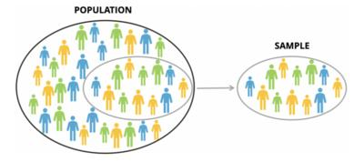
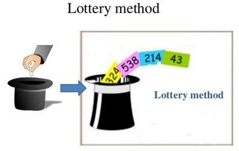
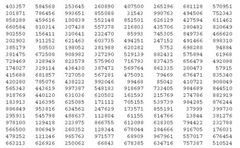
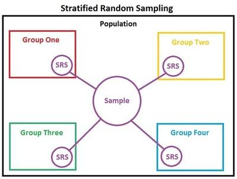
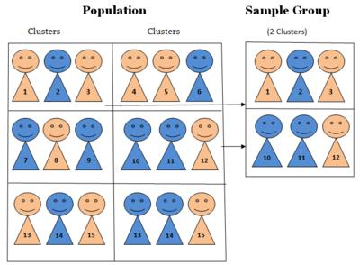
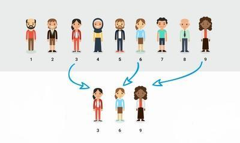

# Contents

- What is Sampling?

- What is Random sampling?

- Types of Random sampling

- Simple random sampling

- Stratified random sampling

- Cluster random sampling

- Systematic random sampling

## Sampling

Sampling is the process of drawing units from a population to determine the characteristic of the entire population. In other words, to study a large group called **population** it takes time hence, to save time, a small group of individuals called **sample** will be selected from the large group  which will be studied and analyzed to determine the characteristics of the population. Hence sample is a **subset** of the population.

> The population size is denoted as N and size of the sample is denoted as n.

**Image Source - [mmsa.org](https://mmsa.org/courses/statistics-glossary/)**

In the above image, a small group of individuals are selected from the larger group of individuals.

> For example, Suppose you want to determine the average annual income of 100 people living in a particular area in New York, instead of surveying and collecting data from each of the 100 individuals living in that area we can select a **unbiased** sample of say, 30 individuals from the 100 individuals and then study and analyze the sample to determine the average annual income of a person living in that particular area of New York.

## Random sampling

It is also called Probability sampling. In random sampling, each unit or individual of the population has an equal chance of being selected to constitute the random sample.

This type of sampling is advanatgeous since the sample is unbiased.

## Types of Random sampling

There are 4 types

1. Simple random sampling

2. Stratified random sampling

3. Cluster random sampling

4. Systematic random sampling

## Simple random sampling

In simple random sampling, every unit or individual in the population has an equal chance getting selected to constitute the sample i.e the sample consists of units **randomly** chosen from the population.

> For example, numbers from 1 to 10 are written in bits of paper and placed in a box. You choose a number from the box without looking inside the box.

Determining sample can be done in 2 ways in this method

- Lottery method

- Using a random number table

### Lottery method

This is the simplest method of choosing a random sample.

- In this method, each unit or member or individual in the population is assigned a unique number.

- Each number is written in a piece of paper or a card and the cards are placed in a container.
  
- A number is randomly chosen from the container without looking inside the container.

**Image Source - [slideshare.net](https://www.slideshare.net/shubhanshug1/seminar-sampling-methods)**

### Using a random number table

A random number table consists of randomly generated numbers in a tabular format. It is used in random sampling to determine the sample.

> Random number tables are available in different sizes ranging from single digit to large digit numbers.

**Image Source - [charteroakgroup.org](http://www.charteroakgroup.org/Services/excel61.html)**

The above image is an example of one such random number table.

- In this method, each unit or member or individual in the population is assigned a unique number.

- The population size and sample size should be defined. The population is numbered from 1 to N and sample is numbered from 1 to n.

- Randomly select any number in the random number table. Assume it as the starting point.

- Note down the last 3 digits of the population size.

- Interpret the last 3 digits of the chosen random number. If the last 3 digits of the chosen random number is a number between *1 to the last 3 digits of population size*, the individual in the population corresponding to this number is selected to constitute the sample. If the chosen random number's last 3 digits are not in the range of last 3 digits of the population, the next number is interpreted.

- The procedure is repeated until the required number of sampling units are chosen.

For example, Consider a population size of **289** and a sample size of **50**. Let me choose a random number from the table given above. I choose **902550** from the first column, fifth row. The last 3 digits of the population size are 289 and the last 3 digits of the chosen random number are **550**. Since 550 doesnt not belong to the range 1 to 289, we move down and choose the next number. **202902** also doesnt belong the range. Moving down, we see **385179**. The last 3 digits are **179**. Since 179 belongs to the range 1 to 289, the individual in the population corresponding to the number 179 is chosen as a sampling unit. This procedure is repeated until 50 sampling units are chosen.

> People use different techniques while determing the sample using the random number table.

### Advantages of simple random sampling

- The implementation process is less complicated when compared to other methods.

- It is unbiased and free of prejudice.

### Disadvantages of simple random sampling

- Cannot be implemented in heterogenous population.

- Implementation process is time consuming when the population size is large. In lottery method of simple random sampling, numbering the population from 1 to N and then writing them in cards and shuffling requires work.

## Stratified random sampling

Stratified random sampling is implemented when the population is heterogenous. The population is divided into different groups based on their common charateristics. Then samples are derived from each of these groups through simple random sampling method. The homogenous groups are called *strata*.

- Divide the heterogeneous population into homogeneous strata.

- Derive sample from each stratum through simple random sampling method.

**Image Source - [wikipedia.org](https://en.wikipedia.org/wiki/Stratified_sampling)**

For example, To determine the annual income of a person living in a particular area, we divide the population(people living in the area) into 3 groups of Rich, Middle class and Poor (stratum) based on their income and then derive sample from each of these groups through simple random sampling method.

### Advantages of stratified random sampling

- Stratified random sampling is extremely useful when the researcher wants to focus only on a particular characteristic of the population.

- Has higher accuracy than simple random sampling since samples are chosen from the relevant stratum. Moreover, the diversification within the stratum will be much lesser when compared to that of a population.

- Ensures greater coverage of the population since the population is divided into sub-groups.
  
### Disdvantages of stratified random sampling

- Should be used only when the population can be divided into distinct subgroups and they should not overlap, since sampling units belonging to two or more subgroups will have a higher chance of getting selected which may lead to errors.

- Requires time and work to study and divide the population into subgroups based on their characteristics.

- Complexity increases if there are more number of strata.

## Cluster random sampling

 This method is used for conducting researches in marketing.

- In cluster random sampling, the population is divided into groups. These groups already exist in the population. For example, A state is divided into different districts. These groups are called *clusters*.

- A cluster is selected randomly through simple random sampling.

**Image Source - [research-methodology.net](https://research-methodology.net/sampling-in-primary-data-collection/cluster-sampling/)**

The above image shows an example of cluster random sampling.

> A major difference between cluster and stratified sampling relates to the fact that in cluster sampling a cluster is perceived as a sampling unit, whereas in stratified sampling only specific elements of strata are accepted as sampling unit. **Source - [researchmethodology.net](https://research-methodology.net/sampling-in-primary-data-collection/cluster-sampling/)**

### Types of cluster random sampling

There are 3 types

- Single stage sampling

  - Data is collected from every unit or individual in the selected clusters.

- Double stage sampling
  
  - A few individuals or units are randomly selected from each of the selected clusters. Then data is collected from these selected units.

- Multi stage sampling

  - In multi stage sampling, the process of double stage sampling is repeated until the required sample is achieved.

### Advantages of cluster random sampling

- It is reduces cost and time.

- Easy to implement in large populations.

### Disdvantages of cluster random sampling

- Prone to sampling errors

- Can be implemented only if the units in the population can be divided into groups.

## Systematic random sampling

In systematic random sampling, the population size and sample size should be well defined. Here, Samples are chosen according to *fixed intervals* from the population.

- The sampling interval is calculated by dividing population size by sample size.

- The population is numbered from 1 to N.

- A random number is chosen from the population. The individual in the population corresponding to this number is considered as the first sampling unit.

- Here onwards, the sampling units on every i th interval are selected starting from this number.

**Image Source - [questionpro.com](https://www.questionpro.com/blog/systematic-sampling/)**

In the image above, the sampling interval is **3** since population size is 9 and sample size is 3. Hence every third unit or individual is selected from the population.

### Advantages of systematic random sampling

- Simple and easy to implement and free from bias since samples are chosen from fixed intervals.

- Ensures data is less crowded.

### Disadvantages of systematic random sampling

- If every individual in the i th interval is similar, it leads to bias.

- It requires a specific population size.

> To know more about applications of systematic sampling read when to use systematic sampling section by [questionpro.com](https://www.questionpro.com/blog/systematic-sampling/)
