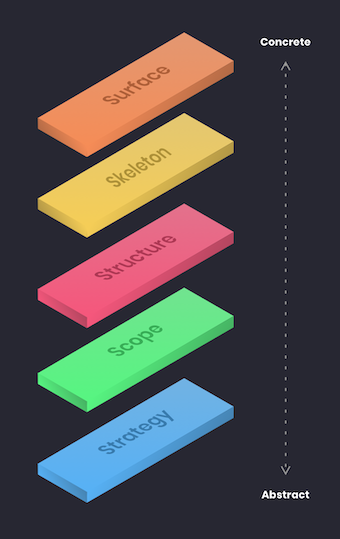

## The Five Elements of User Experience

**The Elements of User Experience** is a 2002 book by **Jesse James Garrett**. It talks about the user experience using this five-layer diagram as layers, that inform one another when building a product. These layers from bottom to top are **Strategy, Scope, Structure, Skeleton, and Surface**. Each layer supports those above it. The issues that we have have to deal with, become less abstract, and more concrete with each plane.

### 1.Strategy
This is the 'why' plane. Here, we need to find the reason for the product, application or the site. Why we create it? Why people are willing to use it? Why they need it? The goal here is to define the user needs and business objectives.

### 2.Scope
This is the 'what' plane. What kind of features and content we want to include in the product? What are its functional and content requirements? 
Functional vs content requirements - The feature is having a phonebook for your contacts, while the content is phone numbers and names for these contacts. The scope plane is about defining requirements based on the goals established on the strategy plane. 

### 3.Structure
This is the 'how' plane. How much content is there? How is it organized? How is it prioritized? How the system will behave when the user interacts with the product? The scope is given structure on the software side through interaction design, in which we define how the system behaves in response to the user. For information spaces, the structure is the information architecture which defines the arrangement of content elements within the information space.

### 4.Skeleton
The skeleton is designed to optimize the arrangement of the elements for maximum effect and efficiency. Here, the designer puts together the information gathered from previous layers to determine the visual form, interaction design and the navigation design of the product. 

### 5.Surface
It is the amalgamation of the layers below. Here, our concern is the visual design, or the look of the finished product. Here, designers plan the user interface and all visual things to aid users in using the product with fonts, styling, colors, animations. Designers need to make things easier to understand what users see on the screen.

