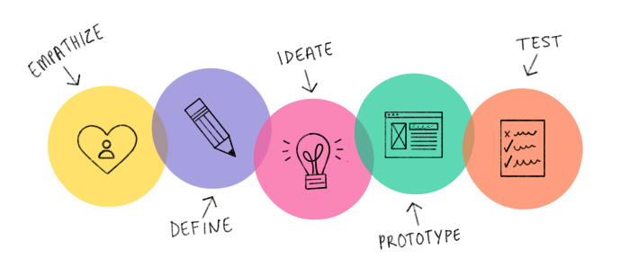

## What is Design Thinking?

Design Thinking is a user-centric, iterative, solution-based approach to problem-solving.

It helps designers create solutions that address a real user problem and are functional and affordable.

According to Tim Brown, CEO of IDEO: "Design thinking is a human-centered approach to innovation that draws from the designer’s toolkit to integrate the needs of people, the possibilities of technology, and the requirements for business success."

Design thinking starts with the customer and then offers the solution, not the other way around!

## 5 stages of Design Thinking

#### Stage 1: Empathize

It starts by putting yourself in your customers’ shoes. During this phase, it is important to understand who your specific user is. Empathize with people through observation or open-ended interviews to uncover what people do, rather than what they want.
 Understand their point of view —what they’re doing, how they’re feeling, and what issues they may have. Do a lot of research to get a clear picture of who your users are and the challenges they are facing.

#### Stage 2: Define

After you understand the user's needs, describe an idea or view of the user that will be the basis of the product or application to be made. Here, identify what’s the ‘aha’ moment from the observations? What’s the problem to be solved? This can be done by making a list of user needs and using knowledge about design to meet the user requirements.

#### Stage 3: Ideate

With a solid background of knowledge from the first two phases, it’s time to start working on potential solutions to the problem statements you have created. The point here is not to get a perfect idea, but rather to come up with as many ideas as possible. Brainstorming is particularly helpful here!

#### Stage 4: Prototype

Take a moment to reflect on what you have learned from the conversations about the different ideas. Ask yourself, how does the idea fit into the context of people's actual lives? The solution could be a combination of a new idea and what is already being used. Then just connect the dots, sketch up the final solution, and build a real prototype that's just good enough to be tested. A prototype is an amazing tool to help you fail fast to learn fast!

#### Stage 5: Test

Go back to the customers and ask what they think. Test their reaction to your prototype. Depending on the feedback from your testing phase, you may need to go back to ideation or prototyping and then apply your learning. Repeat the process until you have a prototype that works and solves the real problem.

## Benefits of Design Thinking :

- It engages creativity through truly innovative ideas.

- Helps to understand the people for whom we are designing products or services.

- Generate new ideas with lowered risk.

- Focuses on developing prototypes quickly and thus reduces the time to market.

- Generate more revenues and returns.

- Gain customer's trust and loyalty.

