# Interface elements-Types of UI buttons in Figma

 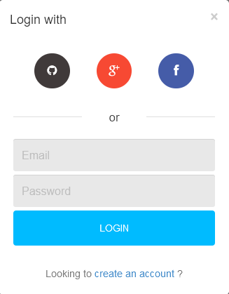
 
A button is an interactive element that enables to get the expected interactive feedback from the system following a particular command. Basically, a button is a control that allows a user to directly communicate with the digital product and send the necessary commands to achieve a particular goal. For example, it may be the task to send an email, buy a product, download some data or a piece of content, turn on the player and tons of other possible actions. One of the reasons why buttons are so popular and user-friendly is that they efficiently imitate interaction with the objects in the physical world.   Modern UI buttons are quite diverse and can serve plenty of purposes, with aesthetics and animations that are icing on the cake. Many also have shapes, color codes, or icons that usually convey it's functionality to the user without the need of documentation.

  

<i>Fig: Simple form with a LOGIN button & create an account button on the bottom.</i>
  

## Anatomy of a button:
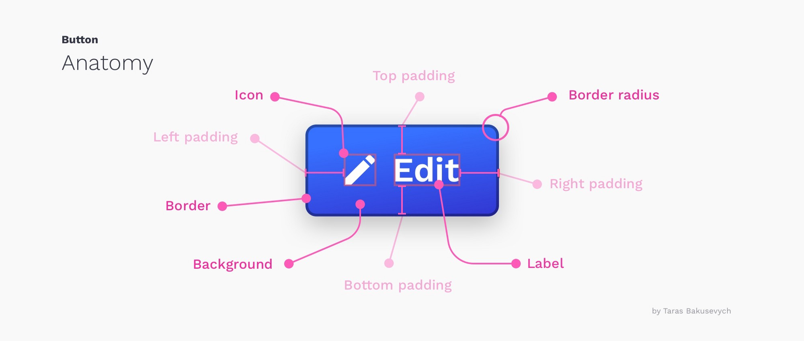*Fig: Design components of  a Button. (Courtesy of uxdesign.cc from writer Taras Bakusevych)*

## Different states of a Button:
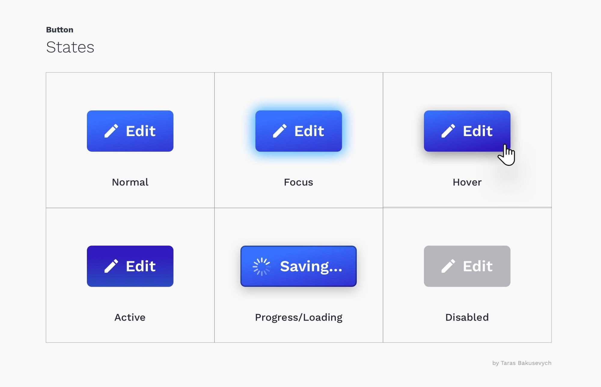*Fig: Button states.(Courtesy of uxdesign.cc from writer Taras Bakusevych)*

 - **Normal:** states that button is available for interaction.
 - **Focus:** states that the button element is highlighted by a keyboard or other input method.
 - **Hover:** states that user is hovering the mouse pointer over it.
 - **Active:** states that the user has tapped on the button, the state starts from the user starting the tap till the tap ends.
 - **Progress/Loading:** states that the user has tapped and the command is executing.
 - **Disabled:** states that the button is not interactive.

## Categories of Buttons:

Buttons are highly flexible element in any product, and their flexibility in design introduces some characteristics of their functionality.
There are multiple categories in which the buttons can be classified:

 - 
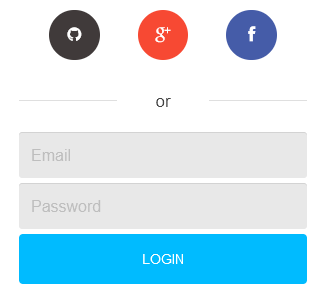
<b>Shape:</b> Buttons come in different shapes, the most preferred shapes are rectangles, rounded rectangles, squares, rounded squares and circles, while sharp borders represent formality, rounded buttons exhibit friendliness.<i>THe images contains various options of logging in with buttons.</i>
     

 - 
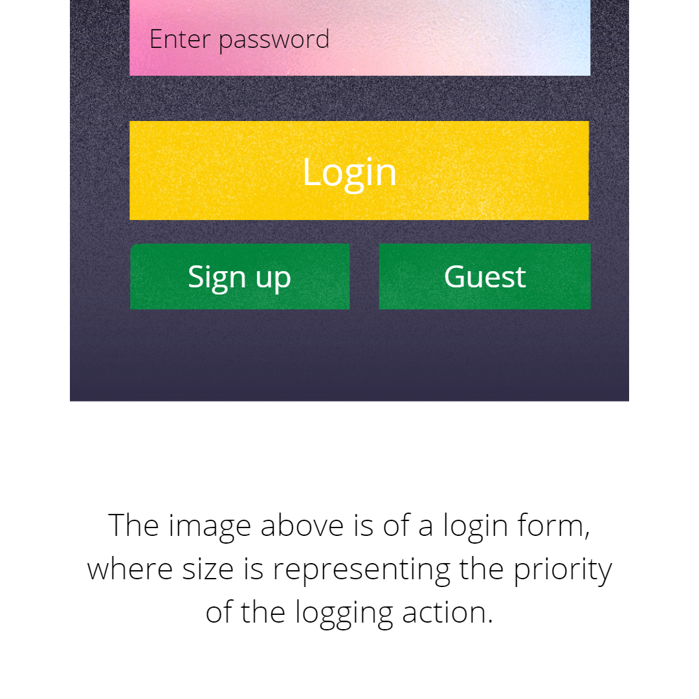
<b>Size:</b> Buttons also come in different sizes, mostly denoting their importance in a product, bigger ones are considered to be primary, while smaller ones are considered secondary.<i>Image contains Login button with higher precedence, while signup and guest have same and lower precedence.</i>
      

 - 
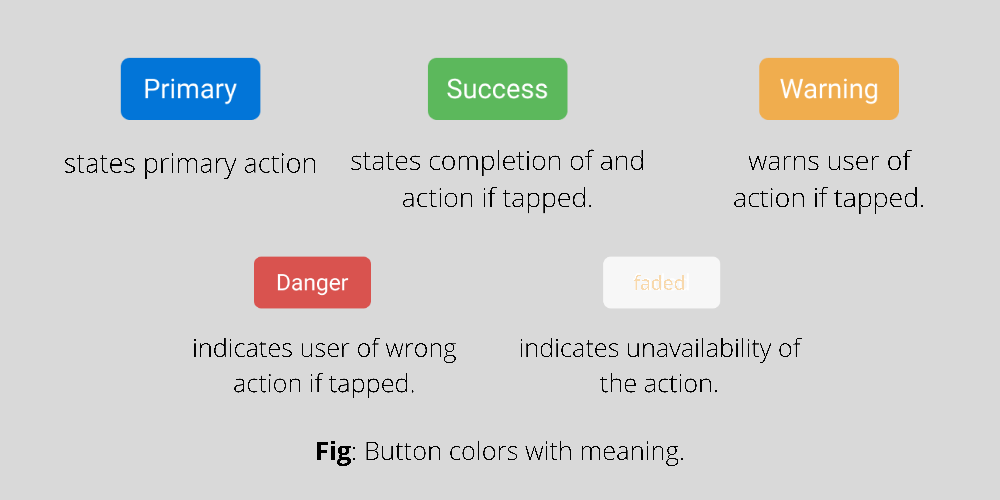
<b>Color:</b> Buttons also come in different colors, As nowadays programming languages allow for manipulating color to match the product aesthetics, conventionally there were some predefined colors that exhibited certain situations.
   

 - 
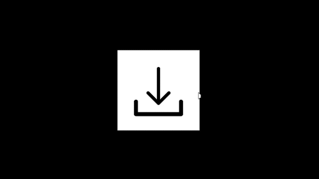
<b>Animation:</b> Static buttons are somewhat very prevalent in well-set businesses, while newer generation focused on more aesthetics, designers found a way to teach their product with animations.
      

## Types of buttons you can create in Figma:
Figma's rich interface allows designers to create literally anything. and so the types of buttons that a designer can create is vast. However, below are some of the buttons that you can easily create with Figma.

 - 
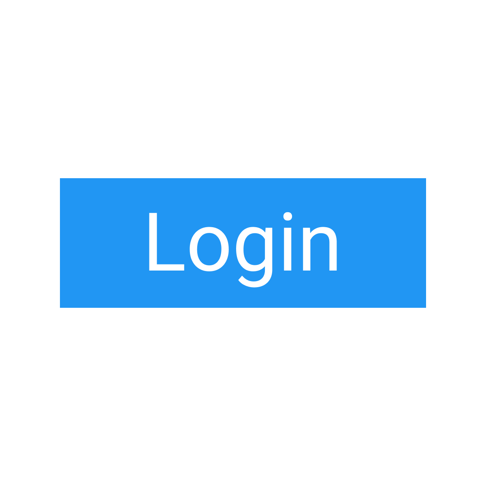
<b><i>Flat Button:</i></b> Simple rectangular shape with text inside.
     

 
 - 
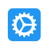
<b><i>IconButton:</i></b> Simple icon in the centre, many times in a circular shape, icon conveys the action done by the button.
     

 
 - 
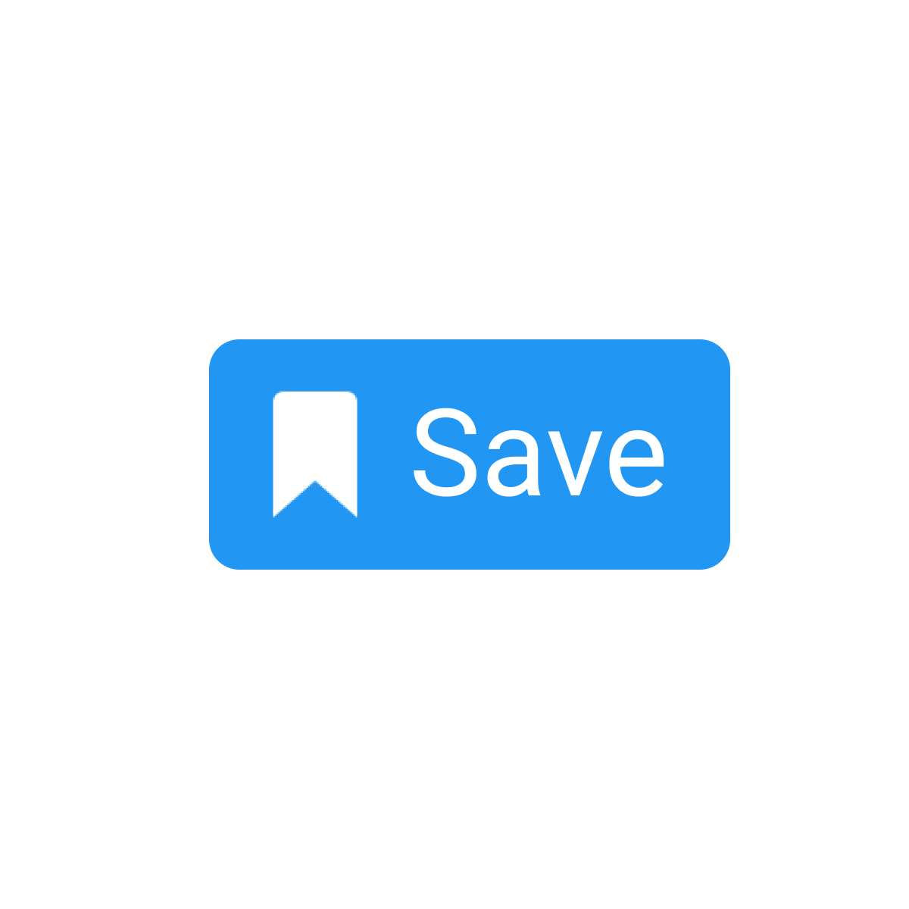
<b><i>Icon with Label Button:</i></b> Simple rectangular shape with Icon and a text.
     

 
 - 
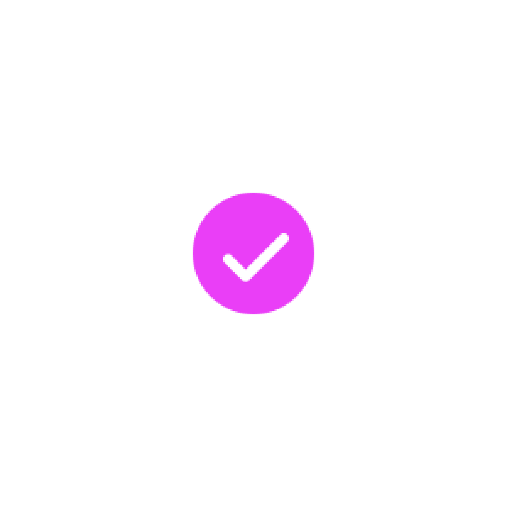
<b><i>CheckBox button:</i></b> Allows selection when multiple options are available, and selections are also more than one required.
    

 
 - 
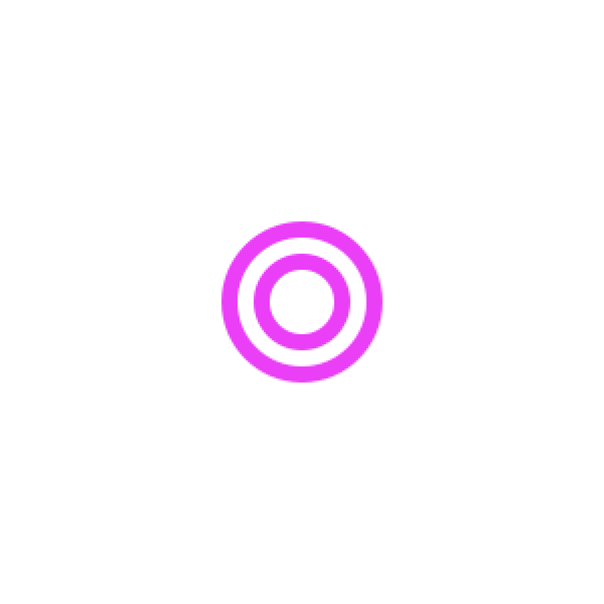
<b><i>Radio Button:</i></b> Also allows selection of options where multiple are available, but only one at a time.
      

 
 - 
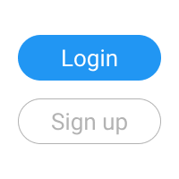
<b><i>Ghost Button:</i></b> Simple rectangular shape, but only borders visible, grouped with primary buttons (solid fill buttons) to signify a secondary behaviour. <i>The image has SignUp functionality integrated with Ghost button</i>
    

 
 - 
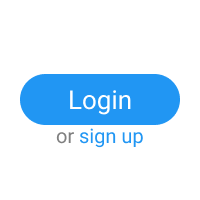
<b><i>Ghost Button:</i></b> Simple text which is capable of action when tapped on. Grouped with primary buttons, to either signify secondary action, or tertiary action when secondary button is also present. <i>The image has signUp functionality embedded with a text button.</i>
    

 - 
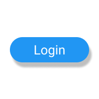
<b><i>RaisedButton:</i></b> Same rectangular button but other applied effects make it look like it is raised above the screen it is on.</i>
    

 - 
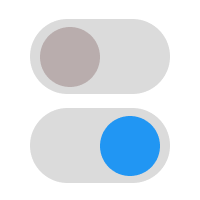
<b><i>Toggle Button:</i></b> A button which changes visuals when clicked. For e.g: Electric switches look different when they are switched from on to off.</i>
    

 - 
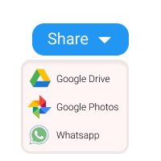
<b><i>DropDown Button:</i></b> Buttons which when clicked, expands into atomic actions. For e.g: A sharing button opens multiple buttons with multiple ways of sharing data.</i>
   

