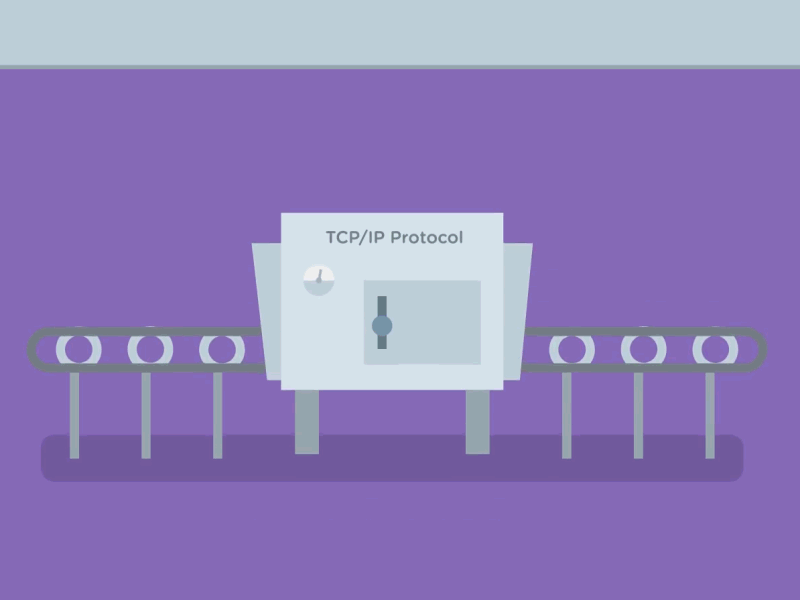

 # How does the Internet works?

Ever wondered how it is so easy for you to watch your favourite cat videos sitting anywhere in the world? How you are able to see someone else live who is maybe residing another part of the globe? How you are able to copy all the contents of Wikipedia to complete your assignment?
In this article, we will know what is internet and how it works. :)

## What is internet for a 10 year old kid?
For a 10 year old kid, a internet is like using someone else's computer which you can use remotely. Whatever you can do in your computer, you can use the internet like that. You wanna watch videos, play games, listen to songs, access files, anything you want. Basically through your computer you can access hundreds or thousands of other computers. The term _internet_ is derived from "**inter**nconnected **net**work" of computers.

__[Image Credits](https://viralchop.com/cryptocurrency-internet-money-gif/)__

## Let's dive into history first
On October 29, 1969, Advanced Research Projects Agency launched the first iteration of the internet connecting computer at The University of Utah and Stanford Research Institute.

## Let's learn some basic first
We are almost there to learn how internet works. Please have patience. Before we dive deep, let's clear some basic terminology.

 - **IP(Internet Protocol) address:** Just like your home has a unique address, every computer present on the internet has something called as IP address.
 - **TCP (Transmission Control Protocol):** It is a communication standard that ensures transmission of data chunks called as packets.
 - **Domain Name System(DNS):** Its like that old telephone book but for the internet. It helps in mapping domain name with IP address.
 - **Domain Name:** A domain name is that name which you use to access someone else's computer. It masks the IP address.

## Who owns the internet?
Nobody owns it. Its like asking who owns all the mobile network.

## So, how does internet works on my computer?
So we now know that the internet is a interconnected network of computers. But how are they connected? They are connected either through router or cables or cables. Well just connecting any of these three won't let you access internet. You have to pay to **ISP(Internet Service Provider)** like, Jio, BSNL who then let's you connect to the big computers across the world. These big computers are also called as data centers or servers  which stores petabytes of data. These data can be in the form of video, files, songs etc.

__[GIF credits](https://gfycat.com/ko/concernedleadinggourami-online-learning-khan-academy-education)__ 

Now when you enter a domain name in browser,  it looks for the IP address in DNS.

IP adresses of some famous websites:
|Domain Name                          |IP address                         
|-----------|-----------------------------------|----------------
|google|2404:6800:4007:810::200e
|wikipedia|91.198.174.192
|reddit |192.254.236.136
| github | 13.234.176.102

Through your browser, you request the data center to take you to the particular IP address. While requesting the browser has to follow set of rules. These set if rules/protocols that is followed is known as **TCP/IP** whenever a request is made through browser. It basically means that when you send a request through your browser and when the browser receives that data, it is received in packets. These data packets are then reassembled in our computer which shows us something meaningful.

__[GIF Credits](https://dribbble.com/shots/2242944-TCP-IP-Protocol)__

So this is how internet works. Well, I know I haven't covered some useful stuffs, because I wanted that the person reading this will at least get a rough idea how internet works. 

### Website Reference Links

 - [How Internet works - HP](https://www.hp.com/us-en/shop/tech-takes/how-does-the-internet-work#:~:text=It%20works%20by%20using%20a,(TCP)%20%5B5%5D.&text=Data%20sent%20over%20the%20internet,into%20tinier%20parts%20called%20packets.)
 - [How internet works - Apna College](https://www.youtube.com/watch?v=YtxLexm-9pI)

