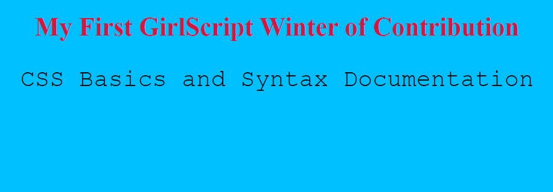
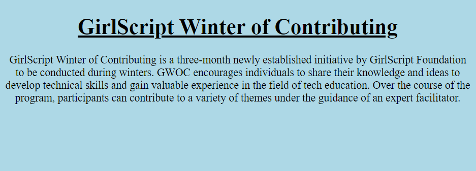
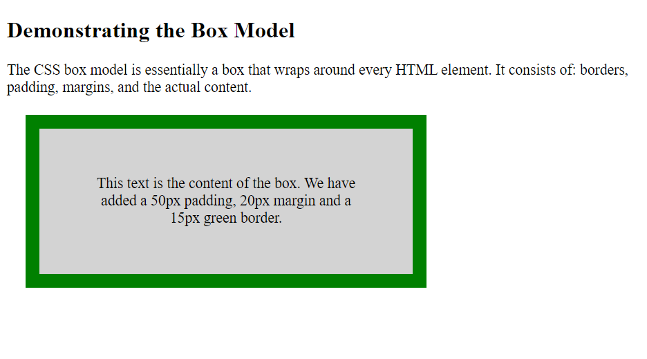
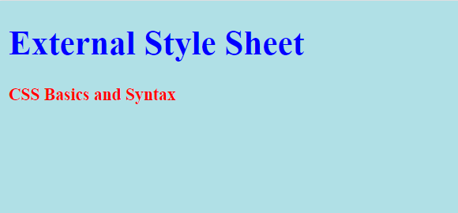
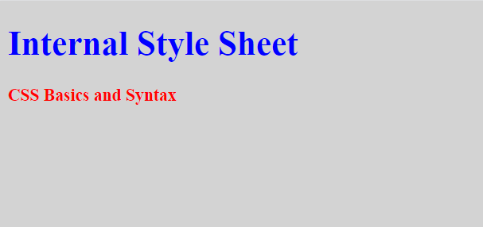
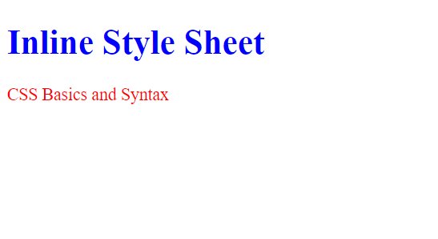

<h1 align="center"><b>CSS BASICS & SYNTAX</b></h1>
<br>
<br>

### **INTRODUCTION:**

- CSS stands for "Cascading Style Sheets".<br>
- CSS is the language used to style an HTML document.<br>
- It is used to format an entire webpage (or an entire website) in one document.<br>
- Simply, CSS describes how HTML elements should be displayed.<br>
- The World Wide Web Consortium(W3C) created CSS. 
<br>
<br>

### **WHY TO USE CSS ?**
- CSS is used to define styles for the web pages, including the design, layout and variations in display for different devices and screen sizes.<br>
- CSS saves a lot of work.<br>
- It can control the layout of multiple web pages all at once.
<br>
<br>

### **CSS EXAMPLE:**
<br>

1. 
```jsx
<!DOCTYPE html>
  <html>
    <head>
      <style>
        body {
          background-color: #00bfff;
        }

        h1 {
          color: Crimson;
          text-align: center;
        }

        p {
          font-family: courier;
          font-size: 30px;
          text-align: center;
        }
      </style>
   </head>
  <body>

    <h1>My First GirlScript Winter of Contribution</h1>
    <p>CSS Basics and Syntax Documentation</p>

  </body>
</html>
```

## **Output:**
<br>

<br>
<br>

2. 
```jsx
<!DOCTYPE html>
  <html>
    <head>
      <style>
        body {
          background-color: lightblue;
        }
        h1 {
          text-decoration: underline;
        }
        .p1 {
          font-family: "Times New Roman", Times, serif;
          text-align: center;
        }

        .p2 {
          font-family: Arial, Helvetica, sans-serif;
          text-align: center;
        }

        .p3 {
          font-family: "Lucida Console", "Courier New", monospace;
          text-align: center;
        }
      </style>
    </head>
  <body>

<h1 align="center"><b>GirlScript Winter of Contributing</b></h1>
<p class="p1">GirlScript Winter of Contributing is a three-month newly established initiative by GirlScript Foundation to be conducted during winters. GWOC encourages individuals to share their knowledge and ideas to develop technical skills and gain valuable experience in the field of tech education. Over the course of the program, participants can contribute to a variety of themes under the guidance of an expert facilitator.</p>
  </body>
</html>
```

## **Output:**
<br>

<br>
<br>

3. 
```jsx
<!DOCTYPE html>
  <html>
    <head>
      <style>
        div {
          background-color: lightgrey;
          width: 300px;
          border: 15px solid green;
          padding: 50px;
          margin: 20px;
        }
      </style>
    </head>
<body>

<h2><strong>Demonstrating the Box Model</strong></h2>

<p>The CSS box model is essentially a box that wraps around every HTML element. It consists of: borders, padding, margins, and the actual content.</p>

<div align="center">This text is the content of the box. We have added a 50px padding, 20px margin and a 15px green border.
</div>

</body>
</html>
```

## **Output:**
<br>

<br>
<br>

### **CSS STYLE SHEET:**
- The CSS StyleSheet interface represents a single CSS stylesheet which inspects and modifies the list of rules contained in the stylesheet.
- It inherits properties and methods from its parent, StyleSheet.
- It consists of a collection of CSS Rule objects representing each of the rules in the stylesheet.
- The rules are contained in a CSS RuleList, which can be obtained from the stylesheet's CSS Rules property.
- There are three types of style sheets:
  1. **External Style Sheet:**
     - An external style sheet is used to define the style for many HTML pages.
     - It is used by adding a link to it in the &lt;head&gt; section of each HTML page.
      ```jsx
      <!DOCTYPE html>
        <html>
          <head>
            <link rel="stylesheet" href="styles.css">
          </head>
        <body>
          <h1>This is a heading</h1>
          <p>This is a paragraph.</p>
        </body>
      </html>
      ```

  ## **Output:**
  <br>
    
  <br>
<br>

  2. **Internal Style Sheet:**
     - An internal CSS is used to define a style for a single HTML page.
     - It is defined in the &lt;head&gt; section of an HTML page, within a &lt;style&gt; attribute.

      ```jsx
      <!DOCTYPE html>
        <html>
          <head>
            <style>
              body {background-color: LightGray;}
              h1   {color: blue;}
              p    {color: red;}
            </style>
          </head>
       <body>
         <h1><b>Internal Style Sheet<b></h1>
         <p><b>CSS Basics and Syntax<b></p>
       </body>
       </html>
      ```

  ## **Output:**
  <br>
    
  <br>
<br>

  3. **Inline Style Sheet:**
     - An inline CSS is used to apply a unique style to a single HTML element.
     - It uses the style attribute of an HTML element.
     ```jsx
     <!DOCTYPE html>
       <html>
       <body>
         <h1 style="color:blue;">Inline Style Sheet</h1>
         <p style="color:red;">CSS Basics and Syntax</p>
        </body>
     </html>
     ```

     ## **Output:**
  <br>
    
  <br>
<br>
<br>
<br>

### **CSS SYNTAX:**
- A CSS rule consists of a selector and a declaration block.
<br>
<br>

<br>
<br>

- The whole structure is called a ruleset.
- This ruleset has different parts such as:
  1. Selector: 
     - This is the HTML element named at the start of the ruleset.
     - It defines the element(s) to be styled.
     - Here, in this example, <div> element is the selector.
  2. Declaration: 
     - This is a single rule such as color: blue and text-align: justify.
     - It specifies which of the element's properties you want to style.
     - Here, the whole code inside the semi-colon is named as declaration.
  3. Properties: 
     - These are ways which are used to style an HTML element.
     - In this example, color is a property of the <div> elements.
     - In CSS, We can choose which properties we want to affect in the rule.
     - Here, in this example, 'color' and 'text-align' are the properties.
  4. Property value: 
     - To the right of the property—after the colon—there is the property value.
     - This chooses one out of many possible appearances for a given property.
     - Here, in this example, color 'blue' and text-align 'justify' are the property values.
<br>
<br>

## *Reference:*
   - Documentation:
     - <a href="https://www.w3schools.com/css/default.asp">W3Schools</a> 
     - <a href="https://developer.mozilla.org/en-US/docs/Learn/Getting_started_with_the_web/CSS_basics">MDN Web Docs</a>
<br>

## *Credits:*
   - Image Source: 
     - <a href="https://puzzleweb.ru/en/images/css/1_1.png">puzzleweb</a>