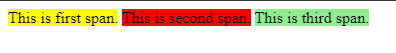
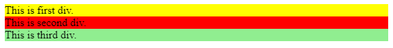
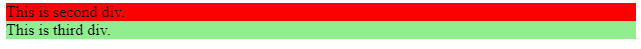

<p align="center"></p> <br>
<h1 align="center">CSS Display Property </h1>

The **Display Property** is an important aspect of the HTML code's presentation because it has a major impact on layouts. In addition, you must use the display property before you can access the different features and values of the new Flexbox and Grid models.

Display property allows us to customize how something appears by default on a web page.

The basic syntax of display property is:

``` css
element{
        display: value;
     }
```
By default, the display value of most elements is either **_block_** or **_inline_**. <hr>

## Display Inline 
When the display property of an element is set to inline, it will not start on a new line and will instead take up the remaining/available screen width. It just occupies the space that such an element would normally occupy.

Some inline elements examples:
* ```<span>```
* ``````
* ```<a>```
* ```<i>```

An example of CSS display inline property:

```
<span style="background-color: yellow;">This is first span.</span>
<span style="background-color: red;">This is second span.</span>
<span style="background-color: lightgreen;">This is third span.</span>
```
Output:



We can see that all the span elements appeared in the same line.

We can not adjust the width and height of an element with an inline display because it doesn't fill the entire screen width.
<hr>

## Display Block

When used in the normal flow, the element creates a block element box with line breaks both before and after it.
A block-level element always begins on a new line and occupies the entire width of the page ((stretches as far as it can to the left and right).

Some block elements examples:
* ```<div>```
* ```<p>```
* ```<section>```
* ```<header>```
* ```<footer>```

An example of CSS display inline property:

```
<div style="background-color: yellow;">This is first div.</div>
<div style="background-color: red;">This is second div.</div>
<div style="background-color: lightgreen;">This is third div.</div>
```
Output:



We can see that all the div elements appeared in different new lines taking full width of the page.

We can adjust the width and height of such elements.
<hr>

## Display Inline-Block

The CSS display: inline-block property combines inline and block-level properties. Inline-block differs from other block types because it responds to width and height properties.

An example of CSS display inline property:
```
<style>
  div{
    display: inline-block;
    height: 30px;
  }
</style>  

<div style="background-color: yellow;">This is first div.</div>
<div style="background-color: red;">This is second div.</div>
<div style="background-color: lightgreen;">This is third div.</div>
```
Output:


We can see that all the div elements appeared on the same line because we have set their display value to inline-block.

<hr>

## Display None
We use the display : none property to hide an element from the page without affecting the layout.
This also implies that screen readers, which make webpages accessible to the blind, will be unable to use the element.

```
<style>
  .hidden{
    display: none;
  }
</style>  

<div class="hidden" style="background-color: yellow;">This is first div.</div>
<div style="background-color: red;">This is second div.</div>
<div style="background-color: lightgreen;">This is third div.</div>
```
Output:

We can see that the div element with display:none property disappeared from the screen and the other div elements have filled its space on the page.

<hr>

## Other Display Properties

* flex
* grid
* table
* run-in
* initial
* inherit
* inline-grid
* inline-flex
* inline-table
* list-item
* table-row
* table-column
* table-column-group
* table-row-group
* table-header-group
* table-footer-group
* table-cell
<hr>

## References
* [W3schools](https://www.w3schools.com/cssref/pr_class_display.asp)
* [GeeksforGeeks](https://www.geeksforgeeks.org/css-display-property/)