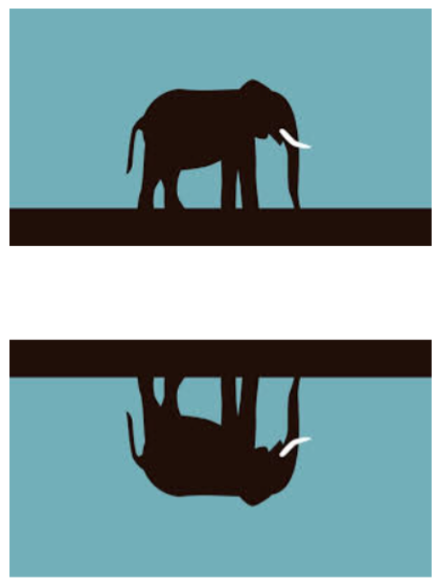

# CSS Image Reflection
The **box-reflect** property is used to reflect an image in CSS.<br>
**box-reflect** can hold the following values:

 - Above
 - Below
 - Left
 - Right
 
 
## Reflection Below The Image

To create a reflection below the image:

```css
img{
    -webkit-box-reflect: below;
}
```


## Reflection To The Right

To create a reflection to the right of the image:

```css
img{
    -webkit-box-reflect: right;
}
```


## Reflection With Offset

To create a reflection with an offset of 75px:

```css
img{
    -webkit-box-reflect:  below 75px;
}
```


## Reflection With Gradient

To create a reflection with a fade-out effect (gradient):

```css
img{
    -webkit-box-reflect:  below 0px linear-gradient(to bottom, rgba(0,0,0,0.2), rgba(0,0,0,0.8));
}
```


## Refrences

 - [W3schools](https://www.w3schools.com/css/css3_image_reflection.asp)
 - [Image Source](https://hatrabbits.com/en/random-image/)


