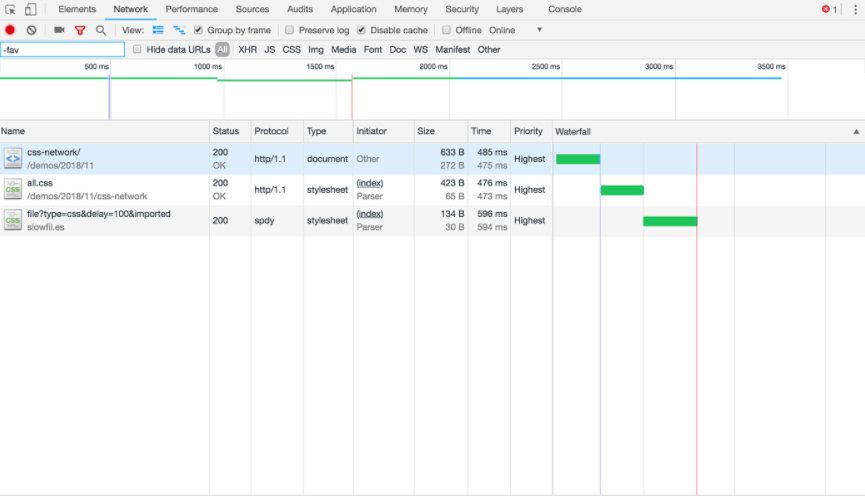

# Introduction
Media Queries is a CSS technique for styling of webpage for different various devices like mobile, desktop etc.
<br>
Media Queries are only applied to the devices whichever has support to it.

## Syntax of Media Queries
```css
@media [media_type] [media_feature]
```
For example :- 
```css
@media screen ( min-width : 320px )
```
<br>

# When to use Media Queries?
- when creating cross platform application or website.
- When debugging website for different resolutions and pixels.

<br>

# Using Media Queries
<details>
<summary>HTML</summary>
<br>

```html
<!-- Serving Different css for different widths -->

<!-- Common css for all types of screens and devices -->
<link rel="stylesheet" href="common_css.css" media="all" />

<!-- Served to screens that are at least 20em wide -->
<link rel="stylesheet" href="small.css" media="(min-width: 20em)" />

<!-- Served to screens that are at least 64em wide -->
<link rel="stylesheet" href="medium.css" media="(min-width: 64em)" />

<!-- Served to screens that are at least 90em wide -->
<link rel="stylesheet" href="large.css" media="(min-width: 90em)" />

<!-- Served to screens that are at least 120em wide -->
<link rel="stylesheet" href="extra-large.css" media="(min-width: 120em)"/>

```

```html
<!-- Defining media query in html tags -->

<picture media="all and (min-width: 500px)">
  <!-- when width is atleast 800px then use this image -->
  <source srcset="girlscript_800px.png" media="(min-width: 800px)">
 <!-- when width is atleast 600px then use this image -->
  <source srcset="girlscript_600.png" media="(min-width: 600px)">

  <!-- when nothing specified then use this image -->
  
</picture>
```
  
</details>

<details>
<summary>CSS</summary>

```css
/* #bada55 background when min width of device is 320px and max width of device is 480px */

@media only screen and (min-device-width: 320px) and (max-device-width: 480px) {
    .girlscript {
        background: #bada55;
    }
}
```

```css
/* Base styles for all screens */
@import url("style.css") screen;

/* Styles for screens in a portrait (narrow) orientation */
@import url('girlscript_landscape_style.css') screen and (orientation: portrait);

/* Print styles */
@import url("girlscript_print_style.css") print;
```

**Note** :- Avoid using ```@import``` by virtue of how it works, is slow. It’s really, really bad for Start Render performance. This is because we’re actively creating more roundtrips on the Critical Path



</details>

<details>
<summary>JavaScript</summary>

```js
// Create a condition that targets viewports at least 768px wide
const mediaQuery = window.matchMedia('(min-width: 768px)')

function handleTabletChange(e) {
  // Check if the media query is true
  if (e.matches) {
    // Then log the following message to the console
    console.log('Media Query Matched!')
  }
}

// Register event listener
mediaQuery.addListener(handleTabletChange)

// Initial check
handleTabletChange(mediaQuery)
```

**Note** :- Old way of using media queries was using a ```resize``` event listener

</details>
<br>

# Breaking down different keywords of syntax
<h2>
<b style="color:skyblue">@media</b> :- It is one of the important At-Rule in CSS.
</h2>
<h4><b style="background:green">At-Rules in CSS :</b> The at-rule is a statement that provides CSS with instructions to perform or how to behave. Each statement begins with an @ followed directly by one of several available keywords that acts as the identifier for what CSS should do. This is the common syntax, though each at-rule is a variation of it.</h4>

<br>

<h2>
<b style="color:skyblue">[media_type]</b> :- Defines the type of media we are trying to access.
</h2>

| Property  | Summary |
| :--- | :--- |
| all:  | Matches all devices  |
| screen: | Matches devices with a screen  |
| print: | Matches documents that are viewed in a print preview or any media that breaks the content up into pages intended to print.  |
| speech: | Matches devices that read the content audibly, such as a screenreader. This replaces the now deprecated aural type since Media  |

<br>

<h2>
<b style="color:skyblue">[media feature]</b> :- Defines the type of media we are trying to match.
<br>
</h2>

| Property  | Summary |
| :--- | :--- |
| width  | Defines the widths of the viewport It can be specific number (e.g. 400px) or a range (using min-width and max-width).  |
| aspect-ratio | Defines the width-to-height aspect ratio of the viewport  |
| overflow-block | Checks how the device treats content that overflows  |
| orientation | The way the screen is oriented i.e. portrait or landscape  |

<br>
<br>

**Note** :- We have a lot more media features such as ```resolution```	,
```Scan```	,
```grid```	,
```update```	,
```environment```-	,
```blending```	,
```display - mode```	,
```color```	,
```color- index```	,
```monochrome```	,
```color -gamut	```,
```dynamic-	range	```,
```inverted-	colors```	,
```pointer```	,
```hover```	,
```any-pointer```	,
```any-	hover```.

<br>
<br>

# Media Query Operators
## **```and```** operator
```css
/* Matches screen between 320px AND 768px */
@media screen (min-width: 320px) and (max-width: 768px) {
  .element {
    /* Styles! */
  }
}
```

## **```or```** operator
```css
/* Matches screens where either the user prefers dark mode or the screen is at least 1200px wide */
@media screen (prefers-color-scheme: dark), (min-width 1200px) {
  .element {
    /* Styles! */
  }
}
```

## **```not```** operator
```css
@media print and ( not(color) ) {
  body {
    background-color: none;
  }
}
```

# Nesting of media queries
```css
@media (min-width: 20em), not all and (min-height: 40em) {  
  @media not all and (pointer: none) { ... }
  @media screen and ( (min-width: 50em) and (orientation: landscape) ), print and ( not (color) ) { ... }
}
```
