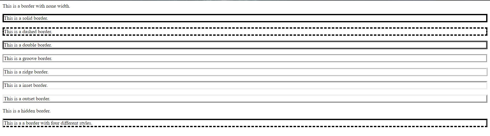
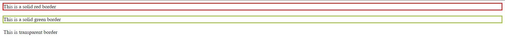
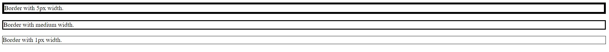
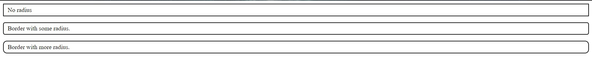

## CSS Borders

The CSS border is a shorthand property used to set the border on an element.

The border property is a shorthand syntax in CSS that accepts multiple values for drawing a line around the element it is applied to.

The CSS border properties are given below :

- border-style
- border-color
- border-width
- border-radius

### **border-style**

The Border style property is used to specify the border type which you want to display on the web page. There are some border style values which are used with border-style property to define a border.

```html
<html>
  <head> </head>

  <body>
    <p style="border-width:4px; border-style:none;">
      This is a border with none width.
    </p>

    <p style="border-width:4px; border-style:solid;">This is a solid border.</p>

    <p style="border-width:4px; border-style:dashed;">
      This is a dashed border.
    </p>

    <p style="border-width:4px; border-style:double;">
      This is a double border.
    </p>

    <p style="border-width:4px; border-style:groove;">
      This is a groove border.
    </p>

    <p style="border-width:4px; border-style:ridge">This is a ridge border.</p>

    <p style="border-width:4px; border-style:inset;">This is a inset border.</p>

    <p style="border-width:4px; border-style:outset;">
      This is a outset border.
    </p>

    <p style="border-width:4px; border-style:hidden;">
      This is a hidden border.
    </p>

    <p
      style="border-width:4px;
         border-top-style:solid;
         border-bottom-style:dashed;
         border-left-style:groove;
         border-right-style:double;"
    >
      This is a a border with four different styles.
    </p>
  </body>
</html>
```

The above html snippet shows the different styles of borders:



### **border-color**

This property is used to set the color of border. You can use any format like name, HEX or RGB.

There is also a border color named "transparent". If the border color is not set it is inherited from the color property of the element.

```html
<html>
  <head>
    <style>
      p.one {
        border-style: solid;
        border-color: red;
      }
      p.two {
        border-style: solid;
        border-color: #98bf21;
      }
      p.three {
        border-style: solid;
        border-color: transparent;
      }
    </style>
  </head>
  <body>
    <p class="one">This is a solid red border</p>
    <p class="two">This is a solid green border</p>
    <p class="three">This is transparent border</p>
  </body>
</html>
```

The above html snippet would look something like this:



### **border-width**

The border-width property specifies the width of the four borders. You can also use the one of the three pre-defined values, thin, medium or thick to set the width of the border.

```html
<html>
  <head>
    <style>
      p.one {
        border-style: solid;
        border-width: 5px;
      }
      p.two {
        border-style: solid;
        border-width: medium;
      }
      p.three {
        border-style: solid;
        border-width: 1px;
      }
    </style>
  </head>
  <body>
    <p class="one">Border with 5px width.</p>
    <p class="two">Border with medium width.</p>
    <p class="three">Border with 1px width.</p>
  </body>
</html>
```

The above html snippet would look something like this:



### **border-radius**

The border-radius property is used to add rounded borders to an element.

```html
<html>
  <head>
    <style>
      p {
        border-width: 2px;
        border-style: solid;
        padding: 5px 10px;
      }
      p.one {
        border-radius: 0px;
      }
      p.two {
        border-radius: 5px;
      }
      p.three {
        border-radius: 10px;
      }
    </style>
  </head>
  <body>
    <p class="one">No radius</p>
    <p class="two">Border with some radius.</p>
    <p class="three">Border with more radius.</p>
  </body>
</html>
```

The above html snippet would look something like this:



### Border Shorthand

Border shorthand is a css technique used to give border without giving value to each border property.

Syntax:

```css
border: 1px solid red;
```

This will give you a border of width 1px with solid style and red color.
