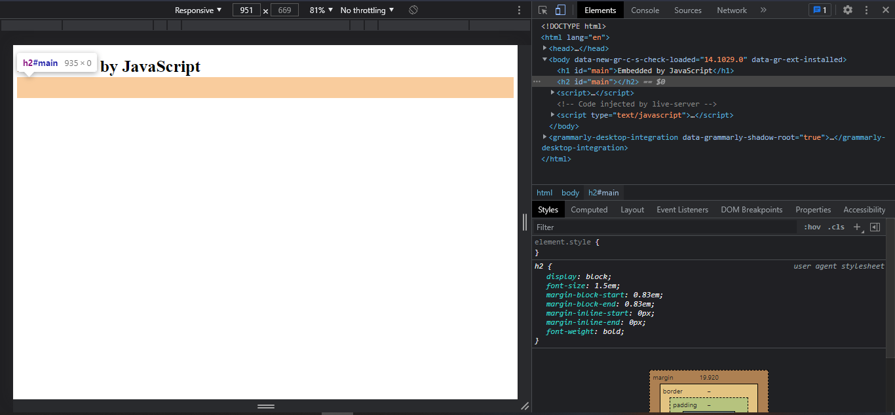

# CSS Classes and IDs

CSS Classes and IDs are the selectors used to define the properties of a particular HTML element. This documentation explains the syntax and differences between ID and class in CSS along with the examples.

## 1. CSS Classes
CSS Classes are used to define the particular HTML element's styling. It is written with the period (`.`) along with the class name in the CSS file.
<br>
In the HTML file, it is initialised with the attribute name `class` inside the HTML tag.

For example,<br> 
In HTML file

``` HTML

<h1 class = "redHeading">I am red.</h1>
<h2 class = "blueHeading">I am blue.</h2>

```

In CSS file
 ``` CSS
.redHeading {
    color: #FF0000;
}

.blueHeading {
    color: #0000FF
}
 ```

 <br>

 Output is <br>
 


 <b>Note: </b>
 The CSS classes can be used repeatedly to any part of the HTML file.

 For example, 

``` HTML
<h1 class = "redHeading">Red</h1>
<h2 class = "redHeading">Also Red</h2> 
```

Output is <br>


<br>

## 2. CSS IDs
CSS IDs are pretty similar to the CSS classes, except the fact IDs **can't** be reused.
<br>
IDs are the unique identifer to the HTML element which can be used once.
<br>
In CSS files, it is written with the hashtag (`#`) followed by the id name. In HTML file, it is initialised by using `id` attribute inside the HTML element.

For example, <br>
In HTML file

``` HTML
<h1 id = "myHeading">I am green</h1>
```

In CSS file

``` CSS
#myHeading {
    color: #008000;
    font-family: "Comic Sans MS";
}
```

Output is <br>


<b>Note: </b>
As mentioned above, IDs can't be used repeatedly and this can't be realised within HTML and CSS, but this property is significant while using JavaScript. While using the function `document.getElementById("id_name")`.

For example, <br>

In HTML file

``` HTML
<h1 id = "main"></h1>
<h2 id = "main"></h2>
```

In JavaScript 

``` JavaScript
"use strict";
let x = document.getElementById("main");
x.innerHTML = "Embedded by JavaScript";
```

Output is <br>


In the above output, only the first heading is visible and the `<h2>` is not visible if the ID name is same.

On inspecting the element in any suitable browser, <br>


The `<h2>` content is not visible on inspecting.
<br>

Therefore, IDs are supposed to be used once.


# Differences between CSS IDs and CSS Classes

1. CSS classes can be reused whereas IDs can be used only once.
2. In CSS files, class is initialised using period (`.`) and IDs with hashtags (`#`).

# References
1. https://www.w3schools.com/html/html_id.asp
2. https://www.w3schools.com/cssref/sel_class.asp
3. https://www.geeksforgeeks.org/difference-between-an-id-and-class-in-html/
4. https://developer.mozilla.org/en-US/docs/Learn/CSS/Building_blocks/Selectors/Type_Class_and_ID_Selectors


<b>Contributors: </b> [Subhendu Dash](https://github.com/subhendudash02)