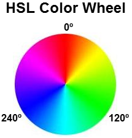
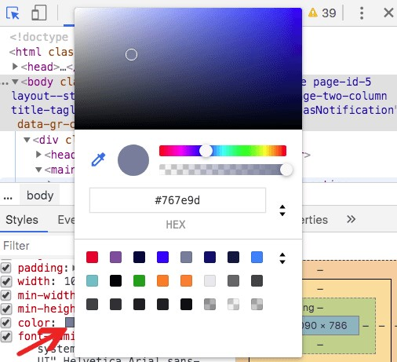
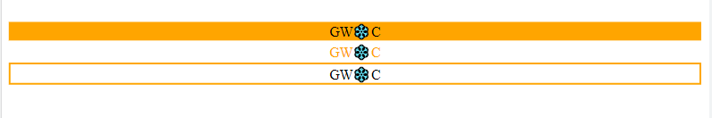

# Colors in CSS 
Colors make webpages look beautiful🌈.You can design your webpage by adding colors of your choice✨.Here I've discussed the different ways in which you can add colors to your webpage.CSS **color** property is used to add color to an element while styling it🎨. eg-
```
.div{
    color: white;
}
```
There are different ways in which we can specify the color of text,background,border etc. using CSS   
We can specify color value using-  
- Predefined color name  
- RGB  
- RGBA  
- HEX  
- HSL  
- HSLA  
- Color picker
### Using predefined color names  
There are many predefined color names which any modern browser supports like Orange, Cyan, DeepPink, Aquamarine to name a few.
You can find a list of predefined color names [here](https://w3schools.sinsixx.com/css/css_colornames.asp.htm). eg-
```
p{
    color: salmon;
}
```
### Using RGB value  
rgb represents **RED**, **GREEN**, **BLUE** light sources. 
Color using rgb value can be specified using - ***rgb(red,green,blue)*** where value of ***red***, ***green***, ***blue*** can range from **0-255** **(or a percentage value 0-100%)** depending on the intensity of these colors in the final color we want to create.  
#### rgb value for some common colors -  
- rgb(255,0,0) is red  
- rgb(0,0,255) is blue  
- rgb(255,255,255) is black  
- rgb(0,0,0) or rgb(100%,100%,100%) is white  

For finding the rgb values of different colors you can refer to this [list](https://www.w3.org/wiki/CSS/Properties/color/keywords). eg-
```
p{
    color: rgb(60,179,113);
}
```  
### Using RGBA value  
rgba is an extension of rbg with an additional ***a(alpha)*** parameter which specifies the opacity of a color.Color using rgba value can be specified using - ***rgba(red,green,blue,alpha)*** where value of alpha ranges between **0.0 (fully transparent) and 1.0 (opaque)** . eg-
```
p{
    color: rgb(60,179,113,0.5);
}
```  
### Using HEX value  
HEX Color is of the form **#rrggbb** where ***rr(red), gg(green), bb(blue)*** are hexadecimal values between **00 and ff**.eg-  

```
p{
    color: #40e0d0;
}
```   
#### Hex value for some common colors -  
- #ff0000 is red  
- #000000 is black
- #ffffff is white  
- ##ffc0cb is pink  
 
We may also use 3 digit hex code which is a shorthand for 6 digit hex code and is of the form ***#rgb***. This can only be used when both the values (rr,gg,and bb) are the same for each components. So,if we have #ffddcc,it can be written as: #fdc.  
### Using HSL value  
Another way to specify color using CSS is to use ***hsl(hue,saturation,lightness)***  
Hue is a degree on the color wheel from 0 to 360. 0 is red, 120 is green, and 240 is blue. 


  [Image credit](https://stackoverflow.com/questions/35816179/calculation-algorithm-to-mix-3-hsl-colors)

Saturation(or intensity of color) is a percentage value, 0% means completely gray(color not visible), and 100% is the pure color i.e. no shade of gray.  
Lightness is also a percentage that describes how much light you want to give the color, 0% means no light(black), 50% is neither light or dark, 100% means full lightness(white).eg-  

```
p{
    color: hsl(0, 100%, 50%);
}
```    
### Using HSLA value 
hsla is an extension of hsl with an additional ***a(alpha)*** parameter which specifies the opacity of a color.Color using hsla value can be specified using - ***hsla(hue,saturation,lightness,alpha)*** where value of alpha ranges between **0.0 (fully transparent) and 1.0 (opaque)**.eg-  

```
p{
    color: hsla(9,100%,64%,0.6);
}
```  
### Using Color Picker  
The easiest and most appropriate way to choose color is by using color picker.Pick the color by clicking and dragging your cursor inside the picker area to highlight a color.After selecting a color, experiment with different harmonies by using the dropdown below the color picker.  

    [Image credit](https://www.digitalocean.com/community/tutorials/devtools-color-picker)
## Adding Background Color, Text Color and Border Color🟠🟡🟢  
We can add color to background,text and/or border using CSS.eg-  

```
<!DOCTYPE html>
<html lang="en">
<head>
    <style>
    <!-- adding background color -->
    .bg{
        background-color: orange;
        text-align: center;
    }
    <!-- adding text color -->
    .txt{
        margin-top: 2px;
        color: orange;
        text-align: center;
    }
    <!-- adding border color -->
    .brdr{
        margin-top: 2px;
        border: 2px solid orange;
        text-align: center;
    }
    </style>
</head>
<body>
    <div class="bg">GW❄️C</div>
    <div class ="txt">GW❄️C</div>
    <div class="brdr">GW❄️C</div>
</body>
</html>
```  
### Output  
  
### Reference  
https://www.w3schools.com/css/css_colors.asp  
https://developer.mozilla.org/en-US/docs/Web/CSS/color  
https://www.w3.org/wiki/CSS/Properties/color/keywords  
https://w3schools.sinsixx.com/css/css_colornames.asp.htm
## Contributed by Arpita Gupta 😊
