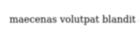
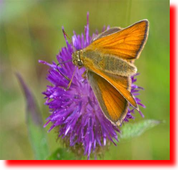
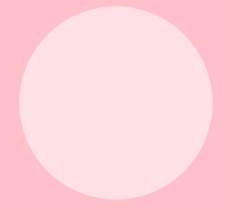

# Filter property in CSS

Filter is a property in CSS(Cascading Style Sheets).

## How it works

The filter property applies visual effects to the contents of your website, making it equivalent to that of a Graphic design tool.

> Let’s start with a web page. When it starts to loads, it renders content and styling is applied, naturally. Filters are applied after everything else but still before the page is fully loaded. The filters actually take a snapshot of the content so that they can perform their duties and redisplay the altered content on top of the original. **Source - [Design modo](https://designmodo.com/css-filters/)**

## Usage

Filter property comes with functions which take in length values as parameters based on which the content of the website will be altered. If the value of the filter property is *none* or the input value is invalid, the content will be unaltered. If the value is *initial* the default value is used and for *inherit*, the filter value of the parent element will be applied. More than one function can be used simultaneously.

## Functions

- blur
- brightness
- contrast
- drop-shadow
- grayscale
- hue-rotate
- invert
- opacity
- saturate
- sepia
- url

### Blur

Applying blur effect reduces the visibilty of the content of your website. Default value is 0. It applies *Gaussian blur* effect. Gaussian blur uses the *Gaussian function* to blur the content of your website.



The above image shows a *blurred text* of **1px**.

```css
filter : blur(1px);
```

> Blur effect can be used for a variety of purposes. To know more about this, read the 7 Ways to use a Gaussian Blur section by **[Design shacks](https://designshack.net/articles/trends/gaussian-blur/)**.

### Brightness

Brightening your image lightens up your image. It takes in only positive values. The value defines the amount of brightness in the content of the website. 0% displays a dim image while 100% displays the original image and a value above 100% displayes a brightened image.


The above image shows a *brightness* of **160%**.

```css
filter : brightness(160%);
```

### Contrast

Applying contrast effect to your image brightens the colors in the image such that they highly contrast each other. A web page should have sufficient contrast which allows for readability.


The above image shows a *contrast* of **500%**.

```css
filter : contrast(500%);
```

### Drop-shadow

Drop-shadow function is works similarily as the box-shadow property in CSS except the former does not have a value for spread radius and for inset. Drop-shadow function takes in 4 values, x-offset, y-offset, blur-radius and color of the shadow. x-offset determines the movement of the shadow in the horizontal position, y-offset determines the movement of the shadow in the vertical position, blur-radius functions similarily like the blur function and color determines the color of the shadow. Both x-offset and y-offset function like a cartesian plane, where a positive value moves the shadow upwards or right and a negative value moves the shadow downwards or left away from the center part.



The above image shows a image where drop-shadow has been applied.

```css
filter : drop-shadow(10px 10px 4px red);
```

### Grayscale

Using grayscale function to your content of your site makes it appear greyish. It takes in only positive values. 0% produces a unaltered content.


The above image shows a grayscale of **100%**.

```css
filter : grayscale(100%);
```

### Hue-rotate

Using hue-rotate function to the content of your website shifts the colors in the content according to the color wheel by the specified angle. 0 and 360 degrees produce an unaltered image.

> What it does is shift the colors around to make an input image look completely different. If you can imagine a color spectrum going from red to violet around a color wheel, then this effect takes the original color on the wheel as input and rotates it by the ‘angle’ parameter to produce the color on the wheel to which it rotated as the output color value. So all the colors in the image are shifted by the same 'angle' on the wheel.
> **Source - [html5rocks](https://www.html5rocks.com/en/tutorials/filters/understanding-css/)**


The above image shows a image of hue-rotation of **134 degrees**.

```css
filter : hue-rotate(134deg);
```

### Invert

Using invert function gives negative effect like from the olden days. 0% produces an unaltered content and 100% is the maximum value.


The above image shows an inversion of **100%**.

```css
filter : invert(100%);
```

### Opacity

Opacity deals with the transparency of the content. 0% makes it completely transparent whilst 100% makes it completely opaque.



The above image shows a circle of opacity **50%**.

```css
filter : opacity(50%);
```

### Saturate

Applying saturate effect to the content of your site will alter the intensity of the colors. It takes in only positive values. 0% will produce a un-saturated content, 100% will produce an unaltered content and above 100% will produce super-saturated content.

> Color saturation refers to how vivid, rich, or intense a color is. It is one of the three elements of color, with the other two being hue and value.
> **Source - [drawpaintacademy](https://drawpaintacademy.com/color-saturation/)**


The above image shows an image of **0%** saturation.

```css
filter : saturate(0%);
```

### Sepia

Applying sepia effect to the content of your website gives it rustic brown tinge of color to it. It takes in only positive values. 0% produces an unaltered content and 100% applies full sepia effect.


The above image shows an image of **100%** sepia effect.

```css
filter : sepia(100%);
```

### Url

> Url function takes the location of an XML file that specifies an SVG filter, and may include an anchor to a specific filter element. **Source - [w3docs](https://www.w3docs.com/learn-css/filter.html)**

## CSS Extensions

Every browser uses a browser engine to render and display the input html,css and js files.

> A browser engine (also known as a layout engine or rendering engine) is a core software component of every major web browser. The primary job of a browser engine is to transform HTML documents and other resources of a web page into an interactive visual representation on a user's device. **Source - [wikipedia](https://en.wikipedia.org/wiki/Browser_engine)**

Different browsers use different browser engines to render content. Due to this there may be some issues in displaying the content as intended. Hence we use CSS prefixes to avoid this issue.

Here is the list of the browsers and their CSS prefixes

Browser | CSS prefixes
------- | ---------------
Google Chrome | -webkit-
Safari | -webkit-
Mozilla Firefox | -moz-
Opera | -o-
Microsoft Internet Explorer | -ms-

```css
-webkit-column-fill: 2em; /* for chrome*/
-o-column-fill: 2em;      /*for opera*/
-moz-column-fill: 2em;    /*for mozilla*/
-ms-column-fill: 2em;     /*for internet explorer*/
column-fill: 2em;         /*the unprefixed version*/
```

CSS properties starting with -webkit-, -moz- etc.,. prefix are called vendor-prefixed properties. These prefixes are used in the CSS properties and Javascript API's to experiment and debug newly created features in browsers before fully releasing a official non-prefixed version.

## Browser Compatibilty

Eventhough Filter property in CSS is supported in most of the browsers, some older versions of the browsers dont support it. Visit [here](https://caniuse.com/mdn-css_properties_filter) to know more about this.

**For more reference about CSS Filters visit [MDN Docs](https://developer.mozilla.org/en-US/docs/Web/CSS/filter)**
