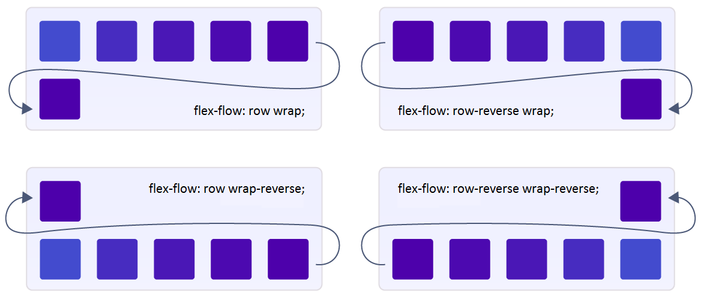

# CSS Flexbox

## What is  CSS Flexbox?
The Flexible Box Module, usually referred to as flexbox, was designed as a one-dimensional layout model, and as a method that could offer space distribution between items in an interface and powerful alignment capabilities.

The main idea behind the flex layout is to give the container the ability to alter its items’ width/height (and order) to best fill the available space (mostly to accommodate to all kind of display devices and screen sizes). A flex container expands items to fill available free space or shrinks them to prevent overflow.

## Basic Layout and terminology of Flex Box
Since flexbox is a whole module and not a single property, it involves a lot of things including its whole set of properties. Some of them are meant to be set on the container (parent element, known as “flex container”) whereas the others are meant to be set on the children (said “flex items”).

If “regular” layout is based on both block and inline flow directions, the flex layout is based on “flex-flow directions”. Please have a look at this figure from the specification, explaining the main idea behind the flex layout.


Items will be laid out following either the `main axis` (from `main-start` to `main-end`) or the cross axis (from `cross-start` to `cross-end`).

## Flexbox Properties
 In flexbox layout there are many properties. Some properties are for Parent i.e. "flex-container" and Some properties are difined for child i.e. "flex-items"

 

Now lets talk about those properties one by one.

## 1.Properties for Parent ( flex container ):
### Display:
This propery defines the flex container.
Code Syntax:
```css
.container  {  display: flex;  /* or inline-flex */  } 

```
### A) Flex Direction:
his is the property that allows us to define our main axis. Remember I mentioned that our main axis can be horizontal or vertical. So if we want the main axis to be horizontal, that's called  **row**. And if we want it to be vertical, that's called  **column**. Also, remember we had a  **main start**  and  **main end**. We simply add a  `reverse`  suffix to set our "main start" in the reverse direction.

CSS Syntax:
```css
.container {
  flex-direction: row /* default */
               or row-reverse
               or column
               or column-reverse
}
```
##### See the image for better understanding:


### B) Flex Wrap:
By default, flex items will try to shrink itself to fit onto one line, in other words,  `no wrap`. However if you want the flex items to maintain its size and have the overflow spread on multiple lines in the containers, then you can turn on  `wrap`.

This property is what will allow flex items in your container to occupy more than one line.
 CSS Syntax:
 ```css
 .parent {
  flex-wrap: nowrap /* default */
          or wrap
          or wrap-reverse
}
```
##### See the image for better understanding:


### C) Flex Flow:
So we've learned  `flex-direction`  and  `flex-wrap`. If you understand those 2, you'll get  `flex-flow`! Because it's just a shorthand for these two properties  👏

You can set both properties at the same time. Or you can just pass one of them. The default value is  `row nowrap`. So if you just set one value, the property that you didn't set will just take on the default value.

CSS Syntax:
```css
.container {
  flex-flow: row nowrap /* default */
          or <flex-direction> <flex-wrap>
          or <flex-direction>
          or <flex-wrap>
}
```
##### See the image for better under standing



### D) Justify Content
This defines the alignment along the main axis. It helps distribute extra free space leftover when either all the flex items on a line are inflexible, or are flexible but have reached their maximum size. It also exerts some control over the alignment of items when they overflow the line.

CSS Syntax:
```css
.container  { 
         justify-content: flex-start  
                           or flex-end
                           or center 
                           or space-between
                           or space-around 
                           or space-evenly  
 }
 ```
 

 -   `flex-start`  (default): items are packed toward the start of the flex-direction.
 -   `flex-end`: items are packed toward the end of the flex-direction.
 -   `space-between`: items are evenly distributed in the line; first item is on the start line, last item on the end line
 -    `space-around`: items are evenly distributed in the line with equal space around them. Note that visually the spaces aren’t equal, since all the items have equal space on both sides. The first item will have one unit of space against the container edge, but two units of space between the next item because that next item has its own spacing that applies.
 -   `center`: items are centered along the line
 -   `space-evenly`: items are distributed so that the spacing between any two items (and the space to the edges) is equal.
 
 ##### See the image for better understanding:

 
#### Space Around vs Space Evenly:
##### Let took a colser look into the picture for better understanding of `space-around` and `space-evenly`

In `space-evenly`, the empty space in between the flex items is always equal. However, in `space-around`, only the inner items will have equal spacing in between each other. The first and last item will only be allocated half the spacing.

#### E) Align Items
The `align-items` property is used to align the flex items.
CSS Syntax:
```css
.parent {
  flex-direction: column;
  
  align-items: stretch /* default */
            or flex-start
            or flex-end
            or center
            or baseline
}
```
Here we make the flex direction as row. this propererty is also applicable for coloum also. Then it will be aligned according to the main-axis(top to bottom)
##### See the image for better understanding:
 

### E) Align content:
Remember we had `flex-wrap` where we allow flex items to wrap on separate lines. Well, with `align-content` we can control how those row of items are aligned on the cross axis. Since this is only for wrapped items, this property won't have any effect if you only have a singular line of flex items.
CSS Syntax:
```css
.container {
  align-content: stretch /* default */
              or flex-start
              or flex-end
              or center
              or space-between
              or space-around
}
```
##### See the picture for better understanding:


## 2)Properties for child(flex-item)
### A) Order:
 By default, flex items are displayed in the same order they appear in your code. But what if you want to change that? No problem! Use the `order` property to change the ordering of your items 🔢. By setting the order for child items we can display them according the order means the highest order element  would be in the last and the lowest order element in the first.
 CSS syntax:
 ```css
 #item_id {
  order: 0 /* default */
      or <number>
}
```
##### See the picture for better uderstanding:


### B) Flex Grow:
We mentioned in the beginning that Flexbox is great for responsive design. This is where it shines. The `flex-grow` property allows our flex item to grow if necessary. So if there is extra free space in my container, we can tell a particular item to fill it up based on some proportion. That's pretty nuts! When We was learning CSS, we remember everything is pretty static. Now with this property, it's like it has its own brain and it will adjust its size depending on the container. That's so great. We don't have to monitor the size. It will adjust accordingly.
CSS Syntax:
```css
#item_id  {  flex-grow:  4;  /* default 0 */  }
```
##### See the image for better under standing


### C) Flex Shrink
So `flex-grow` will expand to fill the extra space if there are any. The opposite of that is `flex-shrink`. What happens when you run out of space. This is the property that controls how much your flex items will shrink to fit. Note the larger the number, the more it will shrink 👍
CSS Syntax:
```css
#item_id {
  flex-shrink: 1 /* default */
            or <number>
}
```
##### See the image for better understanding:


### D) Flex Basis
The `flex-basis` property specifies the initial length of a flexible item.
CSS Syntax:
```css
.child {
  flex-basis: auto /* default */
           or <width>
}
```
##### See the image for better understanding:


### E)Align Self:
Remember our `align-items` property where we can set the flex item along the cross axis. The thing with `align-items` is that it forces ALL of the flex items to play with the rules. But what if you want one of them to break the rule. No worries, for you independent thinkers, you can use `align-self`. This property accepts all of the same values given to `align-items`, so you can easily break from the pack 
CSS Syntax:
```css
#item_id {
  align-self: stretch /* default */
           or flex-start
           or flex-end
           or center
           or baseline
}
```
##### See the image for better under standing:


### F) Flex:
It is a short hand for `flex-grow,`  `flex-shrink` and `flex-basis`. To write the all properties at once for a specific flex item you can use this short hand.
CSS Syntax:
```css
#item_id {
  flex: 0 1 auto /* default */
     or <flex-grow> <flex-shrink> <flex-basis>
     or <flex-grow>
     or <flex-basis>
     or <flex-grow> <flex-basis>
     or <flex-grow> <flex-shrink>
}
```

`NOTE:`As properties for flex items is specific for particular items so rather than using class use id for each flex element.

#### Summery:
Here is the simple documentation about flexbox. You can go throgh the code syntax and implement according to you.
