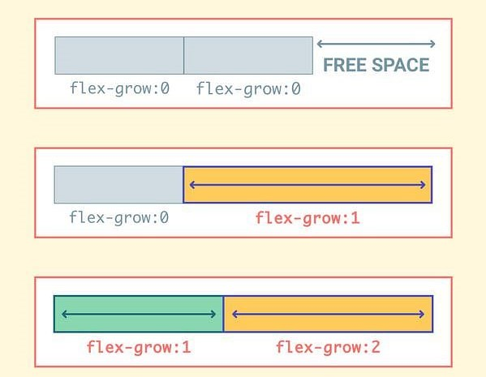

# CSS Flexbox

## What is  CSS Flexbox?
The Flexible Box Module, usually referred to as flexbox, was designed as a one-dimensional layout model, that could offer different properties for good and responsive web designing.

Flexbox is a useful and powerful property in CSS. This gives us the flexibility to design our containers according to our needs easily. 

## Basic Layout and terminology of Flexbox:
Flexbox is a whole module with a set of properties. By using those properties we can design our container(parent) and items(child) of the container(parent). Please look into that given picture to visualize the basic layout of Flexbox.


###### Image Source:https://blog.zipboard.co/getting-started-with-css-flexbox-f5b2b5a5b87d

Items will be laid out following either the `main axis` (from `main-start` to `main-end`) or the cross axis (from `cross-start` to `cross-end`).

## Flexbox Properties
 In flexbox layout, there are many properties. Some properties are for parents i.e. "flex-container" and Some properties are defined for child i.e. "flex-items"

 
 ###### Image Source:https://samanthaming.gumlet.io/flexbox30/29-flexbox-properties.jpg.gz

Now let us talk about those properties one by one.

## 1.Properties for Parent ( flex container ):
### Display:
This property defines the flex container.
CSS Syntax:
```css
.container  {  display: flex;  /* or inline-flex */  } 

```
### A) Flex Direction:
This is the property by which we define our main axis. Don't forget that I said our main axis can be horizontal or vertical. So for the main axis to be horizontal, it's called **row**. And if it's going to be vertical, it's called **column**. Also, remember we had a  **main start**  and  **main end**. We just add a `reverse` suffix to define our "main start" in the reverse direction.

CSS Syntax:
```css
.container {
  flex-direction: row /* default */
               or row-reverse
               or column
               or column-reverse
}
```
##### See the image for better understanding:

###### Image Source:https://samanthaming.gumlet.io/flexbox30/9-flex-direction.jpg.gz


### B) Flex Wrap:
By default, flex items will try to shrink themselves to fit onto one line, in other words,  `no wrap`. However, if you want the flex items to maintain their size and have the overflow spread on multiple lines in the containers, then you can turn on  `wrap`.

This property is what will allow flex items in your container to occupy more than one line.
 CSS Syntax:
 ```css
 .parent {
  flex-wrap: nowrap /* default */
          or wrap
          or wrap-reverse
}
```
##### See the image for better understanding:


###### Image Source:https://samanthaming.gumlet.io/flexbox30/10-flex-wrap.jpg.gz


### C) Flex Flow:
So we learned `flex-direction` and `flex-wrap`. If you understand both, you will get `flex-flow`! Because it's just a shorthand for these two properties.

You can set both properties at the same time. Or you can go over one of them. The default is `row nowrap`. So if you just set a value, the property you haven't set will just take the default value.

CSS Syntax:
```css
.container {
  flex-flow: row nowrap /* default */
          or flex-direction flex-wrap
          or flex-direction
          or flex-wrap
}
```
##### See the image for better under standing

###### Image Source:https://i.stack.imgur.com/6vtqd.png


### D) Justify Content
It defines the alignment along the main axis. It makes it possible to distribute the additional free space remaining when either all flex elements on a line are inflexible, or are flexible but have reached their maximum size. It also provides some control over the alignment of items when they cross the line.

CSS Syntax:
```css
.container  { 
         justify-content: flex-start  
                           or flex-end
                           or center 
                           or space-between
                           or space-around 
                           or space-evenly  
 }
 ```
 

 -   `flex-start`  (default): Items are packed toward the start of the flex-direction.
 -   `flex-end`: Items are packed toward the end of the flex-direction.
 -   `space-between`: Items are evenly distributed in the line; first item is on the start line, last item on the end line
 -    `space-around`: Items are evenly distributed in the line with equal space around them. Note that visually the spaces are not equal, beacuse all the items have equal space on both sides. The first item will have one unit of space against the container edge, but two units of space between the next item because that next item has its own spacing that applies.
 -   `center`: items are centered along the line
 -   `space-evenly`: items are distributed so that the spacing between any two items (and the space to the edges) is equal.
 
 ##### See the image for better understanding:

###### Image Source:https://academy.pega.com/sites/default/files/styles/1024/public/media/images/2020-09/Screen%20Shot%202020-09-15%20at%206.07.44%20PM.png?itok=h9VRYU27
 
#### Space Around vs Space Evenly:
##### Let took a colser look into the picture for better understanding of `space-around` and `space-evenly`

###### Image source:https://codetheweb.blog/assets/img/posts/css-flexboxes/justify-content-space-around-evenly-comparison.png
In `space-evenly`, the empty space in between the flex items is always equal. However, in `space-around`, only the inner items will have equal spacing in between each other. The first and last element will be allocated half of the spacing.

#### E) Align Items
The `align-items` property is used to align the flex items.
CSS Syntax:
```css
.parent {
  flex-direction: column;
  
  align-items: stretch /* default */
            or flex-start
            or flex-end
            or center
            or baseline
}
```
Here we make the flex direction as row. this propererty is also applicable for coloum also. Then it will be aligned according to the main-axis(top to bottom)
##### See the image for better understanding:
 
###### Image Source:https://samanthaming.gumlet.io/flexbox30/15-align-items-row.jpg.gz

### E) Align content:
Remember, we had `flex-wrap` where we allow flex items to wrap on separate lines. Well, with `align-content`, we can control how those rows of items line up on the transverse axis. Since this is only for wrapping items, this property won't have any effect if you only have a singular line of flex items.
CSS Syntax:
```css
.container {
  align-content: stretch /* default */
              or flex-start
              or flex-end
              or center
              or space-between
              or space-around
}
```
##### See the picture for better understanding:

###### Image Source:https://samanthaming.gumlet.io/flexbox30/18-align-content.jpg.gz

## 2)Properties for child(flex-item)
### A) Order:
 By default, flex items are displayed in the same order they appear in your code. But what if you want to change that? No problem! Use the `order` property to change the ordering of your items 🔢. By setting the order for each item we can display them according to the order means the highest order element would be in the last and the lowest order element would be in the first.
 CSS syntax:
 ```css
 #item_id {
  order: 0 /* default */
      or any-number
}
```
##### See the picture for better uderstanding:

###### Image Source:https://coursesweb.net/addons/css/flexbox-order.jpg


### B) Flex Grow:
Flexbox is ideally suited to responsive design. The `flex-grow` property enables our flex item to grow as necessary. So if there is extra free space in my container, we can tell a particular item to fill it up based on some proportion.When we were learning CSS, we remember everything is pretty static. Now, with this property, it will adjust its size to suit the container. That's so great. We don't have to monitor the size. It will fit accordingly.
CSS Syntax:
```css
#item_id  {  flex-grow:  4;  /* default 0 */ 
                        or any-number
}
```
##### See the image for better under standing

###### Image Source:https://samanthaming.gumlet.io/flexbox30/21-flex-grow.jpg.gz?format=auto

### C) Flex Shrink
So `flex-grow` will expand to fill the extra space if there are any. The opposite of that is `flex-shrink`. What happens when you run out of space. This is the property that controls how much your flex items will shrink to fit. Note the larger the number, the more it will shrink 👍
CSS Syntax:
```css
#item_id {
  flex-shrink: 1 /* default */
            or any-number
}
```
##### See the image for better understanding:

###### Image Source:https://samanthaming.gumlet.io/flexbox30/23-flex-shrink.jpg.gz?format=auto

### D) Flex Basis
The `flex-basis` property specifies the initial length of a flexible item.
CSS Syntax:
```css
#item_id{
  flex-basis: auto /* default */
           or width (unit in px, %, em, rem so on)
}
```
##### See the image for better understanding:

###### Image Source:https://samanthaming.gumlet.io/flexbox30/25-flex-basis.jpg.gz?format=auto


### E)Align Self:
Works like `align-items`, but applies only to a single flexbox item, instead of all of them.
CSS Syntax:
```css
#item_id {
  align-self: stretch /* default */
           or flex-start
           or flex-end
           or center
           or baseline
}
```
##### See the image for better under standing:

###### Image Source:https://samanthaming.gumlet.io/flexbox30/28-align-self.jpg.gz

### F) Flex:
It is a shorthand for `flex-grow,`  `flex-shrink` and `flex-basis`. To write all properties at once for a specific flex item you can use this shorthand.
CSS Syntax:
```css
#item_id {
  flex: 0 1 auto /* default */
     or flex-grow flex-shrink flex-basis
     or flex-grow
     or flex-basis
     or flex-grow flex-basis
     or flex-grow flex-shrink
}
```

`NOTE:`As properties for flex items is specific for particular items so rather than using class use id for each flex element.

## Summary:
Here is the simple documentation about flexbox. You can go through the code syntax and implement it according to you.

#### Reference links:
- https://developer.mozilla.org/en-US/docs/Learn/CSS/CSS_layout/Flexbox
- https://www.w3schools.com/css/css3_flexbox.asp
- https://blog.zipboard.co/getting-started-with-css-flexbox-f5b2b5a5b87d
- https://stackoverflow.com/questions/59481712/flexbox-reverse-direction-on-wrap-snake-wrap
