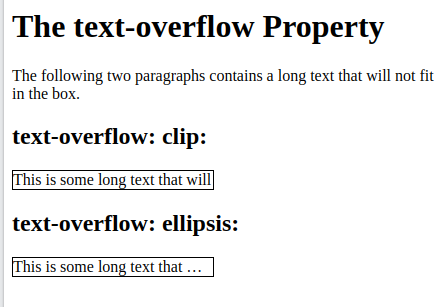
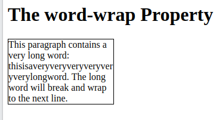
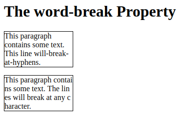
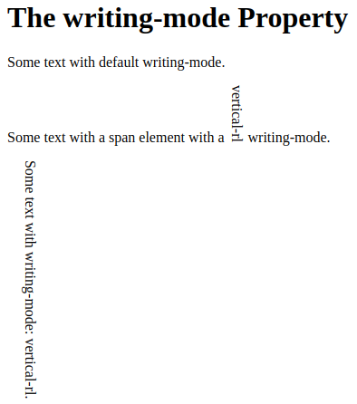

# CSS Text Effects

There are four components in it: 
1. CSS Text Overflow
2. Word Wrap
3. Line Breaking Rules
4. Writing Modes

Lets dive into each one!

## 1. CSS Text Overflow

The CSS text-overflow property specifies how overflowed content that is not displayed should be signaled to the user.

Here is the code explaining it in detail: 

```HTML
<!DOCTYPE html>
<html>
<head>
<style> 
p.test1 {
  white-space: nowrap; 
  width: 200px; 
  border: 1px solid #000000;
  overflow: hidden;
  text-overflow: clip;
}

p.test2 {
  white-space: nowrap; 
  width: 200px; 
  border: 1px solid #000000;
  overflow: hidden;
  text-overflow: ellipsis;
}
</style>
</head>
<body>

<h1>The text-overflow Property</h1>
<p>The following two paragraphs contains a long text that will not fit in the box.</p>

<h2>text-overflow: clip:</h2>
<p class="test1">This is some long text that will not fit in the box</p>

<h2>text-overflow: ellipsis:</h2>
<p class="test2">This is some long text that will not fit in the box</p>

</body>
</html>
```
### Output:



## 2. CSS Word Wrapping

The CSS word-wrap property allows long words to be able to be broken and wrap onto the next line.

Here is the code explaining it in detail:

```HTML
<!DOCTYPE html>
<html>
<head>
<style> 
p.test {
  width: 11em; 
  border: 1px solid #000000;
  word-wrap: break-word;
}
</style>
</head>
<body>

<h1>The word-wrap Property</h1>

<p class="test">This paragraph contains a very long word: thisisaveryveryveryveryveryverylongword. The long word will break and wrap to the next line.</p>

</body>
</html>
```

### Output:



## 3. CSS Word Breaking

The CSS word-break property specifies line breaking rules.

Here is the code explaining it in detail:

```HTML
<!DOCTYPE html>
<html>
<head>
<style> 
p.test1 {
  width: 140px; 
  border: 1px solid #000000;
  word-break: keep-all;
}

p.test2 {
  width: 140px; 
  border: 1px solid #000000;
  word-break: break-all;
}
</style>
</head>
<body>

<h1>The word-break Property</h1>

<p class="test1">This paragraph contains some text. This line will-break-at-hyphens.</p>

<p class="test2">This paragraph contains some text. The lines will break at any character.</p>

</body>
</html>
```
Output:



## 4. CSS Writing Mode

The CSS writing-mode property specifies whether lines of text are laid out horizontally or vertically.

Here, is the code explaining it in detail:

```HTML
<!DOCTYPE html>
<html>
<head>
<style> 
p.test1 {
  writing-mode: horizontal-tb; 
}

span.test2 {
  writing-mode: vertical-rl; 
}

p.test2 {
  writing-mode: vertical-rl; 
}
</style>
</head>
<body>
<h1>The writing-mode Property</h1>

<p class="test1">Some text with default writing-mode.</p>

<p>Some text with a span element with a <span class="test2">vertical-rl</span> writing-mode.</p>

<p class="test2">Some text with writing-mode: vertical-rl.</p>

</body>
</html>
```

### Output:



## CSS Text Effect Properties

|Property|Description|
|-|-|
|text-align-last|Specifies how to align the last line of a text|
|text-justify|	Specifies how justified text should be aligned and spaced|
|text-overflow|	Specifies how overflowed content that is not displayed should be signaled to the user|
|word-break|Specifies line breaking rules for non-CJK scripts|
|word-wrap|	Allows long words to be able to be broken and wrap onto the next line|
|writing-mode|Specifies whether lines of text are laid out horizontally or vertically|

For more details, refer [CSS Text Effects](https://www.w3schools.com/css/css3_text_effects.asp)
