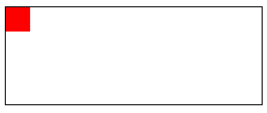
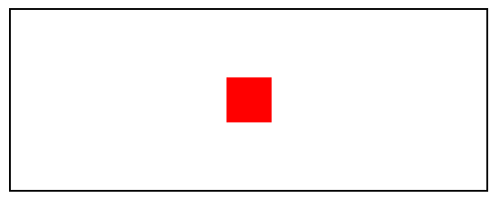
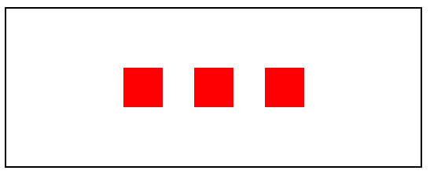
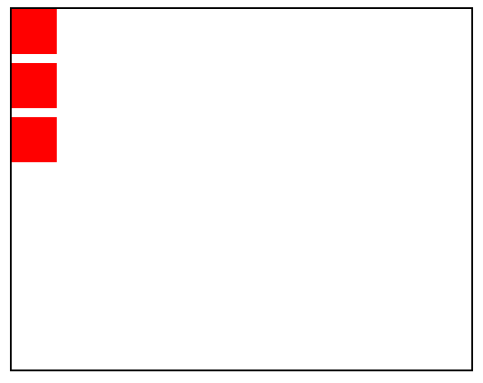
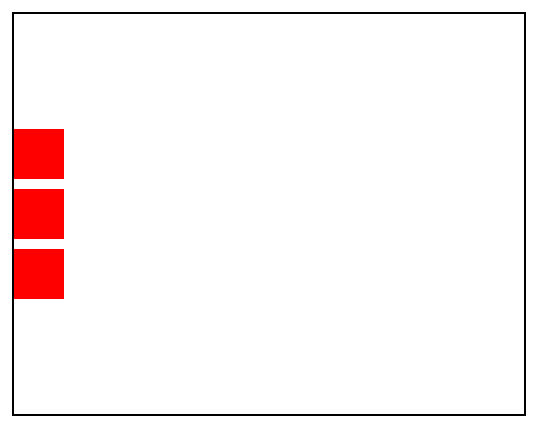
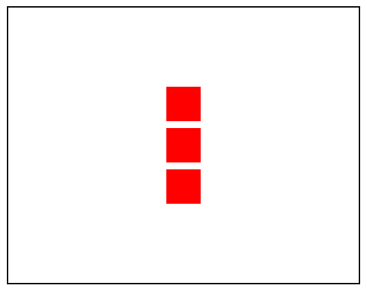

# Center items using Flexbox

CSS Flexbox has been out there for some time and given that you know about all its features, it could be a boon and save you a lot of time trying to align elements and making them responsive.

**Today we will see how to center elements using flexbox in just 3 lines of code!!**

First lets take a container and add a box inside it.

```html
<div class="container">
    <div class="box"></div>
</div>
```

```css
.box{
    height: 50px;
    width: 50px;
    background-color: red;
}

.container{
    border: 2px solid black;
    height: 200px;
}
```



In order to center the inner div we need to make the parent div a flex container.

To do so, we will use `display: flex` property for the parent container. This will make all the elements inside the container **flex-items**.

```css
.container{
    border: 2px solid black;
    height: 200px;
    display: flex;
}
```


## Centering horizontally

To center our item horizontally we use the `justify-content: center;`, this will center our block along the main-axis. The direction of main-axis could be changed using the `flex-direction` property.

```css
.container{
    border: 2px solid black;
    height: 200px;
    display: flex;
    justify-content: center;
}
```


## Centering Vertically

To center our item vertically we use the `align-items: center;`, this will center our block along the cross-axis. 

```css
.container{
    border: 2px solid black;
    height: 200px;
    display: flex;
    justify-content: center;
    align-items: center;
}
```



The nice aspect of flexbox is the styles apply to all the children of our flex container. If we add two more elements, they all stay centered within the parent container.

```html
 <div class="container">
        <div class="box"></div>
        <div class="box"></div>
        <div class="box"></div>
    </div>
```




## flex-direction property

By default the flex-direction is set as row. If we change the flex-direction to column that would interchange the main-axis and the cross-axis. It will also make our items stack in a column instead of a row like before.


Image-source: shorturl.at/ryJV8



Hence, in this case our `justify-content` property will center the boxes vertically and `align-items` property will center the boxes horizontally.

```css
.container {
        border: 2px solid black;
        height: 400px;
        display: flex;
        flex-direction: column;
        justify-content: center;
      }
```



```css
.container {
        border: 2px solid black;
        height: 400px;
        display: flex;
        flex-direction: column;
        justify-content: center;
        align-items: center;
      }
```



Reference-links:

1) https://developer.mozilla.org/en-US/docs/Web/CSS/CSS_Flexible_Box_Layout/Basic_Concepts_of_Flexbox
2)  https://www.w3schools.com/css/css3_flexbox.asp
3) https://www.better.dev/centering-things-with-css-flexbox
