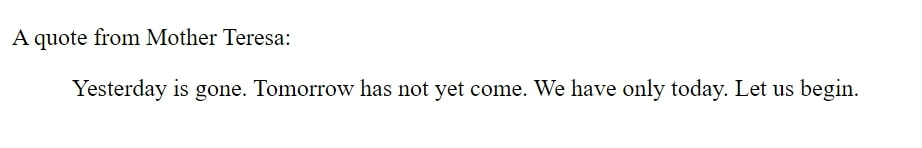
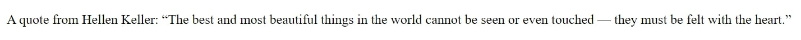
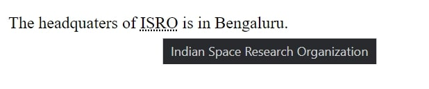
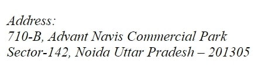
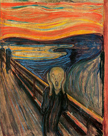
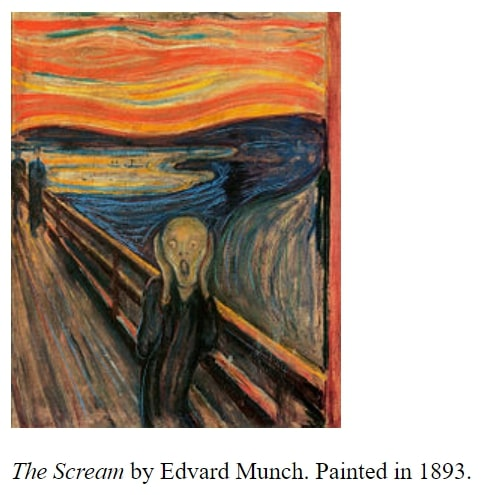
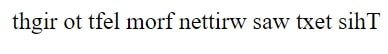

# HTML Quotations
The quotation elements in HTML are used to highlight any text in an HTML document to differentiate it from the other texts.
Here we use different tags/elements to highlight the texts in different formats. 

## Types of Quotation Elements
Below are the types of HTML qutation elements :

 ### 1. ```<blockquote>``` Element
 This element is used to show quoted text but without using quotation marks. Instead, it changes the alignment of the text to show it is different than the rest of the text
 document. It is a container tag,  i.e. there should be an opening and closing tag.
 For example, 
  
 ```
 <p>A quote from Mother Teresa:</p>
 <blockquote>
   Yesterday is gone. Tomorrow has not yet come. We have only today. Let us begin.
 </blockquote>
 ```
  
 This gives us the following output:
  
 <p>A quote from Mother Teresa:</p>
 <blockquote>
 Yesterday is gone. Tomorrow has not yet come. We have only today. Let us begin.
 </blockquote>
  
 
  
 ---
  
 ### 2. ```<q>``` Element
 his element is used to show the text inside the quotation marks. The double quotation marks are used here and it also needs to be closed using a closing tag.
  
 For example,
  
 ```
 <p>
  A quote from Hellen Keller: <q>The best and most beautiful things in the world cannot be seen or even touched — they must be felt with the heart.</q>
 </p>
 ```
 This gives us the following output:
 
 <p>
  A quote from Hellen Keller: <q>The best and most beautiful things in the world cannot be seen or even touched — they must be felt with the heart.</q>
 </p>
 
 
 
 ---
 
 ### 3. ```<abbr>``` Element
 This element is used to define an abbreviation or an acronym in the document. When the mouse hovers over the abbreviation or acronym inside the ```<abbr>``` tag then the 
 browser shows the full form of the abbreviation which is contained by the title attribute.
 This is also a container tag.
 
 Example,
 
 ```
 <p> The headquaters of <abbr title="Indian Space Research Organization">ISRO</abbr> is in Bengaluru.</p>
 ```
 The output is:

 <p> The headquaters of <abbr title="Indian Space Research Organization">ISRO</abbr> is in Bengaluru.</p>

 
 
 ---
 
 ### 4. ```<address>``` Element
 As the name suggests this element is used to display the address of the author or the owner of the web page. The text enclosed within the tag will be italicized and there 
 will be a line break both above and below it.

 For example,

 ```
 <address>

 <p>Address:<br>
   710-B, Advant Navis Commercial Park,<br>
   Sector-142, Noida Uttar Pradesh – 201305</p>

 </address>
 ```
 The output of the above code will be:
 <address>

 <p>Address:<br>
   710-B, Advant Navis Commercial Park<br>
   Sector-142, Noida Uttar Pradesh – 201305</p>

 </address>

 

 ---

 ### 5.```<cite>``` Element
 This tag is used to specify the title of any work or creation. This tag also converts the text into italics and has a closing and opening tag.

 Example,

 ```
 
 <p><cite>The Scream</cite> by Edvard Munch. Painted in 1893.</p>
 ```
 The output will be:

 
 <p><cite>The Scream</cite> by Edvard Munch. Painted in 1893.</p>


 

 ---

 ### 6. ```<bdo>``` Element
 This tag is used to override a text in bi-direction i.e. both left to right or right to left. It overrides the current text direction. It is a container tag. The rtl 
 attribute is used to display the text from right to left.

 For example,

 ```
 <bdo dir="rtl">This text was written from left to right</bdo>
 ```
 The output:

 

 ---
