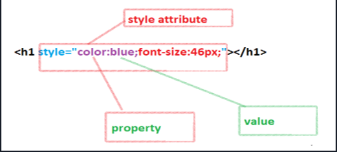
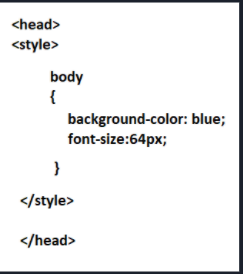
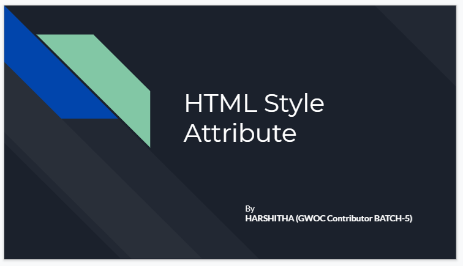

# HTML Style Attribute Video Presentation
This video explains about HTML Style Attribute with code demonstration.
There are 3 ways to define style attribute:
- Inline Style
- Embedded Style
- External style sheet

## Inline style:
- Styling properties are written in the HTML element  within the opening  tag.
- Properties are applied within the element.

 ## Embedded Style:
 - In this method, the style element is used inside the <head> element of the document.
- Styling properties are applicable in one page in which they are defined.

## External style sheet
- All the styling properties are defined in separate css style sheet (.css file) and linked in HTML document through <link> attribute.
- Styling properties can be used for multiple pages.

# Click the image for video!!!!

 
### Hope my video helps!!! Thankyou.