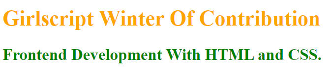
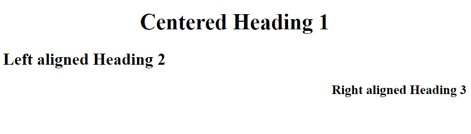
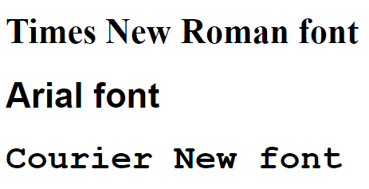
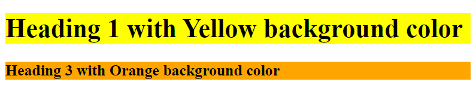

<h1 align="center">
&nbsp;HTML STYLE ATTRIBUTE</h1>
<br>

# **Introduction :**

- The HTML style attribute is used to  change or add styles (like color, size, font, etc) to an HTML element.
- HTML styling is a way of decorating a web page.

## Styles in HTML can be used in three different ways:
- Inline style :- In this way, the style attribute is used inside HTML element. It is used to add different style to a single HTML Element.
- Internal Stylesheet :- In this way, the &lt;style&gt; element is used inside &lt;head&gt; section
- External Stylesheet :- In this way, the path of stylesheet is included inside &lt;link&gt; element in &lt;head&gt; section
<p>&nbsp;</p>

<!----------------------------------------Inline Style------------------------------------------------------->

# **Inline Style :**
## ***Syntax:***
```jsx
<tagname style="property:value;">
```
### ***Example :***
```jsx
<h1 style="color:red;">GWOC 2021</h1>

<h1 style="font-family:Arial;">Opensource</h1>
/*
Here, 
color & font-familiy are properties
red & Arial are the values
*/
```
### ***Output :***

<p>&nbsp;</p>

<!---------------------------------------Internal Stylesheet------------------------------------------------------->
# **Internal Stylesheet :**
### ***Example :***
```jsx
<head>
<style>
h1 {
  color: yellow;
  background-color: blue;
  text-align: center;
  border-style: solid;
  border-color: orange;
  border-width: 10px;
  border-length: 5px;
  
}
</style>
</head>
<body>
<h1>Girlscript<br>Winter of <br>Contribution</h1>
</body>
```
### ***Output :***

<p>&nbsp;</p>

<!---------------------------------------External Stylesheet------------------------------------------------------->
# **External Stylesheet :**
### ***index.html :***
```jsx
<head>
  <link rel="stylesheet" href="style.css">
</head>
<body>

<h1>Opensource is all about giving back to the community.</h1>

</body>
```
### ***style.css :***
```jsx
body {
    background-color: rgb(42, 230, 57);
}
h1 {
    color: blue;
    text-align:center;
    border: solid yellow 5px;
}
```
### ***Output :***

<p>&nbsp;</p>

# **Different properties of HTML Style Attribute** :

### 1. ***Text Color*** : - This property adds color to the text of an HTML Element.
 ```jsx
<h1 style="color:orange;">GWOC 2021</h1>
<h3 style="color:green;">Frontend Development With HTML and CSS.</h3>
```
### ***Output :***

<p>&nbsp;</p>

### 2. ***Text-align*** : - This property sets the horizontal alignment fo the text of an HTML Element.
 ```jsx
<h1 style="text-align:center;">Centered Heading 1</h1>
<h2 style="text-align:left;">Left aligned Heading 2</h2>
<h3 style="text-align:right;">Right aligned Heading 3</h3>
```
### ***Output :***

<p>&nbsp;</p>

### 3. ***font-size*** : - This property adds the text size of an HTML Element.
 ```jsx
<h1 style="font-size:50px;">Heading 1 with font-size:50px</h1>
<h1 style="font-size:30px;">Heading 1 with font-size:30px</h1>
```
### ***Output :***

<p>&nbsp;</p>

### 4. ***font-family*** : - This property specifies the font of an HTML Element.
 ```jsx
<h1 style="font-family:'Times New Roman';">Times New Roman font.</h1>
<h1 style="font-family: Arial;"> Arial font.</h1>
<h1 style="font-family: Courier New;">Courier New font.</h1>
```
### ***Output :***

<p>&nbsp;</p>

### 5. ***Background color*** : - This property sets the background color of an HTML Element.

```jsx
<body style="background-color:lightgreen;">

<h1 style="text-align:center; color:red;"><u>About GWOC</u></h1>

<h3 style="color:brown;">GirlScript Winter of Contributing is a three-month newly established initiative by GirlScript Foundation to be conducted during winters. GWOC encourages individuals to share their knowledge and ideas to develop technical skills and gain valuable experience in the field of tech education</h3>
```
### ***Output :***

<p>&nbsp;</p>

```jsx

<h1 style="background-color:yellow;">Heading 1 with Yellow background color</h1>
<h3 style="background-color:orange;">Heading 3 with Orange background color</h3>

```
### ***Output :***

<p>&nbsp;</p>
<br>

### **Reference:**
- <a href="https://www.w3schools.com/default.asp">w3schools</a>

### **Credits:**
- <div>Icons made by <a href="https://www.freepik.com" title="Freepik">Freepik</a> from <a href="https://www.flaticon.com/" title="Flaticon">www.flaticon.com</a></div>

