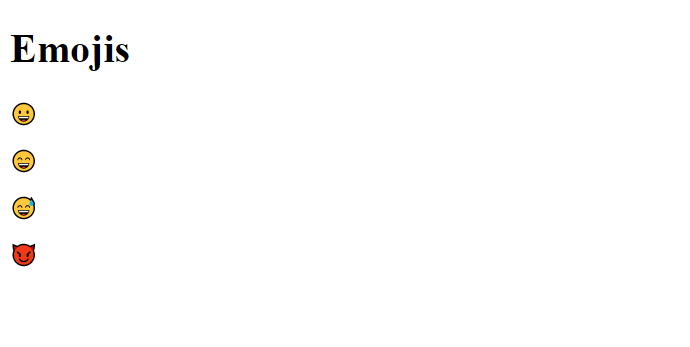

## Introduction
As we all know the use of emojis in our chats and online communication makes the conversation more expressive. So, HTML5 has this new feature which make our website more expressive.This feature came under the unicode character set(UTF_8).

## Character Set
When we are designing any websites , we have to include many character to display our HTML web page more correctly. We have to add the character set in meta tag through which we can display characters in our page.UTF-8 include ASCII character , emoji character etc.
ASCII is the first character set encoding which display the character which we can't put through keyboard . After the coming of HTML5 , UTF-8 came in picture which include each and every character set.
  
This is specified in the meta tag:
 ```
 <meta charset = "UTF-8">

 ```

 ## What are emoticons?

 Emoticon(Emotion + icon), this word is self defined. The emotion, feelings, expression which we express through icons is called emoticons(emojis).But in HTML, we are not using icons or images to display emojis. We are using character and letter from the UTF-8 character set.

## Use of UTF-8 character set
  ### Example:

  ```html
  <!DOCTYPE html>
<html lang="en">
<head>
    <meta charset="UTF-8">   <!---meta tag for character set--->
    <meta http-equiv="X-UA-Compatible" content="IE=edge">
    <meta name="viewport" content="width=device-width, initial-scale=1.0">
    <title>HTML Emojis</title>
</head>
<body>
    <h1>Emojis</h1>
  <p>&#128512;</p>   <!--Grinning Face--->
  <p>&#128516;</p>   <!---Smiling Face With Open Mouth And Smiling Eyes--->
  <p>&#128517;</p>   <!---Smiling Face With Open Mouth And Cold Sweat--->
  <p>&#128520;</p>   <!---Smiling Face With Horns--->
</body>
</html>
```

### Output:
<br>

## Refrences

[w3schools.com](https://www.w3schools.com)

[GeeksforGeeks](https://www.geeksforgeeks.org)

#### To know more about the emojis decimal and hex number [click here] (https://data-flair.training/blogs/html-emojis/) 
