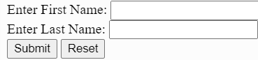
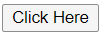
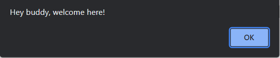
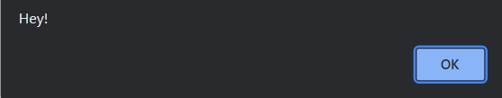

# HTML `<button>` tag

HTML `<button>` is used to represent a clickable button. <br>

We can put different texts or tags (like `<i>`, `<strong>` etc.) within `<button>..</button>` tag, which we can't do in button created using HTML `<input>` tag. <br>

We can use `<button>` tag inside as well as outside of a HTML form on a webpage.<br>

If we use it inside a HTML form then we can make it a "Submit" button or a "Reset" button. Otherwise, if we want to use it outside HTML form then we can call any Javascript function to make it work according to our need.<br>

Let see how to use a HTML button through an example: <br>

```HTML
<button> click here </button>
```

#### Output:
<button> click here </button> <br>
<br>

HTML `<button>` supports many attributes, few of them are listed below:

| Attribute     | Value         | Description  |
| :------------- |:-------------:| :-----:|
| type          | button, submit, reset     | It specifies the type of a button |
| name      | any text      |   It specifies the name for a button |
| value | any text      |    It specifies the initial value for a button|
| form | form_id      |    It specifies, to which form button belongs|
| disabled | disabled     |    It specifies that a button should be disabled|

<br>

Above listed attributes are the attributes for `<button>` which are used commonly.
<br>

It is a good practice to specify "type" attribute of button, as it helps browser to know that which type of button is to be used. <br> <br>

## Let us see some examples to get more clarity about button tag
--- 
<br>

 ## 1. Submit/reset Form
 
 Submitting or reseting a form is a main part while filling a form. Given below is an example which shows how a button, to submit or reset a form, is made.

```HTML
<form>
    Enter First Name: <input type="text" name="fname"> <br/>
    Enter Last Name: <input type="text" name="lname"> <br/>
    <button type="submit">Submit</button>
    <button type="reset">Reset</button>
</form>
```
#### Output: 

 <br> <br>

 ## 2. Calling Javascript function:

As we know, we can call different JavaScript function as a click behaviour inside a button. Given below is an example to show this.

```HTML
<button type="button" onclick="greet()">Click Here </button>
<script>
    function greet(){
        alert("Hey buddy, welcome here!");
    }
</script>
```
After rendering this code browser will show a button as shown in below image: 



After clicking the button, the function called inside button will run and browser will alert with the message written in function. It is shown in below image:

 <br><br>

 ## 3. Applying `EventListeners` 

We can apply many `EventListeners`, defined in Javascript, on `<button>` tag. It helps to add different behaviours on a button in a webpage. 

There are many `EventListeners` we can apply on `<button>` tag. For eg. click, mouseover etc. 

Let us see example of applying `EventListener` on a button

```HTML
<button type="button">Click Here </button>
<script>
    const btn = document.querySelector('button');
    btn.addEventListener('click', function(){
        alert('Hey!');
    })
</script>
```
Here we are selecting `button` element and storing it in variable `btn` then we are applying event listener (here `click`) on that element.

After rendering this code browser will display a button on webpage, similar as shown in figure below. <br><br>


<br>

Now, after clicking button the browser will alert a message as defined in `EventListener`. You can see this in below image.<br><br>



<br> <br>

# References
https://www.javatpoint.com/html-button-tag

https://www.w3schools.com/tags/tag_button.asp