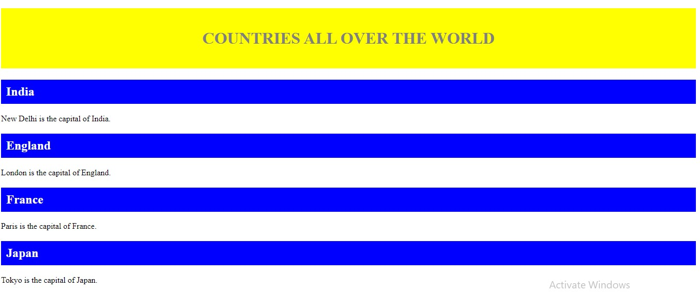
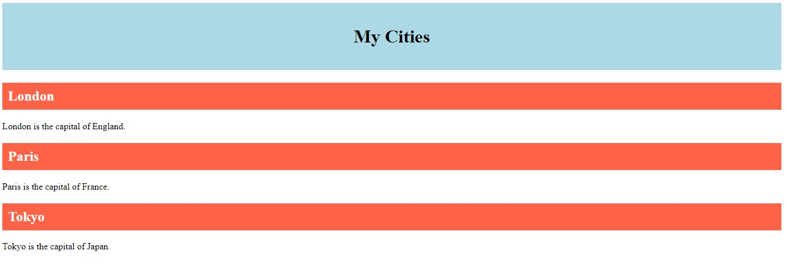

# HTML Classes and Ids 

---

In CSS, selectors are used to target a specific element or range of elements on a web page. Once an element has been targeted, a style or set of styles can be applied to the element.

There is a wide range of selectors available. Two of the most commonly used are `CLASS` and `ID`. Both are used to target elements to which a style should be applied.

---

## **CLASS SELECTORS**

A Class is a style definition that you create in pretty much the same way as you created a global style , but it isn't necessarily bound to any one tag . Instead , you can apply it anywhere you like . The class selector starts with a dot (.) character.

_The class name is case sensitive._
<br>
_You can use the same class on multiple elements._
<br>
_You can use multiple classes on the same element._

```
.highlight {
    background-color: yellow;
}
```

## When to assign an Class attribute to an HTML element :

1. As a style sheet selector (when an author wishes to assign style information to a set of elements).
2. For general purpose processing by user agents.

---

## **ID SELECTORS**

In addition to classes , you can use IDs to apply styles to your pages Except for the syntax , assigning a style to an ID isn't any different from assigning one to a class , and the usage is also similar. The id selector starts with a hash (#) character.

_The ID name is case sensitive._
<br>
_Each element can have only one ID_
<br>
_Each page can have only one element with that ID_

```
#highlight {
    background-color: yellow;
}
```

## When to assign an id attribute to an HTML element :

1. stylize that element differently than other elements of the same type.
2. link to a particular element within a web page.

3. directly access that element using Javascript.

---

## **DIFFERENCE BETWEEN `CLASS` AND `ID`**

## <br>

The only difference between `Class` and `Id` is that _ID_ is unique in a page and can only apply to at most one element, while _Class_ selector can apply to multiple elements.
<br>
|CLASS | ID|
-------| -------------
|On the other hand class assigned to an element has its name starts with “.” followed by class name. | In Html for an element ID name starts with the “#” symbol followed by a unique name assigned to it|
Multiple class selectors can be attached to an element.| Only one ID selector can be attached to an element.
|Id is unique in a page and can only apply to at most one element|The class can be applied to multiple elements so it could be multiple times on a single page.|

```
<!DOCTYPE html>
<html>
<head>
<style>
/* Style the element with the id "myHeader" */
#myHeader {
  background-color: yellow;
  color: grey;
  padding: 40px;
  text-align: center;
}

/* Style all elements with the class name "country" */
.country {
  background-color: blue;
  color: white;
  padding: 10px;
}
</style>
</head>
<body>


<!-- An element with a unique id -->
<h1 id="myHeader">COUNTRIES ALL OVER THE WORLD</h1>

<!-- Multiple elements with same class -->
<h2 class="country">India</h2>
<p>New Delhi is the capital of India.</p>

<h2 class="country">England</h2>
<p>London is the capital of England.</p>

<h2 class="country">France</h2>
<p>Paris is the capital of France.</p>

<h2 class="country">Japan</h2>
<p>Tokyo is the capital of Japan.</p>

</body>
</html>


```

Output Of The Above Code
<br>
--


<br>

## Using ID and CLASS together

<br>

1. We can specify a class and an id on the same element.

```
  <div id=" y" class= "x">
```

2.  We can even specify more than one class for each element.

```
<div class=" x y b ">
```

3.  We **cannot** use more than one id per element.

```
 <div id="  y w ">
```

```
<!DOCTYPE html>
<html>
<head>
<style>

#y.x {
 /* will select element of id="y" that also has class="x" */
 background-color: lightblue;
  color: black;
  padding: 40px;
  text-align: center;
}


.city {
  background-color: tomato;
  color: white;
  padding: 10px;
}

</style>
</head>
<body>
<h1 id="y" class="x">My Cities</h1>

<!-- Multiple elements with same class -->
<h2 class="city">London</h2>
<p>London is the capital of England.</p>

<h2 class="city">Paris</h2>
<p>Paris is the capital of France.</p>

<h2 class="city">Tokyo</h2>
<p>Tokyo is the capital of Japan.</p>

</body>
</html>


```

Output Of The Above Code
<br>

<br>

---

## **WHEN TO USE CLASS VS ID IN CSS**

<br>

The basic rule that you need to keep in mind while using classes and ids in CSS is that, id is used for single elements that appear on the page for only once **(e.g. header, footer, menu)**, whereas class is used for single or multiple elements that appear on the page for once or more than once **(e.g. paragraphs, links, buttons, input boxes)**.

## **CONCLUSION**

---

When you’re working with CSS, there are no specific reasons forcing you to use an ID over a class. However, it is best practice to only use IDs if you want a style to apply to one element on the web page, and to use classes if you want a style to apply to multiple elements.
