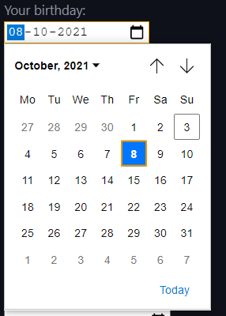

  # HTML Input Types:  

  In HTML, we can take input from the user using the `<input>` and `<textarea>` tag. The inputs can be of various types, from text to images, or even more complicated ones like date or time.  

  ## Here's a list of input types you can use in HTML:  

- `<input type="button">`
- `<input type="number">`
- `<input type="text">`
- `<input type="password">`
- `<input type="email">`
- `<input type="file">`
- `<input type="hidden">`
- `<input type="image">`
- `<input type="checkbox">`
- `<input type="color">`
- `<input type="date">`
- `<input type="time">`
- `<input type="week">`
- `<input type="datetime-local">`
- `<input type="month">`
- `<input type="radio">`
- `<input type="range">`
- `<input type="reset">`
- `<input type="search">`
- `<input type="submit">`
- `<input type="tel">`
- `<input type="url">`

 ## Input type Text, email, password, submit and reset:  

 `<input type="text>` gives you a blank box that accepts text as an input.  

 `<input type="email">` only accept emails, i.e, something like this:  
 `string@mail.com`. (Try typing something in email section and press enter).  

 `<input type="password">` shows `********` (I typed password).  

 `<input type="submit">` is simply a button to submit the data you entered.  

 `<input type="reset">` gives a reset button that will reset all form values to their default state.  

  ### Code:  

```html
<form>
  <label for="name">Your Name:</label><br>
  <input type="text" id="name" name="name"><br>

  <label for="mail">Your email:</label><br>
  <input type="email" id="mail" name="mail"><br>

  <label for="pw">Your password:</label><br>
  <input type="password" id="pw" name="pw"><br>

  <input type="submit" value="Submit">

  <input type="reset">
</form>
```

  ### Result:  


  ## Input type radio, checkbox, button:  

 `<input type="radio">` defines a radio button which lets the user choose only one of the given options.  

 `<input type="checkbox">` lets a user choose zero or more options from a number of choices.  

 `<input type="button">` simply defines a button.  

  ### Code:  

```html
<p>Choose your favorite Naruto character:</p>
<form>
  <input type="radio" id="naruto" name="konoha" value="Naruto">
  <label for="naruto">Naruto</label><br>
  <input type="radio" id="sasuke" name="konoha" value="Sasuke">
  <label for="sasuke">Sasuke</label><br>
  <input type="radio" id="itachi" name="konoha" value="Itachi">
  <label for="itachi">Itachi</label><br><br>


  <input type="checkbox" id="minato" name="minato" value="Bike">
  <label for="minato">Minato was cool too.</label><br>
  <input type="checkbox" id="madara" name="madara" value="Car">
  <label for="madara">Come on, Madara was amazing!</label><br>
  <input type="checkbox" id="kakashi" name="kakashi" value="Boat">
  <label for="kakashi">How can you forget Kakashi?</label><br><br>

  <input type="button" value="I do nothing">
</form>
```

  ### Result:  


  ## Input type date, datetime-local, time, month, week:

 `<input type="date">` takes a date as an input.  

 `<input type="datetime-local">` takes date and time, but with no time zones.  

 `<input type="time">` allows the user to input a time (no time zone).  

 `<input type="month">` takes a month and a year as an input.  

 `<input type="week">` takes a week and year as an input.  

  ### Code:  

```html
<form>
  <label for="birthday">Your birthday:</label><br>
  <input type="date" id="birthday" name="birthday"><br><br>

  <label for="birthdaytime">Your birthday's date and time:</label><br>
  <input type="datetime-local" id="birthdaytime" name="birthdaytime"><br><br>

  <label for="timing">Choose a time:</label><br>
  <input type="time" id="timing" name="timing"><br><br>

  <label for="bdaymonth">Your birthday (month and year):</label><br>
  <input type="month" id="bdaymonth" name="bdaymonth"><br><br>

  <label for="week">Choose a week:</label><br>
  <input type="week" id="week" name="week">
</form>
```

  ### Result:  




  ## Input type file, hidden, color, image:  

 `<input type="file">` gives a field to select file and a "Browse" button for file uploads.  

 `<input type="hidden">` defines an input field invisible to the user. It is often used to save data that is needed to be updated when form submits.  

 `<input type="image">` is used to create custom submit buttons, i.e, submit buttons that take the form of an image rather than text.  

 `<input type="color">` gives an input field that should have a color as an input.  

  ### Code:  

```html
<form>
  <label for="myfile">Select your file:</label><br>
  <input type="file" id="myfile" name="myfile"><br><br>

  <input type="hidden" id="hiddenid" name="hiddenid" value="9669">

  <input type="image" src="https://www.w3schools.com/tags/img_submit.gif"><br>

  <label for="favcolor">Your favorite color:</label>
  <input type="color" id="favcolor" name="favcolor">
</form>
```

  ### Result:  


  ## Input type range, tel and url:  

 `<input type="range">` lets you enter a value through a slider.  

 `<input type="tel">` is used to take telephone number as input.  

 `<input type="url">` is used to take URL (Uniform Resource Locator) as an input.  

  ### Code:  

```html
<form>
  <label for="css">How much CSS do you know?</label>
  <input type="range" id="css" name="css" min="0" max="100">

  <label for="phone">Enter your number:</label>
  <input type="tel" id="phone" name="phone" pattern="[0-9]{3}-[0-9]{2}-[0-9]{3}">

  <label for="link">Enter URL:</label>
  <input type="url" id="link" name="link">
</form>
```

  ### Result:  

