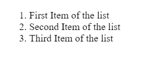
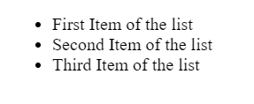
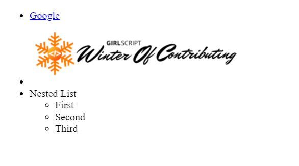

# HTML Lists

HTML element meant to help you structure the content on your page is the list element. Most of the websites you see usually contains some types of list in some way or other. These list helps us to understand the content in a much better and organized way.

Lists are used to group together related pieces of information so they are clearly associated with each other and easy to read. In modern web development, lists are workhorse elements, frequently used for navigation as well as general content.

## Types of Lists

There are majorly two types of lists used in most web-pages you see :

1.**Ordered Lists** - used to group a set of related items in a specific order. One uses this type of list in their web-page when the order of list item is not important.

```html
<ol>
  <li>First Item of the list</li>
  <li>Second Item of the list</li>
  <li>Third Item of the list</li>
</ol>
```

On a web page this type of list looks something like this :



2.**Unordered Lists** - used to group a set of related items in no particular order. This type of list is used in a web page when the order of list items is not important. These are represented in bullet points.

```html
<ul>
  <li>First Item of the list</li>
  <li>Second Item of the list</li>
  <li>Third Item of the list</li>
</ul>
```

On a web page this type of list looks something like this :



---

## List Items

Above you have seen something what is called a list item represented by the html tag `<li>`. We will now see what all we can put inside this list item.

```html
<ul>
  <li><a href="google.com">Google</a></li>
  <li>
    
  </li>
  <li>
    Nested List
    <ul>
      <li>First</li>
      <li>Second</li>
      <li>Third</li>
    </ul>
  </li>
</ul>
```

On a web page this type of list looks something like this :



You can clearly see you can put anything in a list item be it a link, an image or other lists as well.
