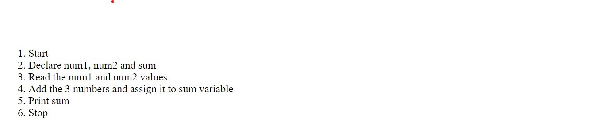
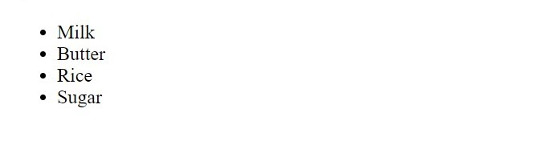
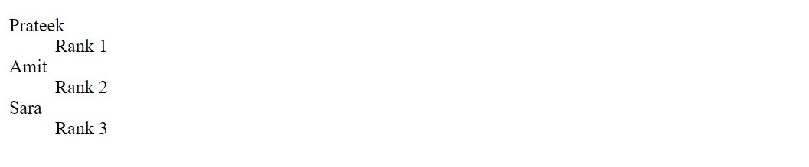
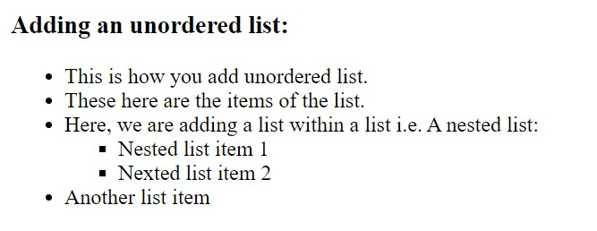
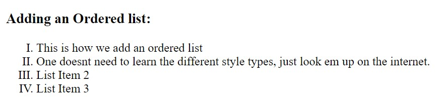

# HTML LISTS
Lists are structured HTML elements which are used to group similar or related items together in order to achieve better readability and an organised representation of information. Lists can be used to represent general data as well as for navigation purposes. 

Using HTML lists not only organises our data, it also helps us style our website better because all the list items are independent and they can be styled differently using different CSS styles. We can also move the data around easily at any point of time by changing the order of our code. This can be a simple cut and paste, so they are very 
easy to maintain as well.

## Types of Lists
There are 3 types of lists present in HTML:
### 1. Ordered List
The elements of an ordered list are arranged in a numbered order. Therefore, an ordered list is used when the order of the list elements is of importance. 
For example, we need to write an algorithm for adding 2 numbers.

1. Start
2. Declare num1, num2 and sum.
3. Read the num1 and num2 values.
4. Add the 3 numbers and assign it to sum variable.
5. Print sum.
6. Stop

Here, the order of the steps matters, therefore we will use an ordered list to represent it on our website. The ordered list uses the ``` <ol></ol>  ``` tag. Inside this we declare our list items using the ``` <li></li> ``` tag. 
Eg.
```
<ol>
  <li>Start</li>
  <li>Declare num1, num2 and sum</li>
  <li>Read the num1 and num2 values</li>
  <li>Add the 3 numbers and assign it to sum variable</li>
  <li>Print sum</li>
  <li>Stop</li>
</ol>
```


This produces an output as follows:
<ol>
  <li>Start</li>
  <li>Declare num1, num2 and sum</li>
  <li>Read the num1 and num2 values</li>
  <li>Add the 3 numbers and assign it to sum variable</li>
  <li>Print sum</li>
  <li>Stop</li>
</ol>



The ordered list marker is numeric by default,however we can always use the ```type``` attribute to define the type of marker that we want in our ordered list. The markers can be numbers, upper and lower case letters and upper and lower case roman numbers.They follow the syntax:
``` <ol type="a"></ol> ``` 

---

### 2. Unordered List
The elements of an unordered list are not numbered. They are used commonly where the order of the elements of our list does not matter. For example, we list down the items that we need to buy from the grocery store. 

- Milk
- Butter
- Rice
- Sugar

The unordered list uses the tag ``` <ul></ul> ```. Inside this tag we list out our elements using the list items tag ``` <li></li> ```. It is similar to the syntax of an ordered list.
Eg.
```
<ul>
  <li>Milk</li>
  <li>Butter</li>
  <li>Rice</li>
  <li>Sugar</li>
</ul>
```

This produces an output as follows:
<ul>
  <li>Milk</li>
  <li>Butter</li>
  <li>Rice</li>
  <li>Sugar</li>
</ul>



The default marker for an unordered list is the black disc shaped bullet, however we can change the list marker to circular, square bullets.We can also discard the bullets all together by using ``` type="none" ``` attribute inside the ``` <ul> ``` tag.

---

### 3. Description List
Description lists are associated with values or elements of our list. It contains the description of the list items. A description list is defined using the ``` <dl></dl> ``` tag. Inside this tag we mention our list items using the ``` <dt></dt> ``` tag and it's description along with it using the ``` <dd></dd> ``` tag.
For example, list items can be the names of students and their description can be their ranks in a class.


```
 <dl>
    <dt>Prateek</dt>
    <dd>Rank 1</dd>

    <dt>Amit</dt>
    <dd>Rank 2</dd>

    <dt>Sara</dt>
    <dd>Rank 3</dd>
</dl>
```

This produces an output as follows:
<dl>
    <dt>Prateek</dt>
    <dd>Rank 1</dd>
   <dt>Amit</dt>
    <dd>Rank 2</dd>
   <dt>Sara</dt>
    <dd>Rank 3</dd>
</dl>



## Styles of HTML Lists
**Style of Unordered list:** <br>
By default, we can see that the unordered list has a bullet point style. However, there are other styles as well, such as disc, square, circle etc. For choosing any one of these styles, all we need to do is add type="list style" in the &lt;ul&gt;, like this:
<br> &lt;ul type="square"&gt;.
Different styles present: 
- Square
- Circle
- Disc etc.

*One doesn't really need to memorize this styles, as they are easily available on the internet* <br>


**Style of Ordered list:** <br>
By default, we can see that the ordered list has a numbering style. However, there are other styles as well, such as roman style, alphabet listing etc. For choosing any one of these styles, all we need to do is add type="list style" in the &lt;ul&gt;, like this:
<br> &lt;ul type="I"&gt;.
Different styles present: 
- Roman (type="I" for Roman numerics in capital letters.)
- Roman (type="i" for Roman numerics in small letters.)
- Alphabetical (type="A" for Alphabetical order in capital letters.)
- Alphabetical (type="a" for Alphabetical order in small letters.)
- Starting from an arbitrary number (start = "4" will start the list from 4, keeping the next items as 5, 6, 7 and so on.) <br>


---

