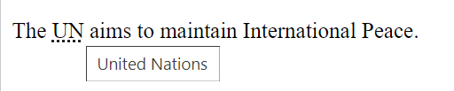
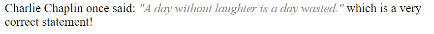
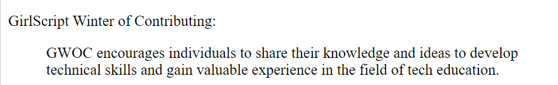
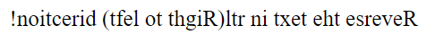
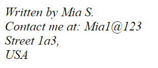

# HTML Quotation and Citation Elements
---

In HTML, to represent quotations and to cite texts, we need to make use of some specific tags to help us distinguish those quoted or cited text from the normal texts that are written.  

## Quotation and Citation Elements in HTML :
1. **HTML \<abbr> tag.**

    a)This tag is used to highlight an abbreviation.<br><br>
    b)They can also be used to write short form of a word like- UN(United Nations), ISRO(Indian Space Research Organisation), GWOC(GirlScript Winter of Contributing)       etc.<br><br>
    c)We use the attribute 'title' along with the tag \<abbr>. This attribute holds the actual meaning of the abbreviation.<br><br>
    d)The \<abbr> tag should end with its respective closing tag\</abbr>. <br><br>
    d)In the output, if we hover/ or move out cursor on the underlined abbreviation, the actual full-form of the abbreviation is displayed.

    **Example :**

``` HTML
    <p>The <abbr title="United Nations">UN</abbr> aims to maintain International Peace.</p>
```

   **Output :**



2. **HTML \<q> tag.**

    a) This tag is used to insert quotation marks when required while writing some quotes.<br><br>
    b) The \<q> tag should end with its respective closing tag\</q>. 

    **Example :**

``` HTML
     <p>Charlie Chaplin once said: 
     <q>A day without laughter is a day wasted.</q>
     which is a very correct statement!</p>
```
   **Output :**



3. **HTML \<cite> tag.**

    a) As the name suggests the \<cite> tag is used to specify a citation.<br><br>
    b) It provides reference/ title  to some unique work done.<br><br>
    c) It identifies the source of a particular work done.<br><br>
    d) The text written inside this tag is displayed in italics during the output.<br><br>
    e) The \<cite> tag should end with its respective closing tag\</cite>. 

    **Example :**

``` HTML
     <p><cite>The Maze Runner</cite> by James Dashner.</p>
```
   **Output :**


4. **HTML \<blockquote> tag.**

    a) This tag is used to highlight a quote taken from another source.<br><br>
    b) It indents the text block that is written inside the tag.<br><br>
    c) The attribute 'cite' can be used with it to notify the source or the place from which the blockquoted text has been taken from.<br><br>
    d) The \<blockquote> tag should end with its respective closing tag\</blockquote>.

    **Example :**

``` HTML
     <p>GirlScript Winter of Contributing:</p>
     <blockquote cite="https://gwoc.girlscript.tech/">
     GWOC encourages individuals to share their knowledge and ideas to develop technical skills and gain valuable experience in the field of tech education.
     </blockquote>
```
   **Output :**



5. **HTML \<bdo> tag.**

    a) The \<bdo> tag stands for Bi-Directional Override.<br><br>
    b) It is used to change the current direction of a text written inside the tag.<br><br>
    c) It is very useful for writing languages like Arabic/Hebrew which usually involve text written from the right to left direction.<br><br>
    d) The attribute 'dir' is used along with the \<bdo> tag.<br><br>
    e) The 'dir' attribute can be assigned two values either-<br> 
        i) ltr - Defines the direction of text from left to right.<br>
        ii) rtl - Defines the direction of text from left to right.<br><br>
    f) The \<bdo> tag should end with its respective closing tag\</bdo>.
    
    **Example :**

``` HTML
    <bdo dir="rtl">Reverse the text in rtl(Right to left) direction!</bdo>
```
   **Output :**



6. **HTML \<address> tag.**

    a) The \<address> tag as the name suggests is used when one wants to display any address or contact information in the document. 
    b) The text written inside this tag is displayed in italics during the output.
    c) The \<address> tag should end with its respective closing tag\</address>.

    **Example :**

``` HTML
   <address>
   Written by Mia S.<br> 
   Contact me at:
   Mia1@123<br>
   Street 1a3,<br>
   USA
   </address>
```

   **Output :**



## To Summarize:

Some of the commonly used tags to represent quotation and cite text are:
<br>

* `<abbr>` - This tag is used to define either an abbreviation or an acronym.
* `<q>` - This tag is used to write a small inline quotation.
* `<cite>` - This tag is used refer to some special, creative work or the title of a specific work..
* `<blockquote>` - This tag is used to represent quote/text that is taken from a difference source.
* `<bdo>` - This tag is used to specify in which direction a text has to be written..
* `<address>` - This tag defines contact info of the person.

## References:

1) https://www.w3schools.com/html/
2) https://www.javatpoint.com/
