# HTML Text Formatting
---

HTML Text Formatting is formatting the text in different styles. HTML provides us many predefined tags that can be used to format texts without using CSS. These tags help us to highlight the texts, to make it bold, italic, subscript, superscript, underlined and many more. Some tags are only for visual appearance while some adds semantic value to the text.

<br>
Following is the list of Formatting tags used in HTML :
<br><br>

* `<b>` - This is used to bold the text written between it.
* `<strong>` - This tag tells the browser that this is Important.
* `<i>` - This tag is used to make text Italic.
* `<em>` - This tag is used to Emphasize text i.e displays the contents in Italic.
* `<mark>` - This tag is used to highlight texts.
* `<tt>` - This tag is used to display a text in Teletype . 
* `<q>` - This tag is a quotation tag and used for short quotation.
* `<small>` - This tag is used to decrease the font size by one unit.
* `<big>` - This tag is used to increase the font size by one unit.
* `<del>` - This tag defines that the text has been deleted from the document.
* `<s>` - This tag is used to display the text which is no longer correct or relevant.
* `<code>` - This tag displays the text in monospaced font , used commonly to display source code.
* `<pre>` - This tag is used to define preformatted text. The browsers displays the enclosed text with white spaces and line breaks.
* `<ins>` - This tag displays the content which is added.
* `<u>` - This tag is used to underline the text written within it.
* `<sub>` - This tag is used to display the content slightly below the normal line.
* `<sup>` - This tag is used to display the content slightly above the normal line.

## Text Formatting  Elements :
1. **HTML \<b> and \<strong> Elements.**

These Elements are used to display the text in Bold .

**Example**

``` HTML
    <p>This text is <b>Bold</b>.</p>
    <p>This text is <strong>Important</strong>.</p>
```

**Output :**

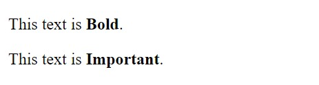

*Note- Here it seems that \<b> tag and \<strong> tag both have bold the text. But here \<strong> is a semantic element specifying that the text written within it is important .*

2. **HTML \<i> and \<em> Elements.**

These Elements sre used to display the contents as Italic.

**Example**

``` HTML
     <p>This text is <i>Italic</i>.</p>
     <p>This text is <em>Emphasized</em>.</p>
```
**Output :**

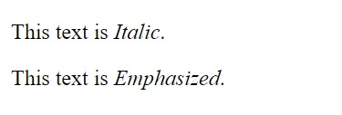

*Note- As in above example ,  here \<i> tag and \<em> tag both have make the text italic. But here \<em> is a semantic element used to emphasize a text.*

3. **HTML \<sub> and \<sup> Elements.**

The \<sup> tag is used to superscript a text where as \<sub> tag is used to subscript a text.

**Example**

``` HTML
     <p>This is <sub>subscripted</sub> text.</p>
     <p>This is <sup>superscripted</sup> text.</p>
```
**Output :**

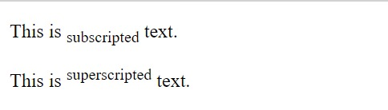

4. **HTML \<mark> Element.**

The \<mark> tag is used to mark or highlight a text . 

**Example**

``` HTML
     <p>Tomorrow is your <mark>Birthday</mark>.</p>
```
**Output :**

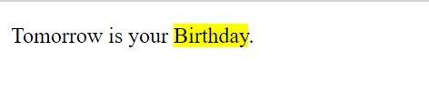

5. **HTML \<tt> Element.**

The \<tt> tag is a teletype element which applies monospace highlighting to the content.

**Example**

``` HTML
    <p>This will add <tt>monospaced</tt> teletype in the text .</p>
```
**Output :**

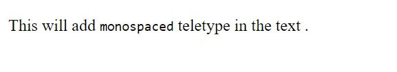

6. **HTML \<q> Element.**

The \<q> tag is a quotation tag and used for short quotation. The browser normally inserts a quotation mark in the text enclosed within this tag.


**Example**

``` HTML
    <p>We should plant more trees to save our <q>Mother Earth</q> .</p>
```
**Output :**

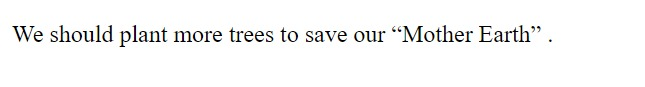


7. **HTML \<small> and \<big> Element.**

The HTML \<small> tag is used to decrease the font size by one unit from base font size.
<br>
The HTML \<big> tag is used to increase the font size by one unit from base font size.

``` HTML
    <p>I like to <small>write</small> contents.</p>
    <p>She is very <big>fond</big> of writing poems.</p>
```
**Output :**

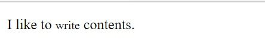

8. **HTML \<code> Element.**

The HTML \<code> tag displays the content in monospaced font. This is commonly used to display computer codes.

**Example**

``` HTML
    <p><code>This is my HTML Code</code></p>
```
**Output :**

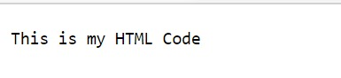

9. **HTML \<pre> Element.**

The \<pre> tag is used to define preformatted text. The browsers render the enclosed text with white spaces and line breaks.

**Example**

``` HTML
    <pre>Got this via email.
               Hello there !!
               Welcome.
    </pre>
```
**Output :**

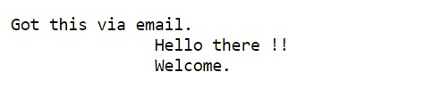


10. **HTML \<ins> and \<u> Element.**

The HTML \<ins> element displays the content which is added in the Documents.<br>
Whereas \<u> element is used to underline the text for stylistic purpose.

``` HTML
    <p>I want to <ins>add</ins> contents.</p>
    <p>There is <u>something </u> new in the wardrobe. </p>
```
**Output :**

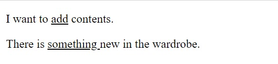

11. **HTML \<del> and \<s> Element.**

The HTML \<del> element displays the text that has been deleted from a document. <br>
Whereas \<s> element is used to represent the texts which is no longer correct in the document. 

``` HTML
    <p>Please delete <del>Icecream</del> from the List .</p>
    <p>I don't need <s>this sentence</s> in my content.</p>
```
**Output :**

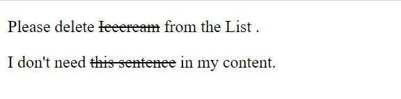

*NOTE - Although they both draw a strikethough in the text within it but they both have different semantic meanings to the browser.*

<hr>


<br>

## Reference
https://www.w3schools.com/html/html_formatting.asp
<br>
https://www.javatpoint.com/html-formatting
<br>
https://www.w3docs.com/learn-html/html-tags-for-text-formatting.html
<br>
https://www.tutorialspoint.com/html/html_formatting.htm


__Contributed by :__[ Ruhi Rani 😊](https://github.com/ruhirani011)