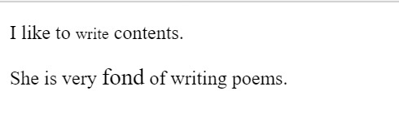

# HTML Text Formatting
---

HTML Text Formatting is formatting the text in different styles. HTML provides us many predefined tags that can be used to format texts without using CSS. These tags help us to highlight the texts, to make it bold, italic, subscript, superscript, underlined and many more. Some tags are only for visual appearance while some adds semantic value to the text.

<br>
Following is the list of Formatting tags used in HTML :
<br><br>

* `<b>` - This is used to bold the text written between it.
* `<strong>` - This tag tells the browser that this is Important.
* `<i>` - This tag is used to make text Italic.
* `<em>` - This tag is used to Emphasize text i.e displays the contents in Italic.
* `<mark>` - This tag is used to highlight texts.
* `<small>` - This tag is used to decrease the font size by one unit.
* `<del>` - This tag defines that the text has been deleted from the document.
* `<ins>` - This tag displays the content which is added.
* `<sub>` - This tag is used to display the content slightly below the normal line.
* `<sup>` - This tag is used to display the content slightly above the normal line.

## Text Formatting  Elements :
1. **HTML \<b> and \<strong> Elements.**

These Elements are used to display the text in Bold .

**Example**

``` HTML
    <p>This text is <b>Bold</b>.</p>
    <p>This text is <strong>Important</strong>.</p>
```

**Output :**


*Note- Here it seems that \<b> tag and \<strong> tag both have bold the text. But here \<strong> is a semantic element specifying that the text written within it is important .*

2. **HTML \<i> and \<em> Elements.**

These Elements sre used to display the contents as Italic.

**Example**

``` HTML
     <p>This text is <i>Italic</i>.</p>
     <p>This text is <em>Emphasized</em>.</p>
```
**Output :**


*Note- As in above example ,  here \<i> tag and \<em> tag both have make the text italic. But here \<em> is a semantic element used to emphasize a text.*

3. **HTML \<sub> and \<sup> Elements.**

The \<sup> tag is used to superscript a text where as \<sub> tag is used to subscript a text.

**Example**

``` HTML
     <p>This is <sub>subscripted</sub> text.</p>
     <p>This is <sup>superscripted</sup> text.</p>
```
**Output :**


4. **HTML \<mark> Element.**

This Element is used to mark or highlight a text . 

**Example**

``` HTML
     <p>Tomorrow is your <mark>Birthday</mark>.</p>
```
**Output :**


5. **HTML \<small> Element.**

This tag is used to decrease the font size by one unit from base font size.

``` HTML
    <p>I like to <small>write</small> contents.</p>
```
**Output :**




6. **HTML \<ins> Element.**

This tag displays the content which is added in the Documents.

``` HTML
    <p>I want to <ins>add</ins> contents.</p>
```
**Output :**


7. **HTML \<del> Element.**

The HTML \<del> element displays the text that has been deleted from a document. 

``` HTML
    <p>Please delete <del>Icecream</del> from the List .</p>
```
**Output :**


<hr>


<br><br>

__Contributer :__[Ruhi_Rani](https://github.com/ruhirani011)