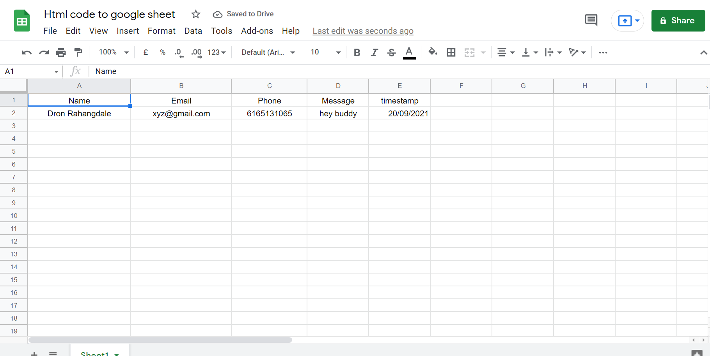
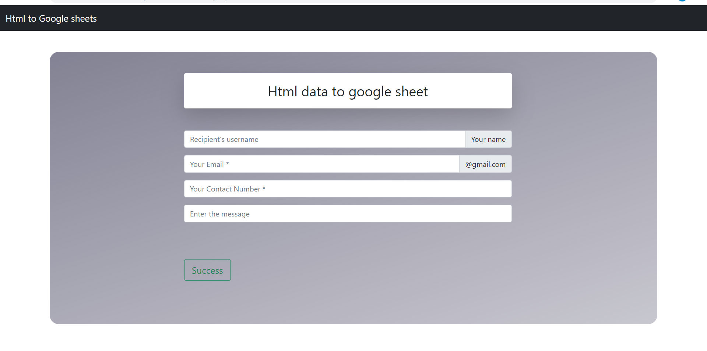

# 📕 Frond End Web Dev 📕

## 1️⃣ HTML

- [x] Html form to google sheets

<hr>

**The basic idea is to connect our html forms to google sheet . The below written documentation clears the whole concept behind it**

<hr>

# HTML CODE

The below Frontend document contains the **html** file which basically contains a **UI** of our form

The form is divided in to sections called:-

-  `Name`
-  `Email`
-  `Message`
-  `Timestamp`
-  `Phone number`

**Here is the UI code**
```html
<!DOCTYPE html>
<html lang="en">
<head>
    <meta charset="UTF-8" />
    <meta name="viewport" content="width=device-width, initial-scale=1.0" />
    <title>Document</title>
    <link href="https://cdn.jsdelivr.net/npm/bootstrap@5.1.1/dist/css/bootstrap.min.css" rel="stylesheet" integrity="sha384-F3w7mX95PdgyTmZZMECAngseQB83DfGTowi0iMjiWaeVhAn4FJkqJByhZMI3AhiU" crossorigin="anonymous">
    <style>
        .form-new {
            margin-right: 22%;
            margin-left: 20%;
        }
        .heading {
            width: 150%;
            display: flex;
            justify-content: center;
            align-items: center;
            color: #e9ecef;
            font-size: 45px;
            font-family: Arial, Helvetica, sans-serif;
        }
        .register {
            background: linear-gradient(162.29deg, rgba(62, 60, 88, 0.64) 0.99%, rgba(23, 22, 40, 0) 179.83%);
            border-radius: 20px;
            box-sizing: border-box;
            margin-top: 3%;
            padding: 3%;
        }
        .centerheading{
            font-size: 30px;
            display: flex;
            justify-content: center;  
        }
    </style>
</head>
<body>
    <nav class="navbar navbar-dark bg-dark">
      <div class="container-fluid">
        <a class="navbar-brand" href="https://docs.google.com/spreadsheets/d/1owGzJeJTi-7V40Xi_7GgYHtdmZrIYVEpnA92yYP3VrY/edit#gid=0">Html to Google sheets</a>
      </div>
    </nav>
    <div class="container register">
        <div class="row">
            <div class="col-md-12">
                <div class="tab-pane fade show active text-align form-new" id="home" role="tabpanel"
                    aria-labelledby="home-tab">
                    <div class="shadow-lg p-3 mb-5 bg-body rounded ">
                       <section class="centerheading">Html data to google sheet</section></div>
                   
                    <div class="row register-form">
                        <div class="col-md-12">
                            <form method="post" autocomplete="off" name="google-sheet">
                                <div class="form-group">
                                    <div class="input-group mb-3">
                                      <input type="text" name="Name"   value="" required="" class="form-control" placeholder="Recipient's username" aria-label="Recipient's username" aria-describedby="basic-addon2">
                                      <span class="input-group-text" id="basic-addon2">Your name </span>
                                    </div>
                                  
                                </div>
                                <div class="form-group">
                                    <div class="input-group mb-3">
                                      <input type="text" name="Email"  value="" required="" class="form-control"placeholder="Your Email *" aria-label="Recipient's username" aria-describedby="basic-addon2">
                                      <span class="input-group-text" id="basic-addon2">@gmail.com</span>
                                    </div>
                               
                                </div>
                              
                                <div class="form-group">
                                    <input type="number" name="Phone" class="form-control"
                                        placeholder="Your Contact Number *" value="" required="" />
                                </div>
                                 <div class="form-group">
                                    <div class="input-group mb-3">
                                      <input type="text" name="Message"   value="" required="" class="form-control my-3" placeholder="Enter the message" aria-label="Recipient's username" aria-describedby="basic-addon2">
                                    </div>
                                  
                                </div>
                                <div class="form-group">
                                    <button type="submit" name="submit"  class="btn btn-outline-success my-5 btn-lg">Success</button>
                                </div>
                                
                            </form>
                        </div>
                    </div>
                </div>
            </div>
        </div>
    </div>
    <script>
        const scriptURL =
            "https://script.google.com/macros/s/AKfycbxFnHqHV20SQOIIO3jyBYcxGb2Pv2l90Xpu0u_tEN3opfMMAAdry6ShlyIEfoaS3K-jBw/exec";
        const form = document.forms["google-sheet"];
        form.addEventListener("submit", (e) => {
            e.preventDefault();
            fetch(scriptURL, { method: "POST", body: new FormData(form) })
                .then((response) => alert("Thanks for fiiling the form"))
                .catch((error) => console.error("Error!", error.message));
        });
    </script>
    <script src="https://maxcdn.bootstrapcdn.com/bootstrap/4.1.1/js/bootstrap.min.js"></script>
    <script src="https://cdnjs.cloudflare.com/ajax/libs/jquery/3.2.1/jquery.min.js"></script>
</body>
</html>
<hr>
```

<hr>

**Which basically looks like this :-**
<br>

**Front Page UI**



# Javasript code

The below mention code which links the form with the html forms
<br>

**Here is the javascript code**
```javascript
var GooglesheetName = "Sheet1";
var scriptProp = PropertiesService.getScriptProperties();
function intialSetup() {
  var activeSpreadsheet = SpreadsheetApp.getActiveSpreadsheet();
  scriptProp.setProperty("key", activeSpreadsheet.getId());
}
function doPost(e) {
  var lock = LockService.getScriptLock();
  lock.tryLock(10000);
  try {
    var doc = SpreadsheetApp.openById(scriptProp.getProperty("key"));
    var sheet = doc.getSheetByName(GooglesheetName);
    var headers = sheet.getRange(1, 1, 1, sheet.getLastColumn()).getValues()[0];
    var nextRow = sheet.getLastRow() + 1;
    var newRow = headers.map(function (header) {
      return header === "timestamp" ? new Date() : e.parameter[header];
    });
    sheet.getRange(nextRow, 1, 1, newRow.length).setValues([newRow]);
    return ContentService.createTextOutput(
      JSON.stringify({ result: "success", row: nextRow })
    ).setMimeType(ContentService.MimeType.JSON);
  } catch (e) {
    return ContentService.createTextOutput(
      JSON.stringify({ result: "error", error: e })
    ).setMimeType(ContentService.MimeType.JSON);
  } finally {
    lock.releaseLock();
  }
}
```
<hr>

**Google Sheet**


# How to link it with the HTML Forms ?

1.Make the UI of your form with a proper HTML and CSS <br/>

<hr/>
2. Go to the Google sheet and make the Info tags you want like(Names, Message ,Email...etc) its upon you How many tags you  want to make <br/>
<hr/>
3. Go to **tools** option in the above menu and select the **Script editor** menu a new tab will pop up <br/>
<hr/>
4. Give the name of your project and embed your javascript file there what you want to add  <br/>
<hr>
5. Afterwards go to **Deploy menu** and select **Web App** and press Deploy button then copy the url you get <br>
<hr>
6. After its require some permissions give  to it and your form gets ready to work 
<br>
