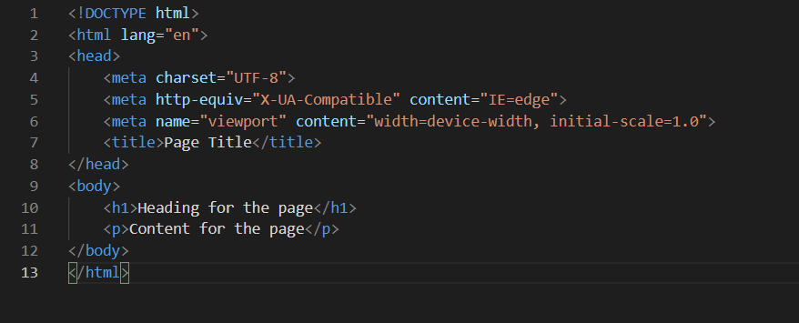
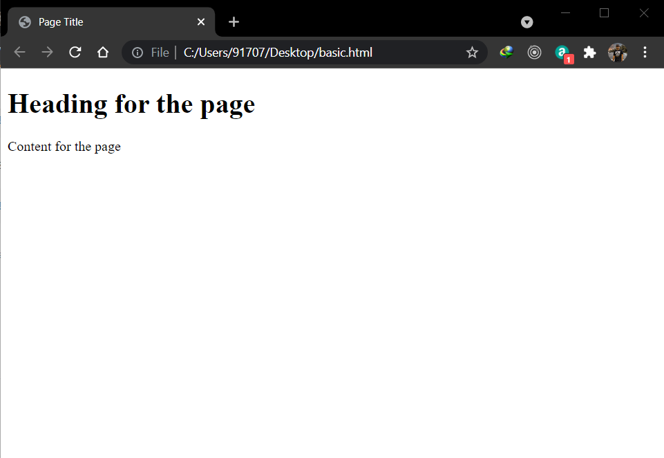

**INTRODUCTION TO HTML**

HTML is a standard markup language which is used for creating Web pages.

- HTML stands for **Hyper Text Markup Language**.
- HTML is a standard markup language for creating web pages
- HTML describes the structure of web pages
- HTML tells the browser how to show the content

**A SIMPLE HTML CODE**

**Code Explanaton**

- The <**!DOCTYPE html**> declares that the document is a HTML5 document.
- The <**html**> element is the root of the HTML page.
- The <**head**> element contains the meta information of the HTML page.
- The <**title** element specifies the title of the HTML page that will be shown in the browser's title bar of in the page's tab.
- The <**body**> element defines the document's body, and it contains all the visible contents i.e. headings, paragraphs, images, tables, links, images etc and will be displayed in the white part of the browser.
- The <**h1**> element defines a large heading.
- The <**p**> element defines a paragraph.

**What is a HTML element**

- <**tagName**>.....Content comes here.....<**/tagName**>
  **HTML element** is everthing from the start tag to the ending tag.
- <**h1**>Heading comes here<**/h1**>
- <**p**>Paragraphs comes here<**/p**> element defines

**Role of Web Browsers**

- The purpose of web browsers(Chrome, Safari, Edge, Firefox) is very simple i.e. to read the HTML document and display the contents correctly.
- The browser does not display the **HTML Tags**, but uses those tags such that the content is displayed.
  
