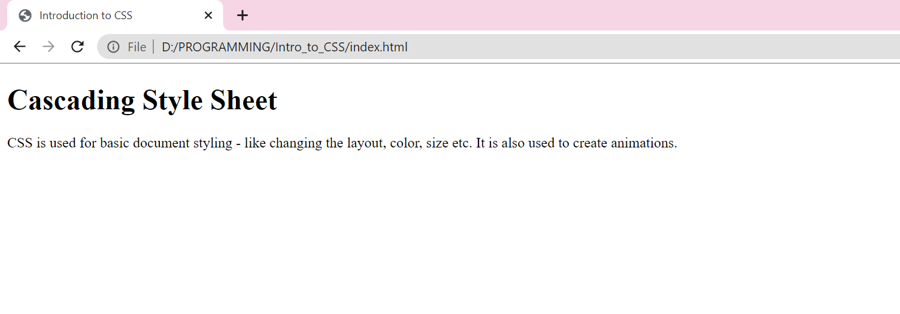
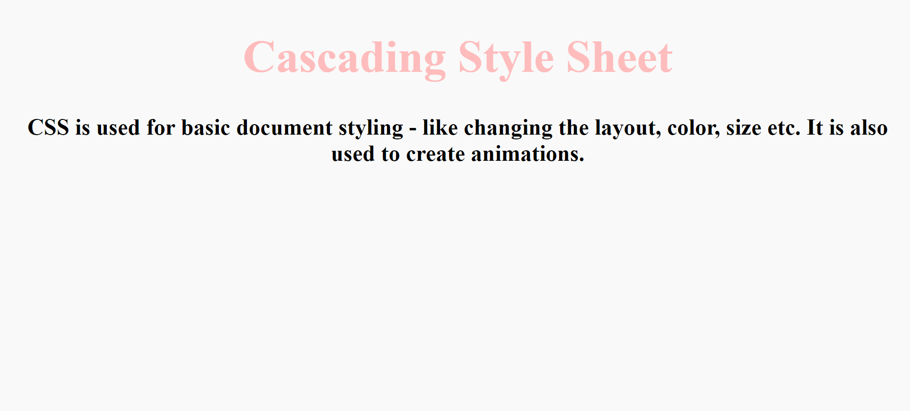

# **INTRODUCTION TO CSS**

CSS stands for ***Cascading Style Sheets.*** 

**Some background on the existence of CSS:**
>Back when the World Wide Web came into existence, one could create web pages with HTML, but one could not make it look the way one wanted to. There was no way to style documents! That is when in 1994 Håkon Wium Lie who was working with Tim Berner's Lee, the creator of WWW at CERN, proposed CSS.

CSS is used for basic document styling - like changing the layout, color, size etc. It is also used to create animations. 

Let's take a look at how CSS can create a change to a simple HTML document.
Copy this code into a file and name it `index.html`👇 

```
<!DOCTYPE html>
<html lang="en">
<head>
    <meta charset="UTF-8">
    <meta http-equiv="X-UA-Compatible" content="IE=edge">
    <meta name="viewport" content="width=device-width, initial-scale=1.0">
    <title>Introduction to CSS</title>
</head>
<body>
    <h1>Cascading Style Sheet</h1>

    <p>CSS is used for basic document styling - like changing the layout, color, size etc.
     It is also used to create animations. </p>
    
</body>
</html>

```


When we view the file in the browser, we can see a simple website like this👇.




We can add CSS to a website in three ways:
- **External CSS**
- **Internal CSS**
- **Inline CSS**

### External CSS

Firstly, create a file called `styles.css`.
We will add all our CSS to this file.

Let us start with some basic changes:
- Let us change the `h1`- Heading to have a lighter shade of pink.
- Let the whole body have a background color to a another shade of white.
- We can also try aligning heading and body to the centre.
- We can also make the font bigger.

Navigate to `styles.css` and add this piece of code. 

```
h1{
    color: #FFBCBC;
    text-align: center;
}

body{
    background-color: #F9F9F9;
    text-align: center;
    font-size: 200%;
    font-weight: bold;
}

```

As you  can see above, we have target and style an HTML element.
To change the h1 tag, we targeted it with the given syntax:
```
h1{

}
```
The properties go within the parenthesis and end with a semicolon.

Now, to implement the changes to the document we will have to **link** the CSS file with our HTML file.

We do that by adding the following line within the `<head></head> tags`.

`<link rel="stylesheet" href="styles.css">`

>**Note**: The `href` should have the whole path to the CSS file.

Next, we can see the changes in the browser and it looks something like this.👇



This is how we can add **External CSS** to our webpage.

### Internal CSS 

An internal stylesheet is present within the HTML document. 
To create an internal stylesheet, you place CSS inside a `<style>` element contained inside the HTML `<head>`.

The HTML file after the adding Internal stylesheet👇

```
<!DOCTYPE html>
<html lang="en">
<head>
    <meta charset="UTF-8">
    <meta http-equiv="X-UA-Compatible" content="IE=edge">
    <meta name="viewport" content="width=device-width, initial-scale=1.0">
    <title>Introduction to CSS</title>
    <style>
     h1{
        color: #FFBCBC;
        text-align: center;
    }

    body{
        background-color: #F9F9F9;
        text-align: center;
        font-size: 200%;
        font-weight: bold;
    }
    </style>
</head>
<body>
    <h1>Cascading Style Sheet</h1>

    <p>CSS is used for basic document styling - like changing the layout, color, size etc.
     It is also used to create animations. </p>
    
</body>
</html>
```
### Inline CSS

Inline styles are CSS declarations that affect a single HTML element, contained within a style attribute.

```
<!DOCTYPE html>
<html lang="en">
<head>
    <meta charset="UTF-8">
    <meta http-equiv="X-UA-Compatible" content="IE=edge">
    <meta name="viewport" content="width=device-width, initial-scale=1.0">
    <title>Introduction to CSS</title>
</head>
<body style = "background-color: #F9F9F9;text-align: center;font-size: 200%;font-weight: bold;">
    <h1 style = "color: #FFBCBC;text-align: center;">Cascading Style Sheet</h1>

    <p >CSS is used for basic document styling - like changing the layout, color, size etc.
     It is also used to create animations. </p>
    
</body>
</html>
```

This is how we can add CSS in our HTML files.

### **References:**

https://developer.mozilla.org/en-US/docs/Learn/CSS/First_steps/How_CSS_is_structured