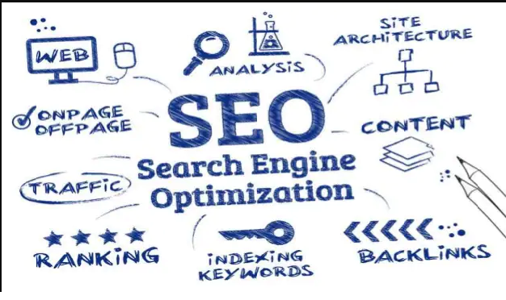
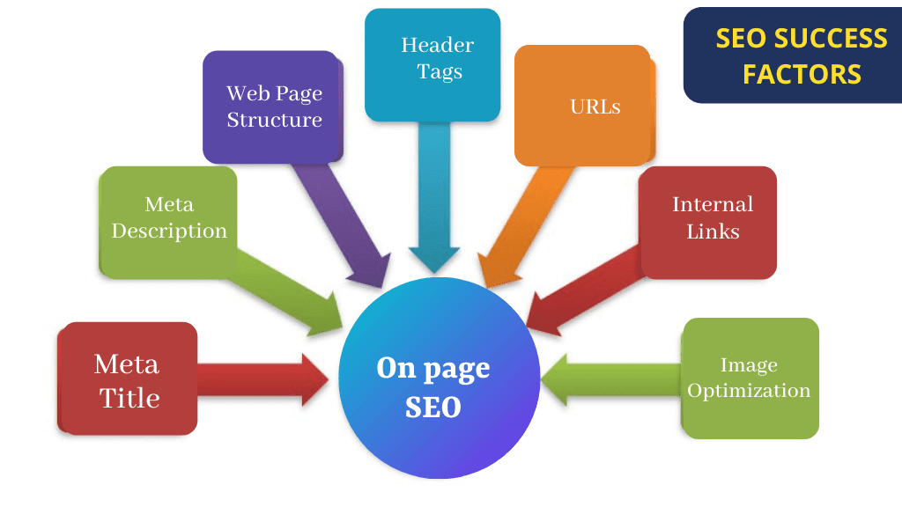

# SEO/Search Engine Optimization
----
## What is it?
- It is the process of improving your website's visibility when people search for products or services related to your business in any Search Engine. The better visibility your pages have in search results, the more likely you are to gain the attention of customers to your business. 
  
  
 
 
 ## How does it work?
 #### In order to understand this let's take the example of the Google Search Engine.
 - Google stores all its web pages in an ***index***. Every ***index*** entry has a Description and URL assiciated with it. *To index* is when Google fetches a page, reads it, and adds it to the index: *Google indexed several pages on my site today*.
 - Google *crawls* the web, looking for new pages, then indexes them if necessary with the help of its *crawler*- the *GoogleBot*. GoogleBot is an automated software that acts as a librarian to help us find what we are searching for. 
 ----
The techniques and factors which work in co-relation with each other to improve the overall SEO of your website are known as the SEO Success Factors. The Periodic Table of SEO Factors organizes the factors into six main categories and weights each based on its overall importance to SEO. In this section our main focus would be on the factors related to HTML Codes. HTML is the coding standard used to make most web pages. Search engines can pick up specific signals from various HTML elements. So, the designers must use these HTML elements effectively to gain maximum advantage. 
 
 
 Here are some of the HTML elements to consider for SEO.
- Ht- ***HTML Title tag***: Search engines use the title tags to understand what a page is about, so it’s important that they are unique and descriptive. Titles should be concise, accurately reflect your page’s content and feature the keywords you wish to rank for.
- Hd- ***Meta tag description***: This can be used to suggest how you’d like your pages to be described in the search listings. Descriptions appear below the headlines in the search results. 
- Hs- ***Structured data***: gives search engines a better understanding of the content on your page and enhances the listing to give them more insight on the pages contents.
- Hh- ***Header tags***: Headings identify key sections of your content and organize them. A page may have a headline having the **H1** tag and several sub-headings having the **H2** tag  to break up the copy into sections. Using keywords in these header tags help increase the traffic to the website.
- Alt- ***Image Alt***: They the Alt tags mostly used in the image descriptions that is displayed when the image does not load.It allows search engines to better crawl and rank your website.

 

#### To know more about these factors [click here](https://iquelab.in/the-periodic-table-of-seo-success-factors-2021/).
