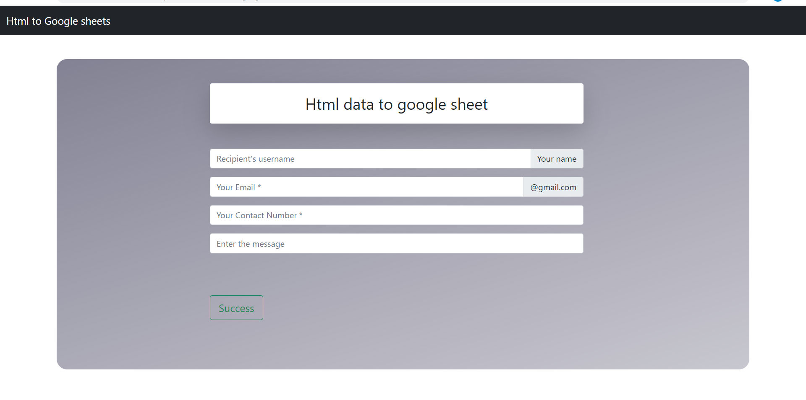

# 📕 Frond End Web Dev 📕

## 1️⃣ HTML

- [x] Html form to google sheets

```
HTML CODE
```
In the above Frontend document i have made **html** file which basically contains ia **UI** of our form

The form is divided in to sestions called:-
###### Name
###### Email
###### Message
###### Timestamp
###### Phone number

```
Javasript code
```
The above mention file also contain **#js** file with the code which link the form with the html form 

```
How to link it with the HTML Forms ?
```
1.Make the UI of your form with a proper HTML and CSS <br/>
<hr/>
2.Go to the Google sheet and make the Info tags you want and like(Names, Message ,Email...etc)How many you 
  want to make <br/>
<hr/>
3.Go to **tools** option in the above menu and select the **Script editor** menu a new tab will pop up <br/>
<hr/>
4.Give the name of your project and emmbed your javascript there what you want to make <br/>
<hr>
5.After wards go to **Deploy menu** and select **Web App** and press Deploy copy the url you get <br>
<hr>
6.After its require some premisions give it to it and your form gets ready to work 

```
 My UI
 ```
**Front Page UI**



**Google Sheet**


             