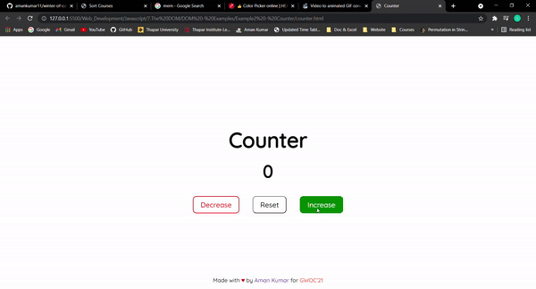

# Example 2 - Counter



HTML Code

```html
<!DOCTYPE html>
<html lang="en">
<head>
    <meta charset="UTF-8">
    <meta http-equiv="X-UA-Compatible" content="IE=edge">
    <meta name="viewport" content="width=device-width, initial-scale=1.0">
    <link rel="stylesheet" href="./counter.css"/>
    <title>Example2 - Counter</title>
</head>
<body>
    <div class="container">
        <!-- <div class="box1">
            
        </div> -->
        <div class="box">
            <h1>Counter</h1>
            <p id="count">0</p>
            <div class="buttons">
                <button id="decrease">Decrease</button>
                <button id="reset">Reset</button>
                <button id="increase">Increase</button>
            </div>
        </div>
    </div>
    <div class="footer">
        <p>Made with <span class="heart">&hearts;</span> by <span><a class="github" href="https://github.com/amankumar11">Aman Kumar</a></span> for <span class="gwoc">GWOC'21</span></p>
    </div>
    <script src="./counter.js"></script>
</body>
</html>
```
CSS Code

```css 
@import url('https://fonts.googleapis.com/css2?family=Quicksand:wght@500&display=swap');

.container{
    display: flex;
    flex-direction: column;
    align-items: center;
    justify-content: center;
    text-align: center;
    font-family: 'Quicksand', sans-serif; 
    margin: auto;
    position: absolute;
    top: 0; left: 0; bottom: 0; right: 0;
    
}

.box{
    background-color: white;
    border-radius: 25px;
    padding-left: 10px;
    padding-right: 10px;
    font-size: 30px;
    font-weight: 600;
}

.box h1{
    margin-bottom: 20px;
}

.box p{
    font-size: 50px;
    margin-top: 15px;
    margin-bottom: 40px;
}

.buttons button{
    background-color: white;
    font-family: 'Quicksand', sans-serif;
    padding-right: 20px;
    padding-left: 20px;
    padding-top: 10px;
    padding-bottom: 10px;
    font-size: 20px;
    margin-right: 15px;
    margin-left: 15px;
    border-radius: 10px;
}

#decrease{
    color: red;
    border: 2px solid red;
}

#decrease:hover{
    color:white;
    background-color: red;
}

#increase{
    color: green;
    border: 2px solid green;
}

#increase:hover{
    color: white;
    background-color: green;
}

#reset:hover{
    color: white;
    background-color: black;
}

/* footer */

.footer {
    font-family: 'Quicksand', sans-serif;
    position: fixed;
    left: 0;
    bottom: 0;
    width: 100%;
    background-color: rgba(255, 255, 255, 0.253);
    color: black;
    text-align: center;
  }

.heart{
    color: red;
}

.github{
    text-decoration: none;
}

.gwoc{
    color: tomato;
}
```
Javascript Code

```javascript
const count = document.getElementById('count');
const decrease = document.getElementById('decrease');
const reset = document.getElementById('reset');
const increase = document.getElementById('increase');
var c = 0;
decrease.addEventListener('click', ()=>{
    c--;
    count.textContent = c;
});

increase.addEventListener('click', ()=>{
    c++;
    count.textContent = c;
});

reset.addEventListener('click', ()=>{
    c=0;
    count.textContent = c;
});

```
