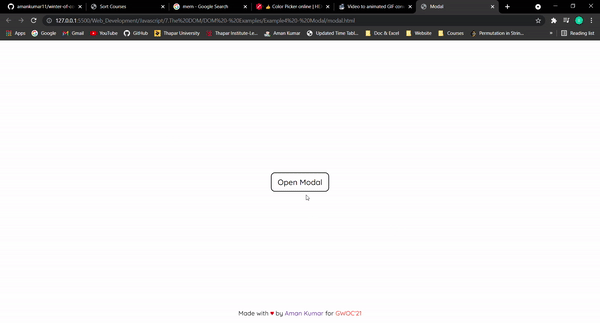

# Example 4 - Modal



HTML Code

```html
<!DOCTYPE html>
<html lang="en">
<head>
    <meta charset="UTF-8">
    <meta http-equiv="X-UA-Compatible" content="IE=edge">
    <meta name="viewport" content="width=device-width, initial-scale=1.0">
    <link rel="stylesheet" href="./modal.css"/>
    <title>Example4 - Modal</title>
</head>
<body>
    <div class="button" id="button">
        <button class="modalbtn" id="modalbtn">Open Modal</button>
    </div>
    <div class="modal" id="modal">
        <h1>This is a Modal</h1>
        <button class="close" id="closebtn">Close</button>
    </div>
    <div class="footer">
        <p>Made with <span class="heart">&hearts;</span> by <span><a class="github" href="https://github.com/amankumar11">Aman Kumar</a></span> for <span class="gwoc">GWOC'21</span></p>
    </div>
    <script src="./modal.js"></script>
</body>
</html>
```

CSS Code

```css
@import url('https://fonts.googleapis.com/css2?family=Quicksand:wght@500&display=swap');

.button{
    display: flex;
    flex-direction: row;
    justify-content: center;
    align-items: center;
    position: absolute;
    top: 0; bottom: 0;right: 0;left: 0;
}

.button button{
    padding-right: 15px;
    padding-left: 15px;
    padding-top: 10px;
    padding-bottom: 10px;
    font-size: 20px;
    background-color: white;
    color: black;
    border: 2px solid black;
    border-radius: 10px;
    font-family: 'Quicksand', sans-serif; 
}

.button button:hover{
    color: white;
    background-color: black;
}

/* modal  */
.modal{
    display: none;
    flex-direction: column;
    align-items: center;
    justify-content: center;
    margin: auto;
    position: absolute;
    top: 0;bottom: 0;right: 0;left: 0;
    border: 2px solid black;
    border-radius: 10px;
    width: 500px;
    height: 50%;
    font-family: 'Quicksand', sans-serif;
}

.close{
    font-family: 'Quicksand', sans-serif;
    padding-right: 15px;
    padding-left: 15px;
    padding-top: 5px;
    padding-bottom: 5px;
    font-size: 15px;
    background-color: white;
    color: red;
    border: 2px solid red;
    border-radius: 10px;
    
}

.close:hover{
    background-color: red;
    color: white;
}

/* footer  */

.footer {
    font-family: 'Quicksand', sans-serif;
    position: fixed;
    left: 0;
    bottom: 0;
    width: 100%;
    background-color: rgba(255, 255, 255, 0.253);
    color: black;
    text-align: center;
  }

.heart{
    color: red;
}

.github{
    text-decoration: none;
}

.gwoc{
    color: tomato;
}
```

Javascript Code

```javascript
const modalbtn = document.getElementById('modalbtn');
const closebtn = document.getElementById('closebtn');
const modal = document.getElementById('modal');
const button = document.getElementById('button');

modalbtn.addEventListener('click', ()=>{
    modal.style.display='flex';
    button.style.display='none';
});

closebtn.addEventListener('click', ()=>{
    modal.style.display='none';
    button.style.display='flex';
});
```