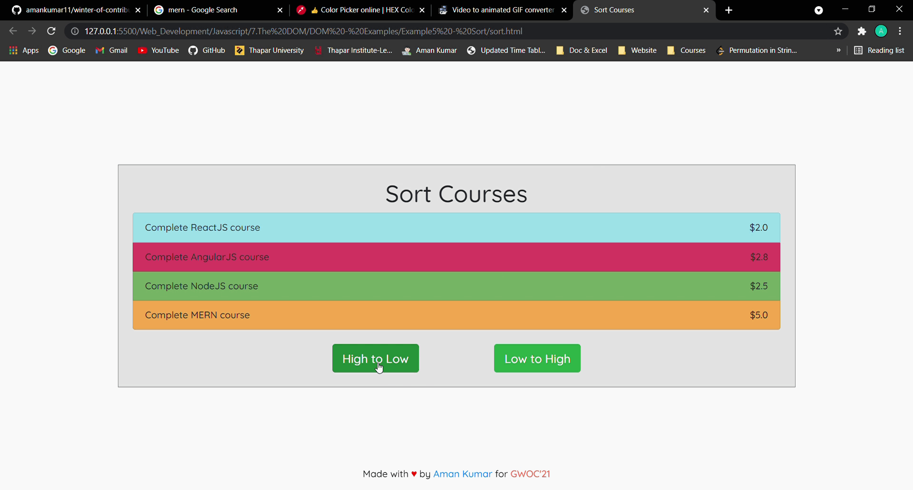

# Example5 - Sort Courses



HTML Code

```html
<!DOCTYPE html>
<html lang="en">
  <head>
    <meta charset="UTF-8" />
    <meta name="viewport" content="width=device-width, initial-scale=1.0" />
    <title>Example5 - Sort Courses</title>
    <link rel="stylesheet" href="./sort.css" />
    <link
      rel="stylesheet"
      href="https://stackpath.bootstrapcdn.com/bootstrap/4.4.1/css/bootstrap.min.css"
    />
  </head>
  <body>
    <div class="container p-4">
      <h1 class="text-center">Sort Courses</h1>
      <ul class="list-group">
      </ul>
      <div class="buttons">
        <button type="button" class="btn btn-success btn-lg mt-4 mx-auto d-block sort-high-low-btn">
          High to Low
        </button>
        <button type="button" class="btn btn-success btn-lg mt-4 mx-auto d-block sort-low-high-btn">
          Low to High
        </button>
      </div>
    </div>
    <div class="footer">
      <p>Made with <span class="heart">&hearts;</span> by <span><a class="github" href="https://github.com/amankumar11">Aman Kumar</a></span> for <span class="gwoc">GWOC'21</span></p>
    </div>
    <script src="./sort.js"></script>
  </body>
</html>
```
CSS Code

```css
@import url('https://fonts.googleapis.com/css2?family=Quicksand:wght@500&display=swap');

body {
  display: flex;
  justify-content: center;
  align-items: center;
  min-height: 100vh;
  
}

.container{
  display: flex;
  flex-direction: column;
  font-family: 'Quicksand', sans-serif;
  background-color: rgba(128, 128, 128, 0.219);
  border: 1px solid grey;
}

.buttons{
  display: flex;
  flex-direction: row;
  width: 50%;
  margin: auto;
  align-items: center;
  justify-content: center;
  font-family: 'Quicksand', sans-serif;
}

/* footer  */
.footer {
  font-family: 'Quicksand', sans-serif;
  position: fixed;
  left: 0;
  bottom: 0;
  width: 100%;
  background-color: rgba(255, 255, 255, 0.253);
  color: black;
  text-align: center;
}

.heart{
  color: red;
}

.github{
  text-decoration: none;
}

.gwoc{
  color: tomato;
}
```
Javascript Code

```javascript
const courses = [
    {
        name: "Complete ReactJS course",
        price: "2.0",
        color: "#00d2f754"
    },
    {
        name: "Complete AngularJS course",
        price: "2.8",
        color: "#d6002eb6"
    },
    {
        name: "Complete NodeJS course",
        price: "2.5",
        color: "#74ac64"
    },
    {
        name: "Complete MERN course",
        price: "5.0",
        color: "rgba(255, 140, 0, 0.664)"
    }
];

const hlbutton = document.querySelector(".sort-high-low-btn");
const lhbutton = document.querySelector(".sort-low-high-btn");

function generateLIST(){
    const ul = document.querySelector(".list-group")
    ul.innerHTML = "";
    courses.forEach( course => {
        const li = document.createElement("li");
        li.classList.add("list-group-item");
        li.style.backgroundColor= course.color;

        const name = document.createTextNode(course.name);
        li.appendChild(name);

        const span = document.createElement("span");
        span.classList.add("float-right");

        const price = document.createTextNode("$" + course.price);
        span.appendChild(price);
        li.appendChild(span);

        ul.appendChild(li);
    } );
}

window.addEventListener("load", generateLIST);

lhbutton.addEventListener("click", ()=>{
    courses.sort( (a,b)=> a.price - b.price );
    generateLIST();
});

hlbutton.addEventListener("click", ()=>{
    courses.sort( (a,b)=> b.price - a.price );
    generateLIST();
});
```