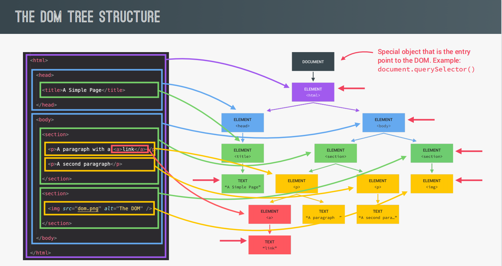

# What is the DOM?
The Document Object Model (DOM) is a programming interface for web documents. It represents the page so that programs can change the document structure, style, and content. The DOM represents the document as nodes and objects; that way, programming languages can interact with the page.

A web page is a document that can be either displayed in the browser window or as the HTML source. In both cases, it is the same document but the Document Object Model (DOM) representation allows it to be manipulated. As an object-oriented representation of the web page, it can be modified with a scripting language such as JavaScript.

For example, the DOM specifies that the querySelectorAll method in this code snippet must return a list of all the ```<p>``` elements in the document:
```js
const paragraphs = document.querySelectorAll("p");
// paragraphs[0] is the first <p> element
// paragraphs[1] is the second <p> element, etc.
alert(paragraphs[0].nodeName);
```
<hr>

# DOM tree structure


<hr>

# Accessing the DOM
You don't have to do anything special to begin using the DOM. You use the API directly in JavaScript from within what is called a script, a program run by a browser.

When you create a script, whether inline in a ```<script>``` element or included in the web page, you can immediately begin using the API for the document or window objects to manipulate the document itself, or any of the various elements in the web page (the descendant elements of the document). Your DOM programming may be something as simple as the following example: 
```html
<div id="demo">Access me by ID</div>
```
```js
const demoId = document.getElementById('demo');
```
<hr>

# DOM Methods
In the DOM, all HTML elements are defined as objects.

The programming interface is the properties and methods of each object.

A property is a value that you can get or set (like changing the content of an HTML element).

A method is an action you can do (like add or deleting an HTML element).
<br>

Some of the methods are listed below:

1. ## **getElementId**
   
   ```getElementId``` is a method to access any element virtually. It accesses the first element with the specified ID.

    Syntax:
    ```js
    var myVariable = document.getElementById("squad");
    ```

    This method places object which needs to be accessed in a variable called ```"myVariable"```. ```myVariable``` allows your program to access object directly.
    <br>

2. ## **getElementsByTagName**

    ```getElementByTagName``` allows you to search all the elements with a specified tag name on your page.

    Syntax:
    ```js
    var myLinkcollection = document.getElementsByTagName("abc");
    ```

    Here ```myVariable``` is substituted by ```"myLinkCollection"```. ```myLinkCollection``` holds all the elements on the page.
    <br>

3. ## **createElement**
   
    As the name goes, it is used to create an element & place it anywhere in the DOM structure.

    Syntax:
    ```js
    var myNewListItem = document.createElement("li");
    var myNewProd = document.createElement("prod5");
    ```

    Here a new element will be created & added in the DOM structure.
    <br>

4. ## **document.querySelector**
   
    The ```querySelector()``` method returns the first element that matches a specified CSS selector(s) in the document.

    Syntax:
    ```js
    document.querySelector("p.example");
    // Get the first <p> element in the document with class="example"
    ```
    <br>

5. ## **document.querySelectorAll**

    The querySelectorAll() method returns all elements in the document that matches a specified CSS selector(s), as a static NodeList object.

    The NodeList object represents a collection of nodes. The nodes can be accessed by index numbers. The index starts at 0.

    Syntax:
    ```js
    // Get all <p> elements in the document
    var x = document.querySelectorAll("p");

    // Set the background color of the first <p> element
    x[0].style.backgroundColor = "red"; 
    ```
<hr>

# What is Document Object?
- The document object represents your web page.

- If you want to access any element in an HTML page, you always start with accessing the document object.

- The Document interface represents any web page loaded in the browser and serves as an entry point into the web    page's content, which is the DOM tree.
  
Various ```document``` properties along with their descriptions are listed below:

| Property                     | Description                                                                |
|------------------------------|----------------------------------------------------------------------------|
| document.anchors             | Returns all ```<a>``` elements that have a name attribute                  |
| document.applets             | Deprecated                                                                 |
| document.baseURI             | Returns the absolute base URI of the document                              |
| document.body                | Returns the ```<body>``` element                                           |
| document.cookie              | Returns the document's cookie                                              |
| document.doctype             | Returns the document's doctype                                             |
| document.documentElement     | Returns the ```<html>``` element                                           |
| document.documentMode        | Returns the mode used by the browser                                       |
| document.documentURI         | Returns the URI of the document                                            |
| document.domain              | Returns the domain name of the document server                             |
| document.domConfig           | Obsolete.                                                                  |
| document.embeds              | Returns all ```<embed>``` elements                                         |
| document.forms               | Returns all ```<form>``` elements                                          |
| document.head                | Returns the ```<head>``` element                                           |
| document.images              | Returns all `````` elements                                           |
| document.implementation      | Returns the DOM implementation                                             |
| document.inputEncoding       | Returns the document's encoding (character set)                            |
| document.lastModified        | Returns the date and time the document was updated                         |
| document.links               | Returns all ```<area>``` and ```<a>``` elements that have a href attribute |
| document.readyState          | Returns the (loading) status of the document                               |
| document.referrer            | Returns the URI of the referrer (the linking document)                     |
| document.scripts             | Returns all ```<script>``` elements                                        |
| document.strictErrorChecking | Returns if error checking is enforced                                      |
| document.title               | Returns the ```<title>``` element                                          |
| document.URL                 | Returns the complete URL of the document                                   |
<br><br><br>

Contributor: [Sushovan Banerjee](https://github.com/sushovanb02)


