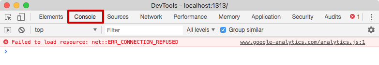

# Developer console
---

## What is Developer Console?
---

As developers, we make a lot of errors, however in the browser, we don't see them by default. If something goes
wrong in the code/script, we can't see what's broken. Hence, to solve this problem we have something called as the
'Developer Tools' that are in-built inside browsers. Mostly Chrome or Firefox is used as these have the best developer tools, however other browsers also provide the same.

Developer tools are super important, beacuse of the multiple features they offer which we will learn here. 

Browsers have in-built development tools to work with JavaScript and other web technologies. These tools include the Console which is similar to a shell interface, along with tools to inspect the DOM, debug, and analyze network activity.

The Developer Console is an integrated development environment (more typically called an IDE) where we can create, debug, and test apps in your org. It's a single tool that can help us with multiple development tasks

The Console is thus like an integrated development environment (ie. an IDE) that can be used to log information as part of the JavaScript development process. We can create, debug, and test applications in the console.

## Working with the Console in a Browser
---

Now, lets discuss how we can work with the console in different web browsers like Chrome, Firefox, Safari etc.

### Chrome
---

To open the developer console in Google Chrome, open the Chrome Menu in the upper-right-hand corner of the browser window and select ```More Tools > Developer Tools```.

We can also use ```Option + ⌘ + J``` (on macOS), or ```Shift + CTRL + J``` (on Windows/Linux).


The console will either open up within the existing Chrome window, or in a new window. We may have to select the Console tab.



### Firefox
---

To open the console on Firefox, use the keyboard shortcut ```Ctrl+Shift+K``` (on Windows) or ```Ctrl+Option+K``` (on Mac). The toolbox will appear at the bottom of the browser window, with the Web Console activated.


Once done, a tray will open at the bottom of your browser window:


The Web Console could also be accessed using the keyboard shortcut ```CTRL + SHIFT + K``` on Linux and Windows, or ```COMMAND + OPTION + K``` on macOS.

### Safari
---

In Safari We need to enable the “Develop menu” first. Then, Open Preferences and go to the “Advanced” pane section. There’s a checkbox at the bottom:


```Cmd+Opt+C``` can toggle the console. The new top menu item named “Develop” will appear. It has many commands and options.

### Working in the Console
---

Inside the Console, we can type JavaScript code.

Let’s start by printing out the string  ``` Hello, Console! ```:

```
>> alert("Hello, Console!");
```
Then, we press the ENTER key and,we will see the following alert popup.

Javascript can also be used to perform math in the Console:

```
>> console.log(3 + 6);
```
 
Output:
```
9
```

Some more complicated math:

```
>> console.log(2344455.89898 * 87897987.89779);
```
 
Output:
```
206072956235446.4
```

Additionally, we can work on multiple lines with variables:

```
>> let d = 5;
>> let a = 7;
>> let c = d + a;
>> console.log(c);
```
 
Output:
```
12
```

In order to modify a command that passed through the Console, type the up arrow ↑ key on your keyboard to retrieve the previous command. This will allow you to edit the command and send it again.

## Understanding Other Development Tools
---

Depending on which browser’s development tools you use, you’ll be able to use other tools to help with your web development workflow. Let’s go over a few of these tools.

### DOM — Document Object Model
---

As we know that when a website is rendered in the browser, it processes the HTML, CSS and JavaScript to create 
special objects called DOM elements, which are further used for manipulating HTML elements and CSS classes.

The DOM stands for Document Object Model, it is a tree of Objects that shows the HTML elements within a hierarchical view. This DOM Tree can be viewed within the Inspector panel in Firefox or the Elements panel in Chrome.

These tools enables us to inspect and edit DOM elements and also let us identify the HTML related to an aspect of a particular page. The DOM can tell you whether a text snippet or image has an ID attribute and can let you determine what that attribute’s value is.

CSS styles can also be viewed in a side panel or below the DOM panel, which allows us to see what styles are being
implemented within the HTML document or via the style sheets.

### Network
---

Every browser's built-in development tools consists of a network tab that can monitor and record network requests.
This is used to view the network requests that the browser makes, for example, when it is loading a page, or how long each request is taking, and based on these, it provides us the details of the requests. This information can be used to optimize page load performance and in debugging request issues.

We can use the Network tab alongside the Javascript Console simultaneously. We can start debugging a page with the Console then switch to the Network tab to see network activity without reloading the page.


#### References:
- [Digitalocean](https://www.digitalocean.com/community/tutorials/how-to-use-the-javascript-developer-console)
- [JAVASCRIPT.INFO](https://javascript.info/devtools)

<br>


 __Contributor :__ [Aniket Pathak](https://github.com/aniketpathak028)
