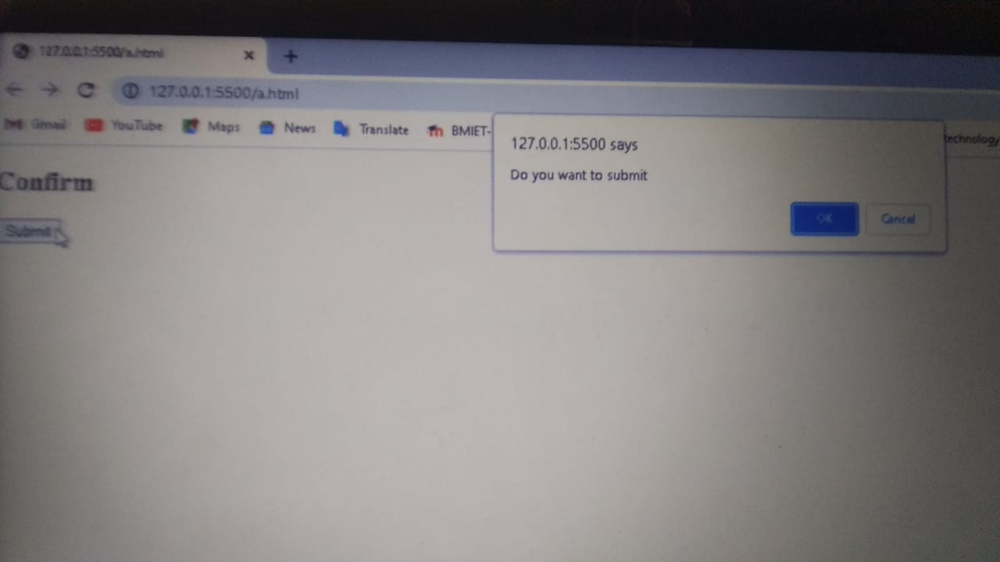
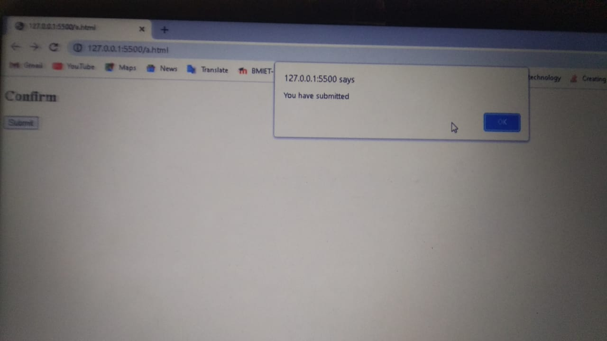
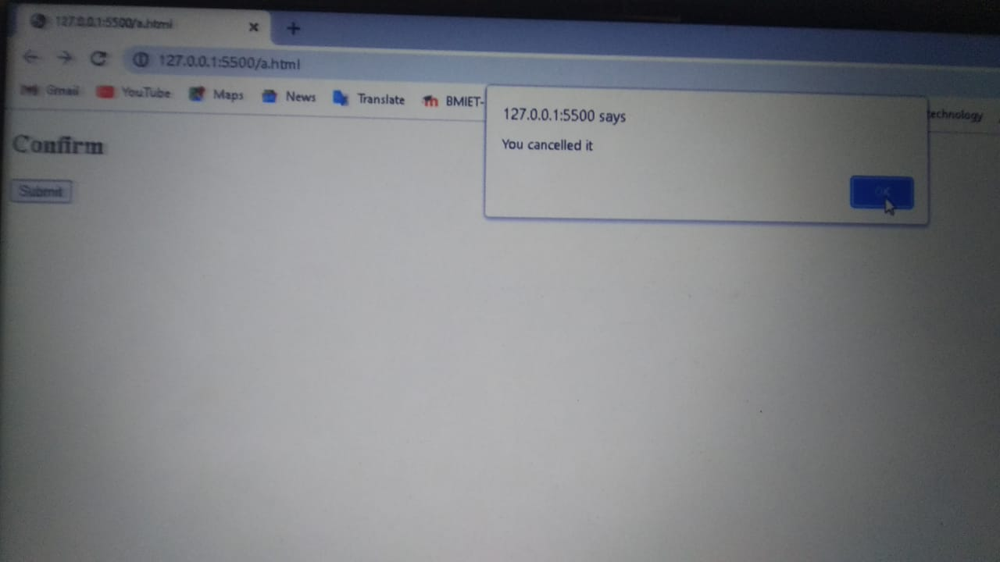

// JavaScript Popup boxes

In Javascript, popup boxes are used to display the message or notification to the user.

There are three types of pop-up boxes in JavaScript
* Alert Box
* Confirm Box
* Prompt Box.

* Alert Box: It is used when a warning message is needed to be displayed or produced on the screen. It is used to display a message to the user on the top-center on the scrren that requires their attention. When the alert box is displayed to the user, the user needs to press ok and proceed. 

For Example:

<!DOCTYPE html>
<html>
<body>
<h2>Alert</h2>

<button onclick="Alert()">Submit</button>

</body>
</html>

Output: 

* Confirm Box: A confirm box is used if you want the user to verify or accept something. When a confirm box pops up, the user will have to click either "OK" or "Cancel" to proceed. If the user clicks "OK", the box returns true. If the user clicks "Cancel", the box returns false.

For Example: 

<!DOCTYPE html>
<html>
    <body>
<h2>Confirm</h2>

<button onclick="Confirm()">Submit</button>

</body>
</html>

Output:

The confirm() function returns true if a user has clicked on the OK button 

or returns false if clicked on the Cancel button.

* Prompt Box: A prompt box is used if you want the user to input a value before entering a page. The prompt() function takes two string parameters. The first parameter is the message to be displayed, and the second parameter is the default value which will be in input text when the message is displayed.

When a prompt box pops up, the user will have to click either "OK" or "Cancel" to proceed after entering an input value.

For Example:

<!DOCTYPE html>
<html>
    <body>
<h2>Prompt</h2>

<button onclick="Prompt()">Submit</button>

</body>
</html>

Output:

If the user clicks "OK" the box returns the input value.

