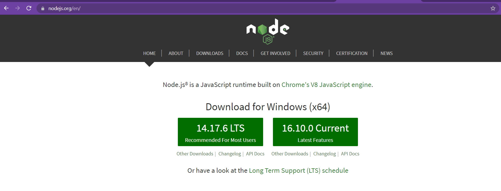
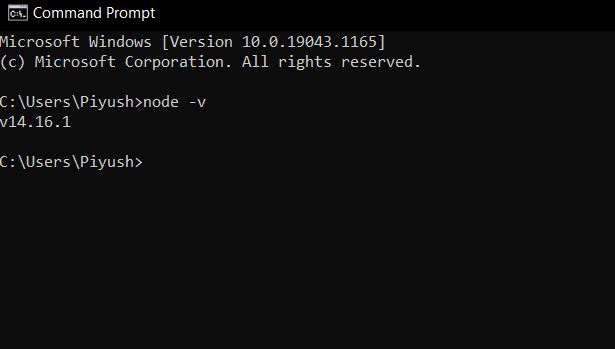
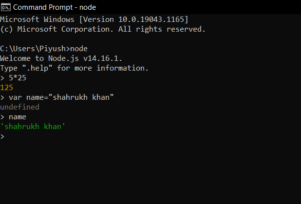

# What is NODE JS?

- First of all, `Node` is not a `Framework` or a `Programming Language`.
- `NODE JS` is a *JavaScript Runtime Environment* and it was introduced by **Ryan Dahl** in 2009. He used the Chrome v8 Engine which is a JavaScript Engine that converts JavaScript Code to Machine Code.
- It allow us to Execute `JavaScript` outside the `Browser`.
- `Node Js` was written using: `C++`,`JavaScript`,`CoffeeScript`.

### Why Node JS?

- `Super Fast`
- `Highly Scalable`
- `Used by Top Companies`

### JavaScript is Everywhere

Node Js behind the scene uses JavaScript which makes it great for the developers out there. Nobody prefers to learn two different languages for backend and frontend. We can use JavaScript for frontend as well as backend development. This makes it easy to learn and use.

One of the main reasons behind every language, framework, or library’s popularity is Community. Node Js has great community support and almost we can find any help and support we want in Node Js. There is code available for almost most of the cases, which makes Node JS preferable to use. With less amount of code, we can create highly scalable and efficient applications.

## Install Node.js on Windows

Visit Node.js official web site [https://nodejs.org](https://nodejs.org/). It will automatically detect OS and display download link as per your Operating System. For example, it will display following download link for 64 bit Windows OS.

Download and install the latest version of Node on your machine.

After installation open command prompt and type the text `node -v`, this will give you back the version of node available on your machine.

Great! You have successfully installed Node Js.

Now its time for us to write our very first node program. To write in Node just simply type `node` on command prompt

then you can do all the JavaScript functionality available in the browser console easily on your command line.

This is it. I encourage you to learn more about Node via below resources.

🐱‍🏍👀✔

### Resources

Node.js official web site: [https://nodejs.org](https://nodejs.org/)

Node.js official docs: [docs](https://nodejs.org/en/docs/)