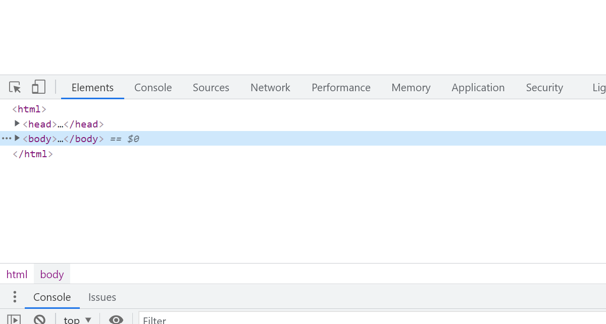
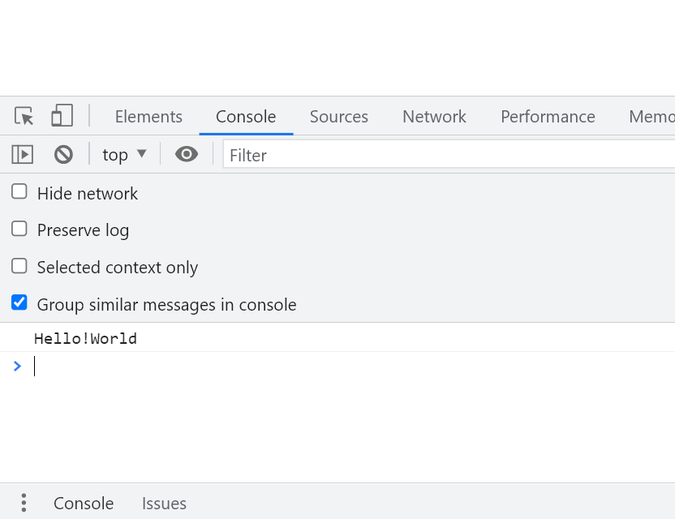
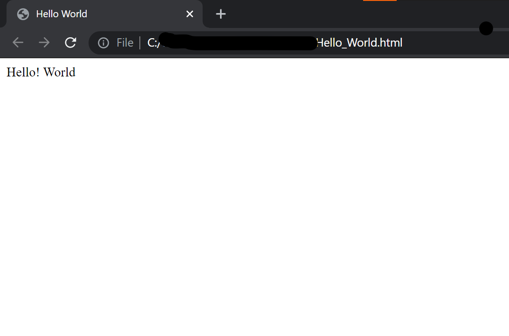

# Say "Hello! World" in JavaScript - For Beginners

 
 

Hello! every one . This tutorial is about writing a simple "Hello! World" program, which is normally the beginning of coding in any new language. 

There are many possible ways to do so in Javascript. Here is a list of beginner-friendly steps you need follow in order to print "Hello! World" in Javascript. So, let's begin with 5 easy steps.

 

## STEP 1: Download an editor to write code:

You can also use Notepad for this purpose. It becomes quite easy to write our code in a smart editor like Visual Studio Code etc. So, it is a recommended to download and install a good editor before you start to write the code. 

 

## STEP 2: Create a new file with .html extention:

After installing the editor we simply need to open the editor and create a new file and save it with .html extention. For example, your file name may look like 'Hello_World.html' .
This will enable us to run our code on browser.

 

## STEP 3: Open the file created in STEP 2 to write some code:

Open the file that we created in step 2 above to write the following code in it:

 

    <html>
    <head>
       <title>Hello World In JavaScript</title>
    </head>
    <body>
         
        
        <!-- the script enclosed in is the actual Javascript code we need to execute in order to print Hello! World. -->
        
    </body>
    </html>

 

## STEP 4: Save the file and open it in a web browser: 

Go to the file location.Right click on the file and select 'Open with' and your web browser. 
The preferred web browser will be any one of the Chrome, Firefox or Microsoft Edge.

 

## STEP 5: Open the console and see the output : 
A blank browser window will open. Right click on the blank window area, and select **Inspect**. It will look as shown image below:

 

  
 
  

Click on console tab and you will finally see the **output** as shown:

 

 

 

## ALTERNATE METHOD:

Yes! there is a way we can print the code "Hello! World" on the browser window as soon as we open it. Check it out by typing the following code instead of the code in STEP 3 above and see the output by following STEP 4.

 

    <html>
        <head>
        <title>Hello World</title>
        </head>
        <body>
             
        
        <!-- This will display the message enclosed in quotes on the browser window(write it) -->
        
    </body>
    </html>

 

This will give the following output:

 

 

## DO YOU KNOW ?

There is another way to print "Hello! World" on your machine without help of HTML unlike we did in above methods.
Following are the steps, if you wish to try this out:

A. Configure your PC and Editor (as in case of VS Code) for Node.js. The link to download and set up is given in references.

 

B. Open the text editor and write:

 

    
    console.log('Hello! World');

 

C. Save the file with .js extention to mark that the file is a JavaScript file.

D. Run the code in the terminal or **Windows Command Prompt** by:

    1.Open Command Prompt.
    

    2.Set path to file location using cd.
    

    3.Write "node <File_Name>.js" and click Enter

 

And finally see the output displayed!

    Hello! World

 

 

Hope you all like this content. Check out the references for the download links of text editor and Node.js.

Thank You !

 

## REFERENCES:

Guide to set-up Node.js:

https://developer.ibm.com/tutorials/learn-nodejs-installing-node-nvm-and-vscode/

 

https://stackoverflow.com/questions/31778413/run-javascript-in-visual-studio-code
 

Download VS Code from this link:

https://code.visualstudio.com/download

Download link for Node.js:

https://nodejs.org/en/download/

 

Contributed by: Yatheshta Vijay
