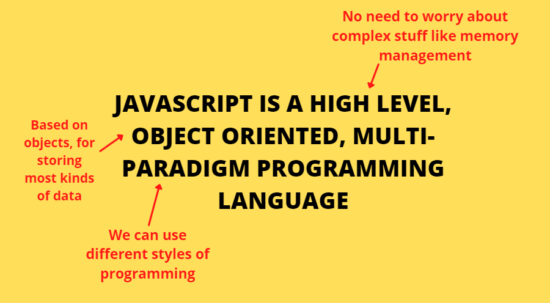

 

# WHAT IS JAVASCRIPT?

 

  

# TIMELINE OF JAVASCRIPT

 

  

# A BRIEF HISTORY OF JAVASCRIPT

 

#### 1995

- Brendan Eich creates the **very first version of JavaScript in just 10 days**. It was called Mocha, but already had many fundamental features of modern JavaScript!

#### 1996

- Mocha changes to LiveScript and then to JavaScript, in order to attract Java developers. However, **JavaScript has almost nothing to do with Java**.
- Microsoft launches IE, **copying JavaScript from Netscape** and calling it JScript.

#### 1997

- With a need to standardize the language, ECMA releases ECMAScript 1 (ES1), the **first official standard for JavaScript** (ECMAScript is the standard, JavaScript the language in practice).

#### 2009

- ES5 (ECMAScript 5) is released with lots of great new features.

#### 2015

- ES6/ES2015 (ECMAScript 2015) was released: **the biggest update to the language ever!**
- ECMAScript changes to an **annual release cycle** in order to ship less features per update.

#### 2016 - ♾ 

- Release of ES2016 / ES2017 / ES2018 / ES2019 / ES2020 / ES2021 / … / ES2089

  

## ES5 

- Fully supported in all browsers
- Ready to be used today

## ES6/ES2015 ... ES2020 

- ES6+: Well supported in all modern browsers
- No support in older browsers
- Can use most features in production with transpiling and polyfilling

## ES2021 ... ♾ 

- **ESNext:** Future versions of the language (new feature proposals that reach Stage 4)
- Can already use some features in production with **transpiling and polyfilling**.

   

##### Contributor: Sushovan Banerjee 
