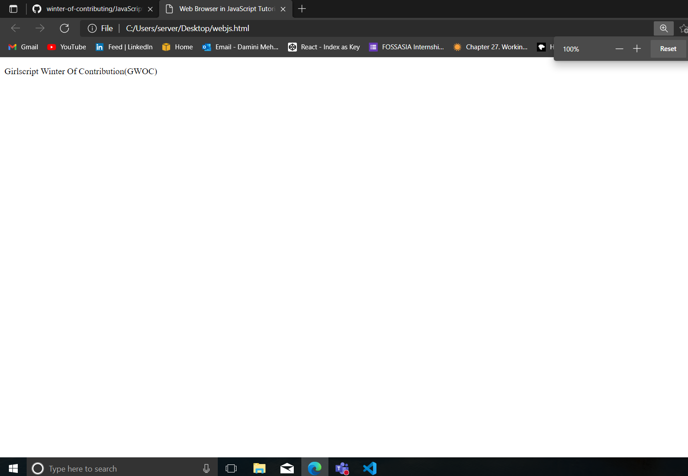
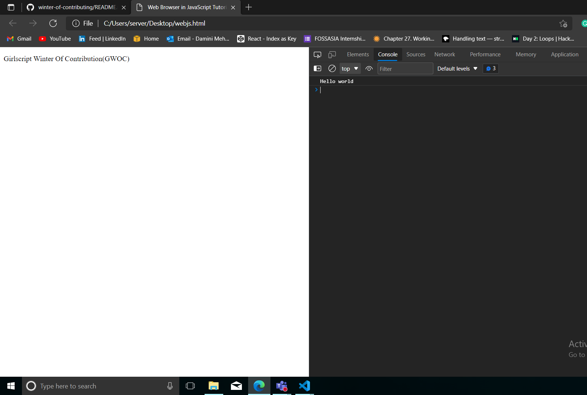

# Web Browser In Javascript

**Web Browsers** are one of the the runtime for JavaScript, which means it's the environment where your JavaScript code gets executed also it's a platform that extends the core JavaScript and provides additional features through specific objects and functions.
</br>
* The global object for **JavaScript** in web browser is the window object. It represents web browser window and simultaneously the ECMAScript Global object. 

* The window object has properties that specify details of the browser window **(navigator, location, history) and methods (alert(), setTimeot())** which perform various operations.

* Another **important part of JavaScript in web browser** is handling events. Event handler allow you to define function, that is called when specified event (for example an click) occurs.

* The most important of them is **XMLHttpRequest object** which enables communication with web-servers.

## **In this tutorial, we will see How to write JavaScript and what are the methods to write it.**

First give the title(of your choice) as "Web Browser in JavaScript Tutorial" under the \<title> tag.


### **Code**
```html
<!DOCTYPE html>
<html lang="en">
<head>
    <meta charset="UTF-8">
    <meta name="viewport" content="width=device-width, initial-scale=1.0">
    <meta http-equiv="X-UA-Compatible" content="ie=edge">
    <title>Web Browser in JavaScript Tutorial</title>
   
</head>
<body>
    <div class="container">
        <div class="row">
            <p>
              Girlscript Winter Of Contribution(GWOC)  
            </p>
        </div>
    </div>
  <script>
        //Write your js here
        console.log('Hello world');
        
    </script>
</body>
</html>

```

The result of the above code will look as follows on the HTML Page-



However, our main focus in this tutorial is to understand JavaScript. Therefore, we will not do any styling or add CSS here.

We have two options to place the JavaScript in the code. One is in the <head> section and the other is after the <body> tag. But if we view other professional websites, they place their JavaScript at the end of the <body> tag so that the DOM does not get affected. The basic code of JavaScript is as follows-

```js
//Write your js code here
console.log("Hello world");
```

If we open the console section of the browser, we can see the output of the above code as shown below-



</br>

Console is one of the place, where you will find all the errors, logs, warnings...etc made in the code and their is Chromium Debugger and many extensions also. If you have locked any request or have applied AJAX in the code, the errors regarding all these things will be shown in the console tab itself. Also, we can see the values of different variables if written in the code. Although there may be a chance that if you are using any other browser apart from Chrome like Opera, Mozilla Firefox, Microsoft Edge or Safari, you may find a different console tab, the high-level ideas of all the browsers will be the same. Therefore, it is recommended to use the Chrome browser due to its high developer tools.

So I believe you must have got some basic ideas about JavaScript and the developer console provided by the browser.


**Contributor**: [Damini Mehra](https://github.com/daminimehra)
