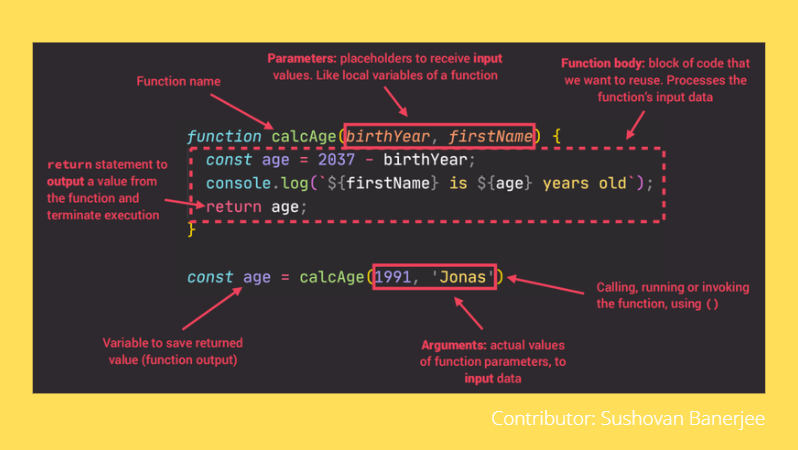
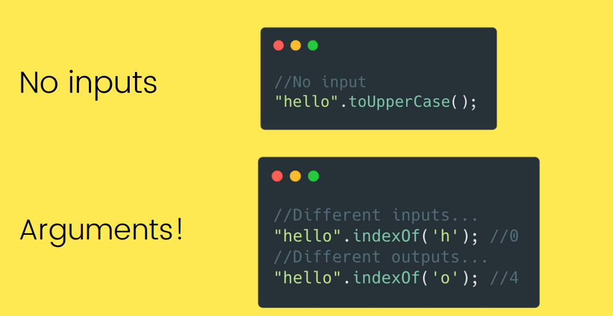
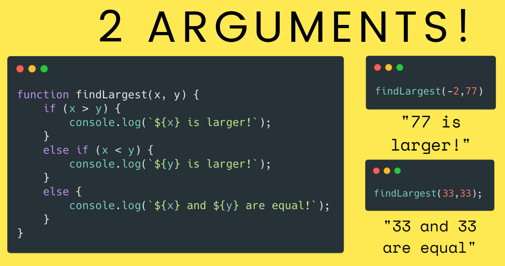

<br>

# SCOPING AND SCOPE IN JAVASCRIPT

- **Scope**: Space or environment in which a certain variable is declared (variable 
environment in case of functions). There is global scope, function scope, and block scope.
- **Scope of a variable**: Region of our code where a certain variable can be accessed.
- **Scoping**: How our program’s variables are organized and accessed. “Where do variables live?” or “Where can we access a certain variable, and where not?”.
- **Lexical scoping**: Scoping is controlled by placement of functions and blocks in the code.

### There are 3 types of scope -
- ### **GLOBAL SCOPE**
    - Outside of any function or block
    - Variables declared in global scope are accessible everywhere
    ```js
    const me = 'Sushovan';
    const job = 'Student';
    const year = 2002;
    ```
- ### **FUNCTION SCOPE**
    - Variables are accessible only inside function, NOT outside
    - Also called local scope
     ```js
    function calcAge(birthYear){
        const now = 2021;
        const age = now - birthYear;
        return age;
    }
    console.log(now); //Reference Error
    ```
- ### **BLOCK SCOPE**
    - Variables are accessible only inside block (block scoped)
    - HOWEVER, this only applies to let and const variables!
    - Functions are also block scoped (only in strict mode)
    ```js
    if (year >= 1981 && year <= 1996){
        const millenial = true;
        const food = 'Pasta';
    }
    console.log(millenial) //Reference Error
    ```

<hr>
<br><br>

# LIFETIME OF JAVASCRIPT VARIABLE
- The lifetime of a JavaScript variable begins when it is declared.

- A local variable will be visible only within a function where it is defined. Function parameters are always local to that function.The completion of a function deletes the local variable.

- A global variable has a global scope which means it can be defined anywhere in your JavaScript code. Global variables delete when the web browser is closed. However if a new page is loaded in the same browser window, then it remains.
<hr>
<br>

# FUNCTIONS

- Functions allow us to write reusable, modular code 
- We define a "chunk" of code that we can then execute at a later point.
- We use them **ALL THE TIME**
  <br><br>

## BASIC FUNCTION SYNTAX
```js
function funcName()
{ 
    //do something 
}
```

<br><br>
<hr>
<br>

# ARGUMENTS
We can also write functions that accept inputs, called arguments.
<br>


<br>


<hr>
<br> 

## TYPES OF FUNCTIONS
Functions are primarily classified into 2 types,i.e, **First Class Functions** and **Higher Order Functions**.
### FIRST CLASS FUNCTIONS
- JavaScript treats functions as **first-class citizens**
- This means that functions are **simply values**
- Functions are just another **“type” of object**
    - Store functions in variables or properties:
    ```js
    const add = (a, b) => a + b;
    const counter = {
        value: 23,
        inc: function(){this.value++;}
        // ...
    }
    ```
    - Pass functions as arguments to OTHER functions:
    ```js
    const greet = () => console.log('Hey Sushovan!');
    btnClose.addEventListener('click', greet);
    ```
    - Return functions FROM functions
    - Call methods on functions:
    ```js
    counter.inc.bind(someOtherObject);
    ```
### HIGHER ORDER FUNCTIONS
- A function that receives another function as an argument, that returns a new function, or both
- This is only possible because of first-class functions
    1. Function that receives another function
    ```js
    const greet = () =>console.log('Hey Sushovan!');
    btnClose.addEventListener('click', greet);
    // addEventListener is a higher order function and greet is a callback function
    ```
    2. Function that returns new function
    ```js
    function count(){
        let counter = 0;
        return function(){
            counter++;
        };
    }
    ```
<hr>
<br>

# WHY USE FUNCTIONS?
- Functions can be seen as the JavaScript’s workhorses. They alone play roles that other languages fulfill with multiple distinct features: procedures, methods, constructors and even classes and modules. Every one of this is covered by the versatility of functions.

- In the newest version of Javascript, concepts like class, method and constructor were introduced but this are nothing more than syntactic sugar over the same functionalities, already covered by the function.
- Functions are everywhere, why not use them!

<br><br><br>

##### Contributor: Sushovan Banerjee 


