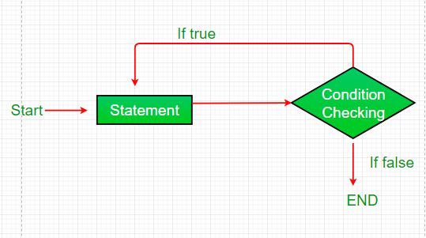

# Do While Loop

do while loop is similar to while loop with only difference that it checks for the condition after executing the statements, and therefore it is an example of Exit Control Loop.

**Syntax:**

```
do
{
    operation...
}
while (condition);

```

1. do while loop starts with the execution of the statement(s). There is no checking of any condition for the first time.
2. After the execution of the statements, and update of the variable value, the
condition is checked for true or false value. If it is evaluated to
true, next iteration of loop starts.
3. When the condition becomes false, the loop terminates which marks the end of its life cycle.
4. It is important to note that the do-while loop will execute its statements atleast once before any condition is checked, and therefore it is an
example of exit control loop.



### Do While loop vs While loop

- In While loop, the condition tested at the beginning of the
loop, and if the condition is True, statements inside the loop will
execute. It means the While loop executes the code block only if the
condition is True.
- At the end of the loop, the Do While
loop tests the condition. So, Do While executes the statements in the
code block at least once even if the condition Fails.

### Example

```jsx
    var x = 21;
    do 
    {
        // The line while be printed even if the condition is false
        console.log("Value of x:" + x + "<br />");
        x++;
    } while (x < 20);
```

Output:

```
Value of x: 21

```
