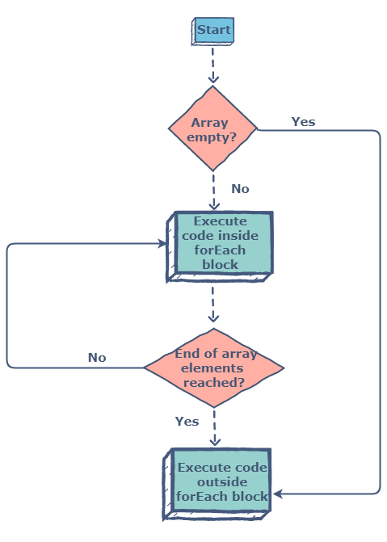

# For Each Method

The `forEach()` method calls a function once for each element in an array, in order.

`forEach()` is not executed for array elements without values.

# Syntax

```java
array.forEach(*function(currentValue, index, arr), thisValue*)
```

The `forEach` method passes a callback function for each element of an array together with the following parameters:

- Current Value (required) - The value of the current array element
- Index (optional) - The current element's index number
- Array (optional) - The array object to which the current element belongs



For example: 

let's take an array numbers

```java
const numbers = [1, 2, 3, 4, 5];
```

Traditionally you would want to use a for loop to iterate through the elements in the array 

```jsx
for (i = 0; i < numbers.length; i++) {
  console.log(numbers[i]);
}
```

Firstly, to loop through an array by using the `forEach` method, you need a callback function (or anonymous function):

```jsx
numbers.forEach(function() {
    // code
});
```

The function will be executed for every single element of the array. It must take at least one parameter which represents the elements of an array:

```jsx
numbers.forEach(function(number) {
    console.log(number);
});
```

That's all we need to do for looping through the array:


Alternatively, you can use the ES6 arrow function representation for simplifying the code:

`numbers.forEach(number => console.log(number));`