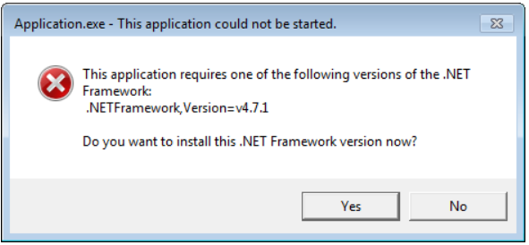
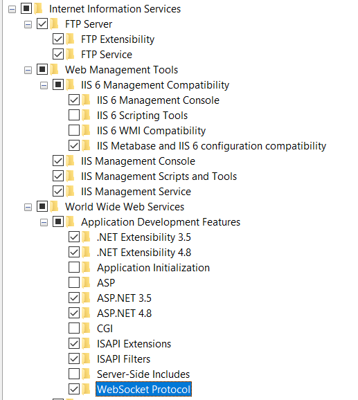

# Installation Procedures

An overview on how to install and configure .NET for development.

## .NET Framework

.NET Framework is used to develop applications that run on windows. Applications developed via .NET Framework can only be hosted on windows servers, therefore the dependencies and packages will also have windows as their runtime identifier.

### Pre-requisites

- Windows OS system
- Reliable internet connection
- Visual Studio (latest version)
- IIS Manager (web development only)

### .NET Framework download and install

It is recommended to install the latest version of .NET Framework. The steps involved are as follows:

1. Navigate to this link: https://dotnet.microsoft.com/download/dotnet-framework.
2. Select the appropriate version required.
3. Click on Download .NET Framework <selected_version> Runtime.
4. Run the exe and install .NET Framework.

**Note**: If the following error in encountered while running a .NET Framework application, follow the above steps for the appropriate version:



### Visual Studio

It is recommended to install the latest version of Visual Studio. The steps involved for configuring Visual Studio to develop .NET Framework applications are as follows:

1. Download latest version of Visual Studio from this link: https://visualstudio.microsoft.com/downloads/
2. Select the appropriate workloads according to the project requirements. The ones used for .NET Framework are as follows:
   1. ASP.NET and Web development
   2. Azure development
   3. .NET desktop development
   4. Mobile development with .NET
   5. .NET cross platform development
3. On the right hand side, under installation details, select only those components that are needed. For example: If machine learning is not involved, ML.NET can be deselected
4. Navigate to Individual components tab on the top and select appropriate .NET Framework runtimes and SDKs.
5. Proceed with the installation.

### IIS Manager

1. Search for Turn Windows Features on or off
2. Select the following under Internet Information Services
   
3. Click OK and restart system if needed.
4. After installation, search for IIS Manager to verify if it's installed.

## .NET Core

.NET Core is a cross platform open source framework. Unlike .NET Framework, applications developed using .NET Core is not limited to Windows OS, thanks to the new lightweight version of CLR compiler known as CoreCLR.

### Pre-requisites

- System with any OS type
- Reliable internet connection
- Visual Studio (latest version)

### .NET Core SDK download and install

It is recommended to install the latest version of .NET Core SDK. The steps involved are as follows:

1. Navigate to this link: https://dotnet.microsoft.com/download/dotnet.

2. Select the appropriate version required, latest is recommended.

3. Download installer for required OS type and install SDK.

4. Restart system for system environment variables to get updated.

5. Open command line; run the following command and verify whether appropriate version was installed:

   ```shell
   dotnet --version
   ```

### Visual Studio

It is recommended to install the latest version of Visual Studio. The steps involved for configuring Visual Studio to develop .NET Core applications are as follows:

1. Download latest version of Visual Studio from this link: https://visualstudio.microsoft.com/downloads/
2. Select the appropriate workloads according to the project requirements. The ones used for .NET Core are as follows:
   1. ASP.NET and Web development
   2. .NET cross platform development
3. On the right hand side, under installation details, select only those components that are needed. For example: If machine learning is not involved, ML.NET can be deselected
4. Navigate to Individual components tab on the top and select appropriate .NET Core runtimes and SDKs that are needed.
5. Proceed with the installation.